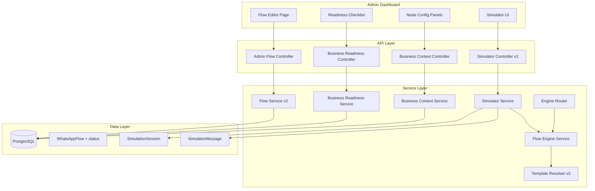
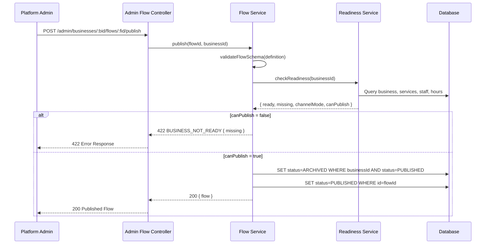

# Design Document: Admin Flow Builder

## Overview

This design layers admin-scoped flow management, a draft/publish lifecycle, business readiness validation, a WhatsApp-like simulator, and runtime correctness fixes on top of the existing Flow Engine foundation. The existing graph runner (`flow-engine.service.ts`), node handlers, durable queue/outbox, and engine router remain intact — this spec adds product rules, new services, and UI enhancements.

### Key Design Decisions

1. **Status field over isActive boolean**: Introduce a `status` enum (`DRAFT`, `PUBLISHED`, `ARCHIVED`) on `WhatsAppFlow` to replace the binary `isActive` flag, with backward-compatible mapping (`isActive: true` ↔ `PUBLISHED`).
2. **Readiness as a pure service**: `BusinessFlowReadinessService` is a stateless validator that computes readiness from live DB state — no cached readiness flags.
3. **Simulator isolation via adapter pattern**: The simulator wraps the Flow Engine with a `SimulationContext` adapter that intercepts persistence calls, routing all state to `SimulationSession` records instead of production tables.
4. **Explicit businessId enforcement at the controller layer**: Admin routes require `businessId` as a path parameter; the "first business" fallback is removed for admin callers.
5. **Template variable expansion**: The existing `TemplateResolver` is extended with dot-path variables (`{{business.name}}`) while preserving the legacy `{{businessName}}` format.

## Architecture



### Request Flow: Publish a Flow



## Components and Interfaces

### 1. Admin Flow Controller (`admin-flow.controller.ts`)

New controller dedicated to admin-scoped flow management. Replaces the current `resolveBusinessId` fallback logic for admin callers.

```typescript
// Route: /api/v1/admin/businesses/:businessId/flows
interface AdminFlowRoutes {
  'GET    /':                         // List flows for business
  'GET    /:flowId':                  // Get flow by id
  'POST   /':                         // Create new flow (DRAFT)
  'PUT    /:flowId':                  // Update flow (new DRAFT version)
  'POST   /:flowId/publish':          // Publish a flow version
  'POST   /:flowId/archive':          // Archive a flow version
  'DELETE /:flowId':                   // Delete a DRAFT flow
}
```

**Key behavior**: Every route extracts `businessId` from `req.params.businessId`. If missing or empty → HTTP 400 `MISSING_BUSINESS_ID`. If business not found → HTTP 404 `BUSINESS_NOT_FOUND`.

### 2. Business Flow Readiness Service (`business-flow-readiness.service.ts`)

Stateless service that computes whether a business can publish a flow.

```typescript
interface ReadinessResult {
  ready: boolean;
  missing: ReadinessItem[];
  channelMode: 'SHARED' | 'DEDICATED' | 'NONE';
  canPublish: boolean; // ready && channelMode !== 'NONE'
}

interface ReadinessItem {
  code: string;       // e.g. 'NO_ACTIVE_SERVICES'
  label: string;      // Human-readable label
  message: string;    // Detailed explanation
  severity: 'blocker' | 'warning';
}

class BusinessFlowReadinessService {
  async checkReadiness(businessId: string): Promise<ReadinessResult>;
}
```

**Checks performed** (all must pass for `ready: true`):
- Business exists
- `onboardingCompleted === true`
- `isActive === true`
- At least one active service with `price > 0` and `duration >= 1`
- At least one active staff member OR at least one active resource
- `hoursOfOperation` is defined and non-empty

**Channel mode resolution**:
- `DEDICATED`: Business has a `WhatsAppChannel` with `mode: 'DEDICATED'` and `status: 'CONNECTED'`
- `SHARED`: Business has a `routingCode` OR a `WhatsAppChannel` with `mode: 'SHARED'`
- `NONE`: Neither condition met

### 3. Business Context Service (`business-context.service.ts`)

Returns business data and available template variables for the flow editor.

```typescript
interface BusinessFlowContext {
  business: {
    id: string;
    name: string;
    category: string;
    routingCode: string | null;
    channelMode: 'SHARED' | 'DEDICATED' | 'NONE';
  };
  services: Array<{ id: string; name: string; price: number; duration: number }>;
  staff: Array<{ id: string; name: string }>;
  resources: Array<{ id: string; name: string }>;
  operatingHours: Record<string, { start: string; end: string }> | null;
  templateVariables: TemplateVariableGroup[];
}

interface TemplateVariableGroup {
  category: string;  // 'business' | 'booking' | 'service' | 'staff'
  variables: Array<{ key: string; description: string; example: string }>;
}
```

### 4. Flow Service v2 (extensions to `flow.service.ts`)

New methods added to the existing `FlowService`:

```typescript
class FlowService {
  // Existing methods remain unchanged...

  // New: Save as DRAFT (replaces create/save for admin flow)
  async saveDraft(businessId: string, data: SaveDraftInput, createdBy?: string): Promise<FlowRecord>;

  // New: Publish a specific flow version
  async publish(flowId: string, businessId: string): Promise<FlowRecord>;

  // New: Archive a specific flow version
  async archive(flowId: string, businessId: string): Promise<FlowRecord>;

  // Modified: resolveActiveFlow now checks status === 'PUBLISHED' (with isActive fallback)
  async resolveActiveFlow(businessId: string): Promise<ResolvedFlow>;
}
```

**Status migration strategy**: The `resolveActiveFlow` method checks for `status === 'PUBLISHED'` first. If no row matches (pre-migration flows), it falls back to `isActive === true`. This ensures backward compatibility during the transition.

### 5. Simulator Service (`simulator.service.ts`)

New service that wraps the Flow Engine for isolated simulation.

```typescript
interface SimulationSession {
  id: string;
  businessId: string;
  flowId: string;
  flowVersion: number;
  adminId: string;
  currentNodeId: string;
  contextData: Record<string, unknown>;
  lastMessageAt: Date;
  createdAt: Date;
}

interface SimulatorResponse {
  sessionId: string;
  message: InteractiveMessage;
  currentNodeId: string;
  contextData: Record<string, unknown>;
  complete: boolean;
}

class SimulatorService {
  async createSession(params: CreateSessionParams): Promise<SimulationSession>;
  async sendMessage(sessionId: string, text: string): Promise<SimulatorResponse>;
  async sendInteractive(sessionId: string, reply: InteractiveReply): Promise<SimulatorResponse>;
  async resetSession(sessionId: string): Promise<void>;
  async getSession(sessionId: string): Promise<SimulationSession | null>;
}
```

**Isolation mechanism**: The simulator loads the flow definition directly (bypassing `resolveActiveFlow`), creates a virtual context object, and calls the Flow Engine's node handlers directly. It intercepts:
- `prisma.whatsAppConversation.*` → writes to `SimulationSession` instead
- `prisma.bookingIntent.*` → returns mock data without persisting
- `prisma.whatsAppOutboundMessage.*` → returns response synchronously, no outbox write

### 6. Template Resolver v2 (extensions to `template-resolver.ts`)

Extended to support dot-path variables while maintaining backward compatibility.

```typescript
// New supported variables (in addition to existing ones):
const VARIABLE_REGISTRY: Record<string, (ctx: TemplateContext) => string> = {
  'business.name':           ctx => ctx.businessName || '',
  'business.category':       ctx => ctx.category || '',
  'business.routingCode':    ctx => ctx.routingCode || '',
  'selectedService.name':    ctx => ctx.selectedServiceName || '',
  'selectedService.price':   ctx => String(ctx.selectedServicePrice || ''),
  'selectedService.duration': ctx => String(ctx.selectedServiceDuration || ''),
  'selectedTime':            ctx => ctx.selectedTime || '',
  'selectedStaff.name':      ctx => ctx.selectedStaffName || '',
  'booking.id':              ctx => ctx.bookingId || '',
};

// Backward-compatible aliases (resolve identically):
// {{businessName}} → same as {{business.name}}
// {{serviceTerm}} → category-based term (unchanged)
// {{servicePluralTerm}} → category-based plural (unchanged)
```

**Unresolvable variables**: Any `{{...}}` placeholder that doesn't match a registered variable or whose context value is `undefined`/`null` is replaced with an empty string.

### 7. Admin Dashboard Changes

#### Route Structure Update

```
/businesses/:businessId/flows              → FlowListPage (scoped to business)
/businesses/:businessId/flows/new          → FlowEditorPage (create)
/businesses/:businessId/flows/:flowId/edit → FlowEditorPage (edit)
```

If no `businessId` in route → redirect to `/businesses` (business selection).

#### FlowEditorPage Enhancements

- **Readiness Checklist Panel**: Sidebar component fetching `/flow-readiness` and displaying pass/fail for each item
- **Channel Mode Badge**: Shows `SHARED (S123)` or `DEDICATED (+1234567890)` in the header
- **Three Action Buttons**:
  - "Save Draft" → `PUT /admin/businesses/:bid/flows/:fid` (always enabled)
  - "Simulate" → Opens simulator panel with current graph
  - "Publish" → `POST /admin/businesses/:bid/flows/:fid/publish` (disabled when readiness fails)

#### NodeConfigPanel Per-Type Panels

Each node type gets a dedicated config component:

| Node Type | Config Controls |
|-----------|----------------|
| `message` | Text area with variable picker |
| `question` | Text area + variable picker + structured choice editor (id/title/description) |
| `service_picker` | Read-only service list preview + header/body/footer/button/empty-message fields |
| `staff_picker` | Prompt text + header/footer/button/empty-message fields |
| `time_picker` | Days ahead (1-14), start hour, end hour, slot duration (15-480 min), max slots (1-10) |
| `confirmation` | Confirm label, cancel label, summary template |
| `booking` | Read-only summary (terminal node indicator) |

#### Simulator UI Component

WhatsApp-like chat interface embedded in a slide-over panel:
- Chat bubble rendering (bot messages left, user messages right)
- Clickable interactive buttons/list items
- Debug panel showing current node ID and contextData
- "Reset" button to clear session
- Session expiry indicator (60-minute timeout)

## Data Models

### Schema Changes

```prisma
// Add status enum to WhatsAppFlow
enum FlowStatus {
  DRAFT
  PUBLISHED
  ARCHIVED
}

model WhatsAppFlow {
  id          String     @id @default(cuid())
  businessId  String
  name        String
  description String?
  version     Int        @default(1)
  status      FlowStatus @default(DRAFT)
  isActive    Boolean    @default(false) // Kept for backward compat, derived from status
  entryNodeId String
  definition  Json
  createdBy   String?
  createdAt   DateTime   @default(now())
  updatedAt   DateTime   @updatedAt

  business Business @relation(fields: [businessId], references: [id], onDelete: Cascade)

  @@unique([businessId, version])
  @@index([businessId, status])  // New index for status-based queries
  @@index([businessId, isActive]) // Existing index retained
}

// New: Simulation session for isolated testing
model SimulationSession {
  id            String   @id @default(cuid())
  businessId    String
  flowId        String
  flowVersion   Int
  adminId       String
  currentNodeId String
  contextData   Json     @default("{}")
  lastMessageAt DateTime @default(now())
  createdAt     DateTime @default(now())
  updatedAt     DateTime @updatedAt

  messages SimulationMessage[]

  @@index([businessId])
  @@index([adminId])
  @@index([lastMessageAt]) // For expiry cleanup
}

model SimulationMessage {
  id            String   @id @default(cuid())
  sessionId     String
  direction     String   // "inbound" | "outbound"
  messageType   String   // "text" | "interactive"
  content       Json
  nodeId        String?  // Which node produced this message
  timestamp     DateTime @default(now())

  session SimulationSession @relation(fields: [sessionId], references: [id], onDelete: Cascade)

  @@index([sessionId, timestamp])
}
```

### Migration Strategy

1. Add `status` column with default `DRAFT`
2. Run data migration: `UPDATE WhatsAppFlow SET status = 'PUBLISHED' WHERE isActive = true`
3. Keep `isActive` column synchronized: `isActive = (status == 'PUBLISHED')`
4. The `resolveActiveFlow` method checks `status = 'PUBLISHED'` first, falls back to `isActive = true`

### Question Choice Schema

```typescript
// New structured choice format
interface StructuredChoice {
  id: string;          // 1-256 characters, unique within node
  title: string;       // 1-24 characters (WhatsApp button limit)
  description?: string; // 1-72 characters (WhatsApp list row limit)
}

// Backward-compatible: choices can be string[] OR StructuredChoice[]
type ChoiceConfig = string[] | StructuredChoice[];
```

The question handler normalizes at runtime:
- If `choices` is `string[]`: map each string to `{ id: string, title: string }`
- If `choices` is `StructuredChoice[]`: use as-is

## Correctness Properties

*A property is a characteristic or behavior that should hold true across all valid executions of a system — essentially, a formal statement about what the system should do. Properties serve as the bridge between human-readable specifications and machine-verifiable correctness guarantees.*

### Property 1: Admin Endpoint BusinessId Enforcement

*For any* flow management endpoint called with a platform admin token, if the request does not include a valid `businessId` parameter, the API SHALL return HTTP 400 with error code `MISSING_BUSINESS_ID` and SHALL NOT perform any flow operation.

**Validates: Requirements 1.1, 1.2, 1.3**

### Property 2: Readiness Computation Correctness

*For any* business state (combination of onboardingCompleted, isActive, services, staff/resources, hoursOfOperation), the `checkReadiness` function SHALL return `ready: true` if and only if ALL conditions are met (onboarding complete, active, has qualifying services, has capacity, has hours), and the `missing` array SHALL contain exactly the items corresponding to failed conditions.

**Validates: Requirements 2.1, 2.3**

### Property 3: Publish Requires Readiness, Draft Does Not

*For any* business and flow definition, saving as DRAFT SHALL succeed regardless of business readiness state, while publishing SHALL succeed only when `canPublish` is true (ready AND channelMode !== NONE).

**Validates: Requirements 2.5, 2.6**

### Property 4: Flow Resolution Serves Only Published or Default

*For any* business, `resolveActiveFlow` SHALL return the flow version with status `PUBLISHED` if one exists, or the `DEFAULT_FLOW` if no `PUBLISHED` version exists. It SHALL never return a `DRAFT` or `ARCHIVED` version for customer-facing conversations.

**Validates: Requirements 3.1, 3.5, 3.8, 8.4**

### Property 5: Publish Lifecycle Transitions

*For any* valid flow definition and ready business, publishing a flow version SHALL set its status to `PUBLISHED`, set any previously `PUBLISHED` version for that business to `ARCHIVED`, and the total count of flow versions for that business SHALL never decrease.

**Validates: Requirements 3.2, 3.7**

### Property 6: Template Resolution Correctness

*For any* template string containing supported variables and any valid context, the Template Resolver SHALL: (a) replace all registered variables with their context values, (b) replace unresolvable variables with empty string (no raw `{{...}}` in output), and (c) resolve `{{businessName}}` identically to `{{business.name}}` for the same context.

**Validates: Requirements 4.3, 4.4, 4.6, 11.3**

### Property 7: Simulator Isolation

*For any* sequence of messages processed through the Flow Simulator, the system SHALL NOT create or modify any `WhatsAppConversation`, `BookingIntent`, `Booking`, or `WhatsAppOutboundMessage` records. All state changes SHALL be confined to `SimulationSession` and `SimulationMessage` records.

**Validates: Requirements 7.2, 7.5, 10.1, 10.2, 10.6**

### Property 8: Runtime Routing Correctness

*For any* inbound customer message with a resolvable business (via routing code on shared number or via WhatsAppChannel on dedicated number), the Engine Router SHALL start the correct business's `PUBLISHED` flow (or Default_Flow), and the Flow Engine context SHALL contain `customerPhone`, `conversationId`, `businessId`, and business metadata.

**Validates: Requirements 8.1, 8.2, 8.3**

### Property 9: Booking Hold Idempotency

*For any* given tuple of (conversationId, sorted serviceIds, requestedTime), the booking flow SHALL produce a deterministic `idempotencyKey`, and re-processing the same confirmation-node entry SHALL NOT create a second `BookingIntent`. If a `BookingIntent` with status `CONFIRMED` already exists for that key, the system SHALL return the existing booking confirmation.

**Validates: Requirements 9.1, 9.6**

### Property 10: Single Outbound Message Per Inbound

*For any* single inbound message and any flow state, the Flow Engine SHALL produce at most one outbound message to the customer (with auto-advancing message nodes combining their content into a single response).

**Validates: Requirements 9.5**

### Property 11: Hold Expiry Transitions

*For any* `BookingIntent` referenced in context where `status !== 'PENDING'` OR `expiresAt < now()`, when the customer sends a confirm action, the system SHALL mark the hold as `EXPIRED`, clear `bookingIntentId` and `requestedTime` from context, and signal a transition to the time_picker node.

**Validates: Requirements 9.7**

### Property 12: Version Pinning for In-Progress Conversations

*For any* in-progress conversation with a pinned `flowId` and `flowVersion`, activating a new flow version for that business SHALL NOT change the flow definition used by that conversation. The conversation SHALL continue on its originally pinned version.

**Validates: Requirements 11.7**

### Property 13: Choice Rendering Format

*For any* question node with N structured choices (1 ≤ N ≤ 10), the question handler SHALL render as button-style interactive message when N ≤ 3, and as list-style interactive message when N > 3. The `id` field SHALL be used for reply matching and the `title` field for display labels.

**Validates: Requirements 12.2, 12.5**

### Property 14: Choice Backward Compatibility

*For any* question node whose `choices` field is a plain `string[]`, the question handler SHALL treat each string as both the `id` and `title`, producing identical matching and display behavior to the structured format.

**Validates: Requirements 12.3**

### Property 15: Duplicate Choice ID Rejection

*For any* question node choices array containing two or more entries with the same `id` value, the flow save/validation SHALL reject the operation and report that choice ids must be unique.

**Validates: Requirements 12.4**

## Error Handling

### API Error Responses

| Scenario | HTTP Status | Error Code | Details |
|----------|-------------|------------|---------|
| Missing businessId (admin) | 400 | `MISSING_BUSINESS_ID` | businessId is required for admin callers |
| Business not found | 404 | `BUSINESS_NOT_FOUND` | No business with the given id |
| Flow not found | 404 | `FLOW_NOT_FOUND` | No flow with the given id for this business |
| Business not ready for publish | 422 | `BUSINESS_NOT_READY` | Includes `missing` array with failed checks |
| Invalid flow schema | 400 | `INVALID_FLOW_DEFINITION` | Schema validation details |
| Duplicate choice ids | 400 | `DUPLICATE_CHOICE_IDS` | Lists the duplicate ids |
| Simulation session expired | 410 | `SESSION_EXPIRED` | Session inactive for 60+ minutes |
| Flow not accessible for simulation | 403 | `FLOW_NOT_ACCESSIBLE` | Flow belongs to different business |

### Simulator Error Isolation

The simulator catches all errors from node handlers and returns them as part of the response payload rather than propagating them as HTTP errors. This allows admins to see exactly what error a customer would encounter.

### Graceful Degradation

- If the readiness endpoint is unavailable, the Publish button remains disabled with a "Cannot verify readiness" message
- If the context endpoint fails, the variable picker shows a cached/empty list rather than blocking the editor
- Template variables that fail to resolve produce empty strings, never raw placeholders

## Testing Strategy

### Property-Based Tests (fast-check)

Each correctness property maps to a property-based test with minimum 100 iterations:

| Property | Test Target | Generator Strategy |
|----------|-------------|-------------------|
| P1: BusinessId Enforcement | `AdminFlowController` | Random endpoint × random token × optional businessId |
| P2: Readiness Computation | `BusinessFlowReadinessService.checkReadiness` | Random business states (all combinations of flags/counts) |
| P3: Publish vs Draft | `FlowService.saveDraft` / `FlowService.publish` | Random flow definitions × random readiness states |
| P4: Flow Resolution | `FlowService.resolveActiveFlow` | Random sets of flow versions with various statuses |
| P5: Publish Lifecycle | `FlowService.publish` | Sequences of save/publish operations |
| P6: Template Resolution | `TemplateResolver.resolve` | Random templates × random contexts × old/new variable formats |
| P7: Simulator Isolation | `SimulatorService.sendMessage` | Random message sequences, assert no production writes |
| P8: Routing Correctness | `EngineRouter.route` | Random routing codes × phone numbers × business configs |
| P9: Booking Idempotency | `bookingHandler.process` | Random (conversationId, serviceIds, time) tuples, repeated calls |
| P10: Single Outbound | `FlowEngine.processMessage` | Random flows × random messages |
| P11: Hold Expiry | `confirmationHandler.process` | Random BookingIntent states (expired/cancelled/pending) |
| P12: Version Pinning | `FlowEngine.processMessage` | Activate new version mid-conversation |
| P13: Choice Rendering | `questionHandler.render` | Random choice arrays of varying lengths (1-10) |
| P14: Choice Compat | `questionHandler.render` / `process` | Random string[] choices |
| P15: Duplicate IDs | Flow schema validation | Random choice arrays with injected duplicates |

**Library**: `fast-check` (already available in the monorepo test infrastructure)
**Configuration**: Minimum 100 iterations per property, `{ numRuns: 100 }`
**Tag format**: `Feature: admin-flow-builder, Property {N}: {description}`

### Unit Tests (Vitest)

- Readiness service: specific business configurations (all pass, each individual failure)
- Template resolver: specific variable substitutions, edge cases (empty context, nested paths)
- Flow status transitions: DRAFT → PUBLISHED → ARCHIVED state machine
- Choice normalization: string[] → StructuredChoice[] conversion
- Simulator session expiry: time-based expiration logic

### Integration Tests

- Admin flow CRUD endpoints: full request/response cycle with auth
- Publish flow with readiness gate: end-to-end publish with validation
- Simulator session lifecycle: create → send messages → reset
- Engine routing with new status field: verify PUBLISHED flows are served
- Backward compatibility: existing `isActive` flows continue working

### E2E Tests

- Admin creates flow → saves draft → publishes → customer receives correct flow
- Simulator runs draft flow without affecting production
- Business with incomplete setup cannot publish (Publish button disabled)
