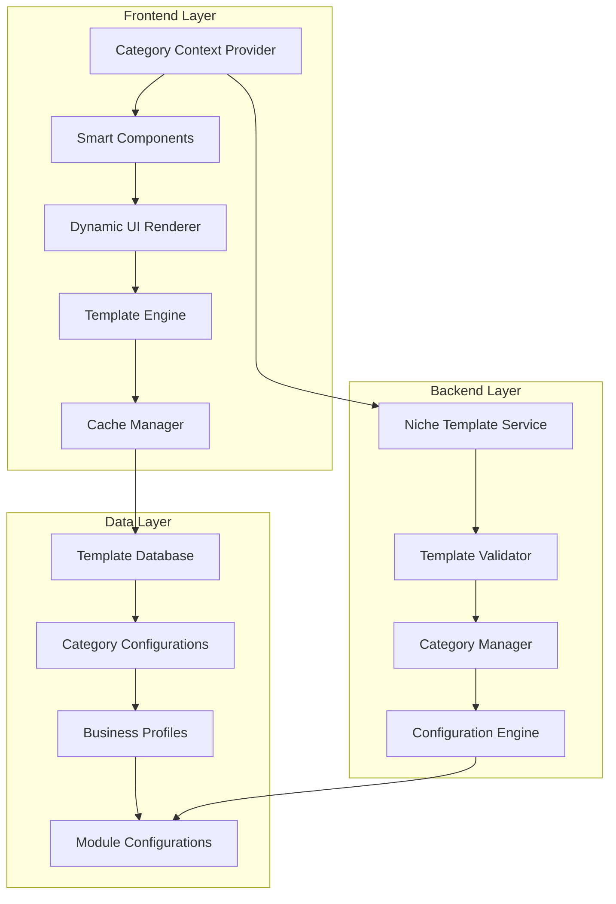
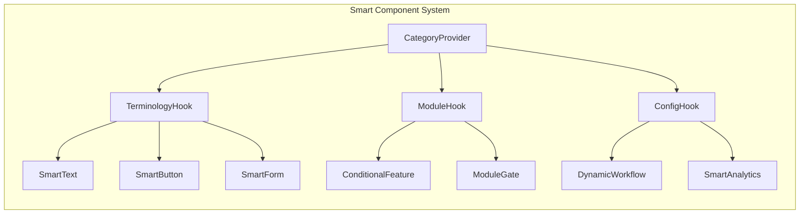

# Design Document

## Overview

The Category-Based Dynamic UI System transforms Salex from a salon-focused app into a truly multi-niche platform that intelligently adapts to different business types. The system uses a sophisticated template engine, smart component architecture, and flexible configuration system to provide tailored experiences for salons, clinics, spas, beauty parlors, barber shops, and fitness centers.

## Architecture

### High-Level Architecture



### Modular File Structure

The system follows a category-based modular structure that allows developers to work independently on specific business categories:

```
apps/MerchantAppExpo/src/
├── categories/                          # Category-specific implementations
│   ├── core/                           # Shared category system
│   │   ├── context/
│   │   │   ├── CategoryContext.tsx     # Main category context provider
│   │   │   ├── CategoryHooks.ts        # Category-related hooks
│   │   │   └── index.ts
│   │   ├── components/                 # Smart components
│   │   │   ├── SmartText.tsx          # Dynamic text component
│   │   │   ├── SmartButton.tsx        # Dynamic button component
│   │   │   ├── ConditionalFeature.tsx # Module-gated features
│   │   │   ├── ModuleGate.tsx         # Module access control
│   │   │   └── index.ts
│   │   ├── services/
│   │   │   ├── TemplateEngine.ts      # Template processing
│   │   │   ├── CategoryManager.ts     # Category management
│   │   │   ├── CacheManager.ts        # Template caching
│   │   │   └── index.ts
│   │   ├── types/
│   │   │   ├── CategoryTypes.ts       # Core category types
│   │   │   ├── TemplateTypes.ts       # Template interfaces
│   │   │   └── index.ts
│   │   └── utils/
│   │       ├── TerminologyUtils.ts    # Terminology helpers
│   │       ├── ValidationUtils.ts     # Template validation
│   │       └── index.ts
│   │
│   ├── salon/                          # Salon-specific implementation
│   │   ├── config/
│   │   │   ├── SalonTemplate.ts       # Salon template configuration
│   │   │   ├── SalonTerminology.ts    # Salon-specific terms
│   │   │   ├── SalonModules.ts        # Salon module configs
│   │   │   └── index.ts
│   │   ├── components/
│   │   │   ├── SalonBookingCard.tsx   # Salon booking UI
│   │   │   ├── StylistSelector.tsx    # Stylist selection
│   │   │   ├── HairServiceCard.tsx    # Hair service display
│   │   │   └── index.ts
│   │   ├── screens/
│   │   │   ├── SalonOnboarding.tsx    # Salon onboarding flow
│   │   │   ├── SalonDashboard.tsx     # Salon dashboard
│   │   │   └── index.ts
│   │   ├── services/
│   │   │   ├── SalonWorkflows.ts      # Salon-specific workflows
│   │   │   ├── SalonAnalytics.ts      # Salon analytics
│   │   │   └── index.ts
│   │   └── types/
│   │       ├── SalonTypes.ts          # Salon-specific types
│   │       └── index.ts
│   │
│   ├── clinic/                         # Clinic-specific implementation
│   │   ├── config/
│   │   │   ├── ClinicTemplate.ts      # Clinic template configuration
│   │   │   ├── ClinicTerminology.ts   # Medical terminology
│   │   │   ├── ClinicModules.ts       # Medical module configs
│   │   │   └── index.ts
│   │   ├── components/
│   │   │   ├── ConsultationCard.tsx   # Consultation booking UI
│   │   │   ├── DoctorSelector.tsx     # Doctor selection
│   │   │   ├── PatientRecordCard.tsx  # Patient record display
│   │   │   ├── PrescriptionForm.tsx   # Prescription management
│   │   │   └── index.ts
│   │   ├── screens/
│   │   │   ├── ClinicOnboarding.tsx   # Clinic onboarding flow
│   │   │   ├── ClinicDashboard.tsx    # Medical dashboard
│   │   │   ├── PatientManagement.tsx  # Patient management
│   │   │   └── index.ts
│   │   ├── services/
│   │   │   ├── ClinicWorkflows.ts     # Medical workflows
│   │   │   ├── ClinicAnalytics.ts     # Medical analytics
│   │   │   ├── PrescriptionService.ts # Prescription handling
│   │   │   └── index.ts
│   │   └── types/
│   │       ├── ClinicTypes.ts         # Medical types
│   │       ├── PatientTypes.ts        # Patient data types
│   │       └── index.ts
│   │
│   ├── spa/                           # Spa-specific implementation
│   │   ├── config/
│   │   │   ├── SpaTemplate.ts         # Spa template configuration
│   │   │   ├── SpaTerminology.ts      # Wellness terminology
│   │   │   ├── SpaModules.ts          # Wellness module configs
│   │   │   └── index.ts
│   │   ├── components/
│   │   │   ├── WellnessSessionCard.tsx # Wellness session UI
│   │   │   ├── TherapistSelector.tsx   # Therapist selection
│   │   │   ├── TreatmentPackageCard.tsx # Treatment packages
│   │   │   └── index.ts
│   │   ├── screens/
│   │   │   ├── SpaOnboarding.tsx      # Spa onboarding flow
│   │   │   ├── SpaDashboard.tsx       # Wellness dashboard
│   │   │   └── index.ts
│   │   ├── services/
│   │   │   ├── SpaWorkflows.ts        # Wellness workflows
│   │   │   ├── SpaAnalytics.ts        # Wellness analytics
│   │   │   └── index.ts
│   │   └── types/
│   │       ├── SpaTypes.ts            # Spa-specific types
│   │       └── index.ts
│   │
│   ├── beauty-parlor/                 # Beauty Parlor implementation
│   │   ├── config/
│   │   │   ├── BeautyParlorTemplate.ts # Beauty parlor template
│   │   │   ├── BeautyTerminology.ts    # Beauty terminology
│   │   │   ├── BeautyModules.ts        # Beauty module configs
│   │   │   └── index.ts
│   │   ├── components/
│   │   │   ├── BeautySessionCard.tsx   # Beauty session UI
│   │   │   ├── BeauticianSelector.tsx  # Beautician selection
│   │   │   ├── BeautyServiceCard.tsx   # Beauty service display
│   │   │   ├── BridalPackageCard.tsx   # Bridal service packages
│   │   │   └── index.ts
│   │   ├── screens/
│   │   │   ├── BeautyParlorOnboarding.tsx # Beauty parlor onboarding
│   │   │   ├── BeautyParlorDashboard.tsx  # Beauty dashboard
│   │   │   └── index.ts
│   │   ├── services/
│   │   │   ├── BeautyWorkflows.ts      # Beauty workflows
│   │   │   ├── BeautyAnalytics.ts      # Beauty analytics
│   │   │   └── index.ts
│   │   └── types/
│   │       ├── BeautyParlorTypes.ts    # Beauty parlor types
│   │       └── index.ts
│   │
│   ├── barber-shop/                   # Barber Shop implementation
│   │   ├── config/
│   │   │   ├── BarberShopTemplate.ts  # Barber shop template
│   │   │   ├── BarberTerminology.ts   # Grooming terminology
│   │   │   ├── BarberModules.ts       # Grooming module configs
│   │   │   └── index.ts
│   │   ├── components/
│   │   │   ├── GroomingSessionCard.tsx # Grooming session UI
│   │   │   ├── BarberSelector.tsx      # Barber selection
│   │   │   ├── GroomingServiceCard.tsx # Grooming service display
│   │   │   └── index.ts
│   │   ├── screens/
│   │   │   ├── BarberShopOnboarding.tsx # Barber shop onboarding
│   │   │   ├── BarberShopDashboard.tsx  # Grooming dashboard
│   │   │   └── index.ts
│   │   ├── services/
│   │   │   ├── BarberWorkflows.ts      # Grooming workflows
│   │   │   ├── BarberAnalytics.ts      # Grooming analytics
│   │   │   └── index.ts
│   │   └── types/
│   │       ├── BarberShopTypes.ts      # Barber shop types
│   │       └── index.ts
│   │
│   ├── fitness/                       # Fitness Center implementation
│   │   ├── config/
│   │   │   ├── FitnessTemplate.ts     # Fitness template
│   │   │   ├── FitnessTerminology.ts  # Fitness terminology
│   │   │   ├── FitnessModules.ts      # Fitness module configs
│   │   │   └── index.ts
│   │   ├── components/
│   │   │   ├── WorkoutSessionCard.tsx  # Workout session UI
│   │   │   ├── TrainerSelector.tsx     # Trainer selection
│   │   │   ├── FitnessClassCard.tsx    # Fitness class display
│   │   │   ├── MembershipCard.tsx      # Membership management
│   │   │   └── index.ts
│   │   ├── screens/
│   │   │   ├── FitnessOnboarding.tsx   # Fitness onboarding
│   │   │   ├── FitnessDashboard.tsx    # Fitness dashboard
│   │   │   └── index.ts
│   │   ├── services/
│   │   │   ├── FitnessWorkflows.ts     # Fitness workflows
│   │   │   ├── FitnessAnalytics.ts     # Fitness analytics
│   │   │   └── index.ts
│   │   └── types/
│   │       ├── FitnessTypes.ts         # Fitness types
│   │       └── index.ts
│   │
│   └── registry/                      # Category registry and factory
│       ├── CategoryRegistry.ts        # Central category registry
│       ├── CategoryFactory.ts         # Category instance factory
│       ├── TemplateLoader.ts          # Template loading logic
│       └── index.ts

# Backend Structure (apps/api/src/)
├── categories/                        # Backend category system
│   ├── core/
│   │   ├── services/
│   │   │   ├── CategoryService.ts     # Core category management
│   │   │   ├── TemplateService.ts     # Template CRUD operations
│   │   │   └── index.ts
│   │   ├── validators/
│   │   │   ├── TemplateValidator.ts   # Template validation
│   │   │   ├── CategoryValidator.ts   # Category validation
│   │   │   └── index.ts
│   │   └── types/
│   │       ├── CategoryTypes.ts       # Shared category types
│   │       └── index.ts
│   │
│   ├── templates/                     # Category template definitions
│   │   ├── salon/
│   │   │   ├── SalonTemplate.json     # Salon template data
│   │   │   ├── SalonServices.json     # Default salon services
│   │   │   └── SalonModules.json      # Salon module config
│   │   ├── clinic/
│   │   │   ├── ClinicTemplate.json    # Clinic template data
│   │   │   ├── ClinicServices.json    # Default medical services
│   │   │   └── ClinicModules.json     # Medical module config
│   │   ├── spa/
│   │   │   ├── SpaTemplate.json       # Spa template data
│   │   │   ├── SpaServices.json       # Default spa services
│   │   │   └── SpaModules.json        # Spa module config
│   │   ├── beauty-parlor/
│   │   │   ├── BeautyParlorTemplate.json # Beauty parlor template
│   │   │   ├── BeautyServices.json       # Default beauty services
│   │   │   └── BeautyModules.json        # Beauty module config
│   │   ├── barber-shop/
│   │   │   ├── BarberShopTemplate.json   # Barber shop template
│   │   │   ├── BarberServices.json       # Default grooming services
│   │   │   └── BarberModules.json        # Grooming module config
│   │   └── fitness/
│   │       ├── FitnessTemplate.json      # Fitness template
│   │       ├── FitnessServices.json      # Default fitness services
│   │       └── FitnessModules.json       # Fitness module config
│   │
│   └── migrations/                    # Category-specific migrations
│       ├── AddClinicSupport.ts        # Clinic category migration
│       ├── AddBeautyParlorSupport.ts  # Beauty parlor migration
│       └── index.ts
```

### Development Workflow Benefits

**1. Independent Development**
- Junior developers can work entirely within their category folder
- No risk of breaking other categories during development
- Clear ownership and responsibility boundaries

**2. Easy Category Addition**
```bash
# Adding a new category (e.g., dental clinic)
mkdir -p src/categories/dental-clinic/{config,components,screens,services,types}
cp -r src/categories/clinic/* src/categories/dental-clinic/
# Customize for dental-specific needs
```

**3. Modular Testing**
```bash
# Test only clinic-related code
npm test -- --testPathPattern=categories/clinic

# Test core category system
npm test -- --testPathPattern=categories/core
```

**4. Category-Specific Builds**
```typescript
// Conditional category inclusion for smaller builds
const categoryModules = {
  salon: () => import('./categories/salon'),
  clinic: () => import('./categories/clinic'),
  spa: () => import('./categories/spa'),
  // Load only needed categories
};
```

### Component Architecture



## Components and Interfaces

### 1. Category Context Provider

**Purpose**: Centralized category management and data distribution

```typescript
interface CategoryContextValue {
  // Current category data
  category: BusinessCategory;
  template: NicheTemplate;
  terminology: TerminologyConfig;
  modules: ModuleConfig[];
  
  // Helper functions
  getTerm: (key: string, context?: string) => string;
  isModuleEnabled: (moduleCode: string) => boolean;
  getWorkflow: (workflowType: string) => WorkflowConfig;
  
  // State management
  updateCategory: (category: BusinessCategory) => Promise<void>;
  refreshTemplate: () => Promise<void>;
  customizeTerminology: (overrides: Partial<TerminologyConfig>) => void;
}

interface CategoryProviderProps {
  businessId: string;
  children: React.ReactNode;
  fallbackCategory?: BusinessCategory;
}
```

### 2. Smart Component System

**Purpose**: Components that automatically adapt based on category context

```typescript
// Smart Text Component
interface SmartTextProps {
  termKey: string;
  context?: string;
  fallback?: string;
  transform?: 'uppercase' | 'lowercase' | 'capitalize';
  plural?: boolean;
  style?: TextStyle;
}

// Smart Button Component
interface SmartButtonProps extends ButtonProps {
  actionType: 'book' | 'schedule' | 'reserve' | 'create';
  entityType: 'appointment' | 'service' | 'staff';
  onPress: () => void;
}

// Conditional Feature Component
interface ConditionalFeatureProps {
  requiredModules: string[];
  fallback?: React.ReactNode;
  children: React.ReactNode;
}
```

### 3. Template Engine

**Purpose**: Processes and applies category-specific configurations

```typescript
interface TemplateEngine {
  // Template processing
  processTemplate: (template: NicheTemplate) => ProcessedTemplate;
  validateTemplate: (template: NicheTemplate) => ValidationResult;
  mergeTemplates: (base: NicheTemplate, custom: Partial<NicheTemplate>) => NicheTemplate;
  
  // Configuration application
  applyToOnboarding: (template: NicheTemplate) => OnboardingConfig;
  applyToUI: (template: NicheTemplate) => UIConfig;
  applyToWorkflows: (template: NicheTemplate) => WorkflowConfig[];
}

interface ProcessedTemplate {
  terminology: ProcessedTerminology;
  modules: ProcessedModule[];
  services: ProcessedService[];
  workflows: ProcessedWorkflow[];
  analytics: ProcessedAnalytics;
}
```

### 4. Category-Specific Onboarding Flow

**Purpose**: Dynamic onboarding steps based on business category

```typescript
interface OnboardingFlowManager {
  getStepsForCategory: (category: BusinessCategory) => OnboardingStep[];
  customizeStep: (step: OnboardingStep, template: NicheTemplate) => OnboardingStep;
  validateStepCompletion: (step: OnboardingStep, data: any) => ValidationResult;
}

interface OnboardingStep {
  id: string;
  title: string;
  description: string;
  component: React.ComponentType;
  validation: ValidationSchema;
  categorySpecific: CategorySpecificConfig;
}

interface CategorySpecificConfig {
  terminology: Record<string, string>;
  fields: FormField[];
  defaultValues: Record<string, any>;
  skipConditions?: SkipCondition[];
}
```

## Data Models

### Enhanced Niche Template Structure

```typescript
interface NicheTemplate {
  id: string;
  code: BusinessCategory;
  displayName: string;
  icon: string;
  description: string;
  
  // Core configurations
  terminology: TerminologyConfig;
  modules: ModuleConfig[];
  services: ServiceTemplate[];
  workflows: WorkflowTemplate[];
  
  // Advanced configurations
  analytics: AnalyticsConfig;
  integrations: IntegrationConfig[];
  customizations: CustomizationConfig;
  
  // Metadata
  version: string;
  parentTemplate?: string;
  isCustom: boolean;
  createdAt: Date;
  updatedAt: Date;
}

interface TerminologyConfig {
  // Core entities
  customer: TerminologyEntry;
  staff: TerminologyEntry;
  service: TerminologyEntry;
  appointment: TerminologyEntry;
  resource: TerminologyEntry;
  
  // Actions
  book: TerminologyEntry;
  schedule: TerminologyEntry;
  cancel: TerminologyEntry;
  complete: TerminologyEntry;
  
  // Contexts
  contexts: Record<string, TerminologyEntry>;
  
  // Multi-language support
  languages: Record<string, Partial<TerminologyConfig>>;
}

interface TerminologyEntry {
  singular: string;
  plural: string;
  variations: Record<string, string>;
  description?: string;
}
```

### Category-Specific Service Templates

```typescript
interface ServiceTemplate {
  name: string;
  description: string;
  category: ServiceCategory;
  
  // Pricing
  basePrice: number;
  currency: string;
  priceVariations: PriceVariation[];
  
  // Timing
  duration: number;
  bufferTime: number;
  
  // Requirements
  requiredResources: ResourceRequirement[];
  requiredStaff: StaffRequirement[];
  
  // Category-specific
  categorySpecific: {
    clinic?: ClinicServiceConfig;
    spa?: SpaServiceConfig;
    salon?: SalonServiceConfig;
    beautyParlor?: BeautyParlorServiceConfig;
    barberShop?: BarberShopServiceConfig;
    fitness?: FitnessServiceConfig;
  };
}

interface ClinicServiceConfig {
  requiresConsultation: boolean;
  followUpRequired: boolean;
  prescriptionEnabled: boolean;
  insuranceCoverage?: InsuranceCoverage[];
}

interface SpaServiceConfig {
  wellnessCategory: 'relaxation' | 'therapeutic' | 'beauty' | 'detox';
  packageCompatible: boolean;
  membershipDiscount?: number;
  seasonalAvailability?: SeasonalConfig;
}
```

### Module Configuration System

```typescript
interface ModuleConfig {
  code: string;
  name: string;
  description: string;
  category: ModuleCategory;
  
  // Enablement rules
  enabledByDefault: boolean;
  requiredForCategories: BusinessCategory[];
  incompatibleWith: string[];
  dependencies: string[];
  
  // Configuration
  settings: ModuleSettings;
  permissions: Permission[];
  
  // UI Configuration
  uiConfig: ModuleUIConfig;
}

interface ModuleUIConfig {
  menuItems: MenuItem[];
  dashboardWidgets: Widget[];
  formFields: FormField[];
  customComponents: ComponentConfig[];
}
```

## Correctness Properties

*A property is a characteristic or behavior that should hold true across all valid executions of a system-essentially, a formal statement about what the system should do. Properties serve as the bridge between human-readable specifications and machine-verifiable correctness guarantees.*

### Property 1: Category Template Consistency
*For any* business category selection, applying the corresponding niche template should result in consistent terminology, modules, and services across all UI components.
**Validates: Requirements 1.1, 1.2, 1.3**

### Property 2: Terminology Context Preservation
*For any* terminology lookup with a specific context, the returned term should be appropriate for both the business category and the usage context.
**Validates: Requirements 2.1, 2.2, 2.3, 2.4, 2.5, 2.6**

### Property 3: Service Template Completeness
*For any* business category, the applied service templates should include all essential services for that industry with appropriate pricing and duration.
**Validates: Requirements 3.1, 3.2, 3.3, 3.4, 3.5, 3.6**

### Property 4: Module Dependency Resolution
*For any* set of enabled modules, all required dependencies should be automatically enabled and no incompatible modules should be active simultaneously.
**Validates: Requirements 4.7, 4.8, 4.9**

### Property 5: Category Context Propagation
*For any* component within the category context, accessing category-specific data should return consistent and up-to-date information.
**Validates: Requirements 5.1, 5.2, 5.3, 5.4, 5.5**

### Property 6: Dynamic UI Adaptation
*For any* UI component that uses category context, changing the business category should result in immediate and consistent UI updates.
**Validates: Requirements 6.1, 6.2, 6.3, 6.4, 6.5**

### Property 7: Onboarding Flow Customization
*For any* business category selection, the onboarding flow should present category-appropriate steps with correct terminology and field configurations.
**Validates: Requirements 7.1, 7.2, 7.3, 7.4, 7.5**

### Property 8: Template Synchronization Integrity
*For any* template update, affected businesses should receive consistent updates while preserving their custom configurations.
**Validates: Requirements 8.1, 8.2, 8.3, 8.4, 8.5**

### Property 9: Category Migration Consistency
*For any* category migration, the new template should be applied while preserving compatible existing data and configurations.
**Validates: Requirements 9.1, 9.2, 9.3, 9.4, 9.5**

### Property 10: Cache Consistency
*For any* cached template data, the cached version should be consistent with the server version or marked as stale for background refresh.
**Validates: Requirements 10.1, 10.2, 10.3, 10.4, 10.5**

### Property 11: Category Detection Accuracy
*For any* business description or service list, the suggested categories should be relevant and ranked by appropriateness.
**Validates: Requirements 11.1, 11.2, 11.3, 11.4, 11.5**

### Property 12: Template Inheritance Consistency
*For any* custom template derived from a base template, the inheritance chain should be maintained and updates should merge correctly.
**Validates: Requirements 12.1, 12.2, 12.3, 12.4, 12.5**

### Property 13: Multi-Language Terminology Consistency
*For any* language switch, all category-specific terminology should be consistently translated or fallback to appropriate alternatives.
**Validates: Requirements 13.1, 13.2, 13.3, 13.4, 13.5**

### Property 14: Analytics Category Relevance
*For any* business category, the displayed analytics should be relevant to that industry and use appropriate metrics and terminology.
**Validates: Requirements 14.1, 14.2, 14.3, 14.4, 14.5**

### Property 15: Workflow Automation Appropriateness
*For any* completed service in a specific category, the triggered automation workflows should be appropriate for that industry.
**Validates: Requirements 15.1, 15.2, 15.3, 15.4, 15.5**

### Property 16: Integration Category Alignment
*For any* business category, the available integrations should be relevant to that industry and properly configured.
**Validates: Requirements 16.1, 16.2, 16.3, 16.4, 16.5**

## Error Handling

### Template Loading Errors
- **Missing Template**: Fall back to closest category template with user notification
- **Corrupted Template**: Auto-repair using default values and log for admin review
- **Network Errors**: Use cached template with background retry mechanism
- **Validation Errors**: Provide detailed error messages with suggested fixes

### Category Migration Errors
- **Data Conflicts**: Present resolution options with impact preview
- **Partial Failures**: Complete successful parts and retry failed components
- **Rollback Scenarios**: Maintain previous state for quick rollback if needed

### Performance Degradation
- **Cache Misses**: Implement progressive loading with skeleton screens
- **Large Templates**: Use lazy loading for non-critical template sections
- **Memory Issues**: Implement intelligent cache eviction based on usage patterns

## Testing Strategy

### Unit Testing
- Test individual smart components with different category contexts
- Validate terminology lookup functions with various inputs
- Test template processing and validation logic
- Verify cache management and synchronization

### Property-Based Testing
- Generate random category configurations and verify consistency
- Test terminology resolution with random context combinations
- Validate module dependency resolution with various configurations
- Test template inheritance with random customization scenarios

### Integration Testing
- Test complete onboarding flows for each business category
- Verify category migration scenarios with real data
- Test multi-language switching with category-specific terminology
- Validate analytics generation for different business types

### Performance Testing
- Measure template loading and application times
- Test cache performance with large template configurations
- Validate memory usage with multiple category contexts
- Test UI responsiveness during category switches

### User Acceptance Testing
- Test with real business owners from each category
- Validate terminology appropriateness with industry experts
- Test onboarding flows with actual business setup scenarios
- Verify analytics relevance with business owners