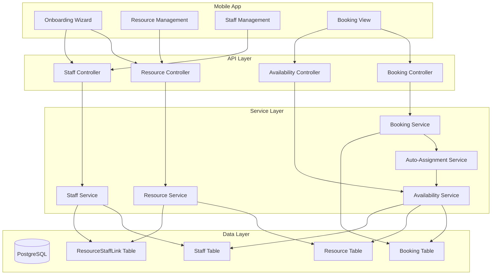

# Design Document: Resource & Staff Booking System

## Overview

This design implements a comprehensive Resource and Staff Management system that enables salon owners to configure physical resources (chairs, beds, rooms) and staff members, with intelligent automatic allocation for bookings. The system ensures bookings are always assigned to available resources and staff, preventing double-bookings through per-resource availability checking and database transactions.

### Key Design Decisions

1. **Resource-Based Availability**: Instead of counting total overlapping bookings, we track which specific resource is booked at each time slot
2. **Optional Staff-Resource Linking**: Staff can be optionally linked to preferred resources, but the system falls back gracefully
3. **Load Balancing**: Auto-assignment prioritizes least-utilized resources and staff for even distribution
4. **Soft Deletes**: Resources and staff are deactivated rather than deleted to preserve booking history
5. **Transaction-Based Allocation**: Database transactions with row-level locking prevent race conditions

## Architecture



## Components and Interfaces

### 1. Resource Service

Manages physical bookable units (chairs, beds, rooms).

```typescript
interface ResourceService {
  // CRUD Operations
  create(businessId: string, data: CreateResourceInput): Promise<Resource>;
  createBulk(businessId: string, count: number, prefix?: string): Promise<Resource[]>;
  getById(id: string, businessId: string): Promise<Resource>;
  list(businessId: string, includeInactive?: boolean): Promise<ResourceWithStats[]>;
  update(id: string, businessId: string, data: UpdateResourceInput): Promise<Resource>;
  deactivate(id: string, businessId: string): Promise<Resource>;
  reactivate(id: string, businessId: string): Promise<Resource>;
  
  // Utilization
  getUtilization(id: string, from: Date, to: Date): Promise<UtilizationStats>;
}

interface CreateResourceInput {
  name?: string;        // Auto-generated if not provided
  description?: string;
  displayOrder?: number;
}

interface ResourceWithStats {
  id: string;
  name: string;
  description: string | null;
  isActive: boolean;
  displayOrder: number;
  utilizationPercent: number;  // 0-100
  activeBookingsCount: number;
}
```

### 2. Staff Service

Manages staff members who perform services.

```typescript
interface StaffService {
  // CRUD Operations
  create(businessId: string, data: CreateStaffInput): Promise<Staff>;
  getById(id: string, businessId: string): Promise<Staff>;
  list(businessId: string, includeInactive?: boolean): Promise<StaffWithStats[]>;
  update(id: string, businessId: string, data: UpdateStaffInput): Promise<Staff>;
  deactivate(id: string, businessId: string): Promise<Staff>;
  reactivate(id: string, businessId: string): Promise<Staff>;
  
  // Resource Linking
  linkToResource(staffId: string, resourceId: string): Promise<ResourceStaffLink>;
  unlinkFromResource(staffId: string, resourceId: string): Promise<void>;
  getLinkedResources(staffId: string): Promise<Resource[]>;
  
  // Utilization
  getUtilization(id: string, from: Date, to: Date): Promise<UtilizationStats>;
}

interface CreateStaffInput {
  name: string;
  phone?: string;
  linkedResourceIds?: string[];
}

interface StaffWithStats {
  id: string;
  name: string;
  phone: string | null;
  isActive: boolean;
  linkedResources: Resource[];
  utilizationPercent: number;
  activeBookingsCount: number;
}
```

### 3. Auto-Assignment Service

Handles intelligent allocation of resources and staff to bookings.

```typescript
interface AutoAssignmentService {
  // Find best available resource and staff for a time slot
  findBestAssignment(
    businessId: string,
    scheduledAt: Date,
    endAt: Date,
    preferences?: AssignmentPreferences
  ): Promise<AssignmentResult>;
  
  // Allocate with transaction lock
  allocateWithLock(
    businessId: string,
    bookingId: string,
    scheduledAt: Date,
    endAt: Date,
    preferences?: AssignmentPreferences
  ): Promise<AllocationResult>;
}

interface AssignmentPreferences {
  preferredResourceId?: string;
  preferredStaffId?: string;
  customerPreferredStaffId?: string;  // From customer history
}

interface AssignmentResult {
  success: boolean;
  resource?: Resource;
  staff?: Staff;
  reason?: string;
  alternatives?: AlternativeSlot[];
}

interface AllocationResult extends AssignmentResult {
  bookingId: string;
  lockedAt: Date;
}
```

### 4. Enhanced Availability Service

Extended to support per-resource availability checking.

```typescript
interface AvailabilityService {
  // Existing method (enhanced)
  checkAvailability(
    businessId: string,
    requestedStart: Date,
    requestedEnd: Date,
    excludeBookingId?: string
  ): Promise<AvailabilityResult>;
  
  // New: Per-resource availability
  getAvailableResources(
    businessId: string,
    requestedStart: Date,
    requestedEnd: Date
  ): Promise<AvailableResource[]>;
  
  // New: Per-staff availability
  getAvailableStaff(
    businessId: string,
    requestedStart: Date,
    requestedEnd: Date
  ): Promise<AvailableStaff[]>;
  
  // New: Combined availability with suggestions
  getAvailabilityWithSuggestions(
    businessId: string,
    requestedStart: Date,
    requestedEnd: Date
  ): Promise<AvailabilityWithSuggestions>;
  
  // New: Capacity calculation
  getEffectiveCapacity(businessId: string): Promise<CapacityInfo>;
}

interface AvailableResource {
  resource: Resource;
  utilizationPercent: number;
  isLinkedStaffAvailable: boolean;
}

interface AvailableStaff {
  staff: Staff;
  utilizationPercent: number;
  linkedResources: Resource[];
}

interface AvailabilityWithSuggestions {
  availableResources: AvailableResource[];
  availableStaff: AvailableStaff[];
  suggestedAssignment: {
    resource: Resource;
    staff: Staff;
    reason: string;  // "Lowest utilization" | "Linked pair available"
  } | null;
  effectiveCapacity: number;
  currentUtilization: number;
}

interface CapacityInfo {
  activeResources: number;
  activeStaff: number;
  effectiveCapacity: number;  // min(resources, staff)
  warning?: string;  // "Staff shortage" | "Resource shortage"
}
```

## Data Models

### Database Schema Changes

```prisma
// ============================================
// NEW MODELS
// ============================================

/// Physical bookable resource (chair, bed, room)
model Resource {
  id           String   @id @default(cuid())
  businessId   String
  name         String   @db.VarChar(100)
  description  String?  @db.VarChar(500)
  isActive     Boolean  @default(true)
  displayOrder Int      @default(0)
  createdAt    DateTime @default(now())
  updatedAt    DateTime @updatedAt

  business     Business            @relation(fields: [businessId], references: [id])
  bookings     Booking[]
  staffLinks   ResourceStaffLink[]

  @@unique([businessId, name])
  @@index([businessId, isActive])
}

/// Staff member who performs services
model Staff {
  id         String   @id @default(cuid())
  businessId String
  name       String   @db.VarChar(100)
  phone      String?  @db.VarChar(20)
  isActive   Boolean  @default(true)
  createdAt  DateTime @default(now())
  updatedAt  DateTime @updatedAt

  business      Business            @relation(fields: [businessId], references: [id])
  bookings      Booking[]
  resourceLinks ResourceStaffLink[]

  @@unique([businessId, name])
  @@index([businessId, isActive])
}

/// Junction table for optional staff-resource linking
model ResourceStaffLink {
  id         String   @id @default(cuid())
  resourceId String
  staffId    String
  isPrimary  Boolean  @default(false)  // Primary assignment for this staff
  createdAt  DateTime @default(now())

  resource Resource @relation(fields: [resourceId], references: [id], onDelete: Cascade)
  staff    Staff    @relation(fields: [staffId], references: [id], onDelete: Cascade)

  @@unique([resourceId, staffId])
}

// ============================================
// UPDATED MODELS
// ============================================

/// Business entity - add onboarding status
model Business {
  // ... existing fields ...
  
  onboardingCompleted Boolean @default(false)
  
  // New relations
  resources Resource[]
  staff     Staff[]
}

/// Booking - add resource and staff assignment
model Booking {
  // ... existing fields ...
  
  resourceId String?
  staffId    String?
  
  resource Resource? @relation(fields: [resourceId], references: [id])
  staff    Staff?    @relation(fields: [staffId], references: [id])
  
  @@index([resourceId, scheduledAt])
  @@index([staffId, scheduledAt])
}
```

### TypeScript Types

```typescript
// Resource types
interface Resource {
  id: string;
  businessId: string;
  name: string;
  description: string | null;
  isActive: boolean;
  displayOrder: number;
  createdAt: Date;
  updatedAt: Date;
}

// Staff types
interface Staff {
  id: string;
  businessId: string;
  name: string;
  phone: string | null;
  isActive: boolean;
  createdAt: Date;
  updatedAt: Date;
}

// Link types
interface ResourceStaffLink {
  id: string;
  resourceId: string;
  staffId: string;
  isPrimary: boolean;
  createdAt: Date;
}

// Enhanced Booking type
interface BookingWithAllocation extends Booking {
  resource: Resource | null;
  staff: Staff | null;
}

// Utilization stats
interface UtilizationStats {
  totalMinutes: number;
  bookedMinutes: number;
  utilizationPercent: number;
  bookingCount: number;
}
```


## Correctness Properties

*A property is a characteristic or behavior that should hold true across all valid executions of a system—essentially, a formal statement about what the system should do. Properties serve as the bridge between human-readable specifications and machine-verifiable correctness guarantees.*

### Property 1: Resource Name Uniqueness

*For any* business and any two resources within that business, if both resources have the same name, then they must be the same resource (same ID).

**Validates: Requirements 1.6**

### Property 2: Resource Auto-Naming

*For any* bulk resource creation request with count N and no explicit names, the system shall create exactly N resources with names following the pattern "{prefix} 1", "{prefix} 2", ..., "{prefix} N".

**Validates: Requirements 1.3**

### Property 3: Resource Deactivation Protection

*For any* resource with at least one active booking (PENDING or CONFIRMED status), attempting to deactivate that resource shall fail with an error.

**Validates: Requirements 1.5**

### Property 4: Staff Name Uniqueness

*For any* business and any two staff members within that business, if both staff have the same name, then they must be the same staff member (same ID).

**Validates: Requirements 2.5**

### Property 5: Staff Deactivation Protection

*For any* staff member with at least one active booking (PENDING or CONFIRMED status), attempting to deactivate that staff member shall fail with an error.

**Validates: Requirements 2.4**

### Property 6: Effective Capacity Calculation

*For any* business configuration, the effective capacity shall equal min(active_resources_count, active_staff_count).

**Validates: Requirements 3.1**

### Property 7: Zero Capacity Booking Prevention

*For any* business with effective capacity of zero, all booking creation attempts shall be rejected.

**Validates: Requirements 3.2**

### Property 8: Capacity Mismatch Warning

*For any* business where active_resources_count ≠ active_staff_count, the system shall return a warning indicating the mismatch.

**Validates: Requirements 3.3, 3.4**

### Property 9: Auto-Assignment Completeness

*For any* booking created without explicit resource/staff selection, if the booking succeeds, then both resourceId and staffId shall be non-null.

**Validates: Requirements 4.1**

### Property 10: Load Balancing Assignment

*For any* auto-assignment where multiple resources are available, the assigned resource shall be the one with the lowest utilization percentage among available resources.

**Validates: Requirements 4.2**

### Property 11: Linked Pair Preference

*For any* auto-assignment where a staff member is linked to a resource and both are available, the system shall assign them together.

**Validates: Requirements 4.3, 9.2**

### Property 12: Resource Unavailability Rejection

*For any* booking request where all resources are occupied during the requested time slot, the booking shall be rejected with a clear message.

**Validates: Requirements 4.4**

### Property 13: Staff Unavailability Rejection

*For any* booking request where all staff are occupied during the requested time slot, the booking shall be rejected with a clear message.

**Validates: Requirements 4.5**

### Property 14: No Double-Booking Resources

*For any* two confirmed bookings on the same resource, their time ranges shall not overlap. Formally: NOT (booking1.scheduledAt < booking2.endAt AND booking1.endAt > booking2.scheduledAt).

**Validates: Requirements 4.6**

### Property 15: No Double-Booking Staff

*For any* two confirmed bookings with the same staff member, their time ranges shall not overlap.

**Validates: Requirements 4.6**

### Property 16: Manual Selection Availability

*For any* manual booking creation with explicit resource/staff selection, if the selected resource or staff is not available for the requested time, the booking shall fail with an error suggesting alternatives.

**Validates: Requirements 5.4**

### Property 17: Booking Edit Allocation Change

*For any* existing booking, changing the assigned resource or staff shall succeed if and only if the new resource/staff is available for the booking's time slot.

**Validates: Requirements 5.5**

### Property 18: Bulk Resource Creation Count

*For any* bulk resource creation with count N, exactly N resources shall be created (no more, no less).

**Validates: Requirements 6.3**

### Property 19: Booking Display Includes Allocation

*For any* booking with assigned resource and staff, the booking response shall include the resource name and staff name.

**Validates: Requirements 7.1**

### Property 20: WhatsApp Confirmation Content

*For any* WhatsApp booking confirmation message, the message shall contain both the assigned resource name and staff name.

**Validates: Requirements 8.1, 8.2**

### Property 21: Customer Staff Preference

*For any* booking where the customer has a preferred staff member and that staff is available, the system shall assign that staff member.

**Validates: Requirements 8.3**

### Property 22: Many-to-Many Staff-Resource Linking

*For any* staff member and resource, a link can be created between them. Multiple staff can link to the same resource, and one staff can link to multiple resources.

**Validates: Requirements 9.3, 9.4**

### Property 23: Linked Resource Fallback

*For any* auto-assignment where a staff member's linked resource is unavailable, the system shall assign an available resource instead of failing.

**Validates: Requirements 9.5**

### Property 24: Availability Response Completeness

*For any* availability check, the response shall include all resources and staff that are not booked during the requested time slot.

**Validates: Requirements 10.1**

### Property 25: Availability Utilization Data

*For any* availability response, each available resource and staff shall include their utilization percentage.

**Validates: Requirements 10.2**

### Property 26: Multi-Slot Availability

*For any* availability check with multiple time slots, the response shall include availability data for each requested slot.

**Validates: Requirements 10.4**

## Error Handling

### Resource Errors

| Error Code | Condition | HTTP Status | Message |
|------------|-----------|-------------|---------|
| RESOURCE_NOT_FOUND | Resource ID doesn't exist | 404 | "Resource not found" |
| RESOURCE_NAME_EXISTS | Duplicate name in business | 409 | "Resource with this name already exists" |
| RESOURCE_HAS_BOOKINGS | Deactivate with active bookings | 409 | "Cannot deactivate resource with active bookings" |
| RESOURCE_INACTIVE | Booking to inactive resource | 400 | "Resource is not active" |

### Staff Errors

| Error Code | Condition | HTTP Status | Message |
|------------|-----------|-------------|---------|
| STAFF_NOT_FOUND | Staff ID doesn't exist | 404 | "Staff member not found" |
| STAFF_NAME_EXISTS | Duplicate name in business | 409 | "Staff member with this name already exists" |
| STAFF_HAS_BOOKINGS | Deactivate with active bookings | 409 | "Cannot deactivate staff with active bookings" |
| STAFF_INACTIVE | Booking to inactive staff | 400 | "Staff member is not active" |

### Capacity Errors

| Error Code | Condition | HTTP Status | Message |
|------------|-----------|-------------|---------|
| ZERO_CAPACITY | No active resources or staff | 400 | "Business has no capacity. Add resources and staff first." |
| NO_RESOURCES_AVAILABLE | All resources booked | 409 | "No resources available for this time slot" |
| NO_STAFF_AVAILABLE | All staff booked | 409 | "No staff available for this time slot" |

### Allocation Errors

| Error Code | Condition | HTTP Status | Message |
|------------|-----------|-------------|---------|
| ALLOCATION_CONFLICT | Race condition detected | 409 | "Slot was just booked. Please try again." |
| RESOURCE_ALREADY_BOOKED | Manual selection conflict | 409 | "Selected resource is not available" |
| STAFF_ALREADY_BOOKED | Manual selection conflict | 409 | "Selected staff is not available" |

## Testing Strategy

### Property-Based Testing

We will use **fast-check** for property-based testing in TypeScript. Each correctness property will be implemented as a property test with minimum 100 iterations.

**Test Configuration:**
```typescript
import fc from 'fast-check';

// Configure for 100+ iterations
const testConfig = { numRuns: 100 };
```

**Generator Strategy:**
- Generate random business configurations with varying resource/staff counts
- Generate random time slots ensuring valid date ranges
- Generate random booking sequences to test concurrency
- Generate random staff-resource link configurations

### Unit Tests

Unit tests will cover:
- Individual service method behavior
- Edge cases (empty inputs, boundary values)
- Error conditions and validation
- Database constraint enforcement

### Integration Tests

Integration tests will cover:
- End-to-end booking flow with allocation
- Onboarding wizard completion
- WhatsApp booking with confirmation message
- Concurrent booking race condition handling

### Test Organization

```
tests/
├── unit/
│   ├── resource.service.test.ts
│   ├── staff.service.test.ts
│   ├── auto-assignment.service.test.ts
│   └── availability.service.test.ts
├── property/
│   ├── resource.property.test.ts
│   ├── staff.property.test.ts
│   ├── capacity.property.test.ts
│   ├── allocation.property.test.ts
│   └── availability.property.test.ts
└── integration/
    ├── booking-flow.test.ts
    ├── onboarding.test.ts
    └── whatsapp-booking.test.ts
```

## API Endpoints

### Resource Endpoints

```
POST   /api/businesses/:businessId/resources           # Create resource
POST   /api/businesses/:businessId/resources/bulk      # Bulk create resources
GET    /api/businesses/:businessId/resources           # List resources
GET    /api/businesses/:businessId/resources/:id       # Get resource
PATCH  /api/businesses/:businessId/resources/:id       # Update resource
POST   /api/businesses/:businessId/resources/:id/deactivate
POST   /api/businesses/:businessId/resources/:id/reactivate
```

### Staff Endpoints

```
POST   /api/businesses/:businessId/staff               # Create staff
GET    /api/businesses/:businessId/staff               # List staff
GET    /api/businesses/:businessId/staff/:id           # Get staff
PATCH  /api/businesses/:businessId/staff/:id           # Update staff
POST   /api/businesses/:businessId/staff/:id/deactivate
POST   /api/businesses/:businessId/staff/:id/reactivate
POST   /api/businesses/:businessId/staff/:id/link-resource
DELETE /api/businesses/:businessId/staff/:id/link-resource/:resourceId
```

### Availability Endpoints

```
GET    /api/businesses/:businessId/availability        # Check availability
GET    /api/businesses/:businessId/capacity            # Get capacity info
```

### Enhanced Booking Endpoints

```
POST   /api/businesses/:businessId/bookings            # Create (with auto/manual allocation)
PATCH  /api/businesses/:businessId/bookings/:id/allocation  # Change allocation
```
