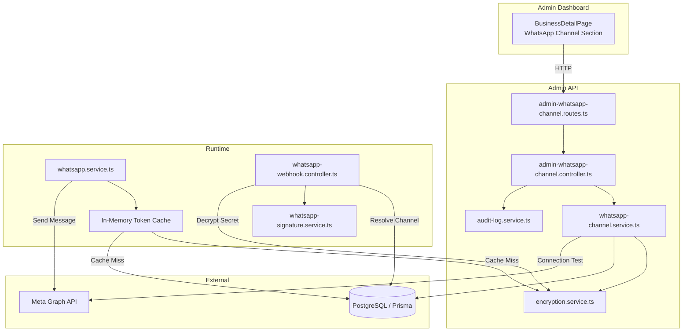
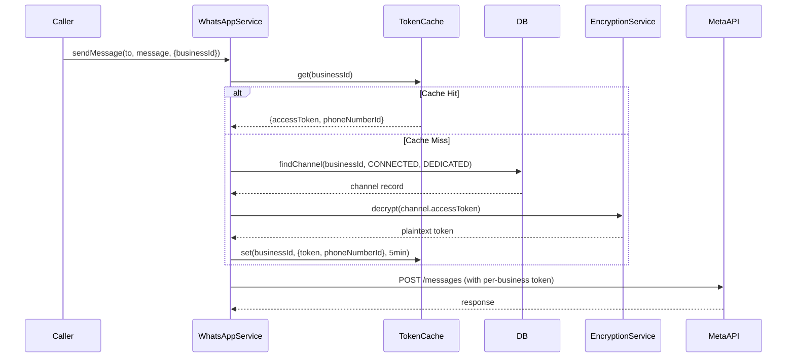

# Design Document: WhatsApp Channel Configuration

## Overview

This feature adds per-business WhatsApp channel configuration with dedicated Meta App credentials to the Salex platform. It enables businesses to connect their own WhatsApp number (via their own Meta App) instead of relying on the shared platform number with routing codes.

The system introduces:
- An **Encryption Service** for secure credential storage (AES-256-GCM)
- **Schema changes** adding encrypted `accessToken` and `appSecret` fields to `WhatsAppChannel`
- **Admin API endpoints** for CRUD, connection testing, and lifecycle management
- **Runtime outbound routing** that selects per-business or shared credentials based on channel mode
- **Per-business webhook signature verification** using the business's own App Secret
- **Admin Dashboard UI** for channel configuration within the Business Detail page
- **Audit logging** for all channel configuration operations

### Key Design Decisions

1. **Encryption at the service layer** rather than database-level encryption — gives us control over key rotation, masking, and error handling without DB vendor lock-in.
2. **In-memory token cache with 5-min TTL** — avoids repeated decryption on every message send while keeping the window for stale credentials small.
3. **Upsert pattern for PUT endpoint** — simplifies the API surface (single endpoint for create and update) since a business can only have one channel.
4. **Credential retention on disconnect** — allows reconnection without re-entering credentials, reducing admin friction.
5. **Fallback to shared credentials on decryption failure** — ensures message delivery isn't blocked by credential corruption.

## Architecture



### Request Flow: Outbound Message



## Components and Interfaces

### 1. Encryption Service (`apps/api/src/services/encryption.service.ts`)

```typescript
interface EncryptionService {
  encrypt(plaintext: string): string;   // Returns base64-encoded IV:ciphertext:authTag
  decrypt(ciphertext: string): string;  // Accepts base64-encoded format, returns plaintext
}
```

- Uses `crypto.createCipheriv('aes-256-gcm', key, iv)` from Node.js `crypto` module
- Encryption key sourced from `CHANNEL_ENCRYPTION_KEY` env var (32-byte hex string)
- Output format: `base64(iv):base64(ciphertext):base64(authTag)`
- Random 12-byte IV generated per encryption operation
- Throws `EncryptionError` on decryption failure (corrupted data, wrong key)

### 2. WhatsApp Channel Service (`apps/api/src/services/whatsapp-channel.service.ts`)

```typescript
interface WhatsAppChannelService {
  getChannel(businessId: string): Promise<ChannelResponse | null>;
  upsertChannel(businessId: string, input: UpsertChannelInput): Promise<ChannelResponse>;
  testConnection(businessId: string): Promise<ConnectionTestResult>;
  connect(businessId: string): Promise<ChannelResponse>;
  disconnect(businessId: string): Promise<ChannelResponse>;
  getCredentials(businessId: string): Promise<DecryptedCredentials | null>;
}

interface UpsertChannelInput {
  phoneNumberId: string;
  displayPhoneNumber: string;
  wabaId: string;
  accessToken: string;  // plaintext, will be encrypted before storage
  appSecret: string;    // plaintext, will be encrypted before storage
}

interface ChannelResponse {
  id: string;
  businessId: string;
  mode: 'SHARED' | 'DEDICATED';
  status: 'PENDING' | 'CONNECTED' | 'DISABLED' | 'FAILED';
  displayPhoneNumber: string;
  phoneNumberId: string;
  wabaId: string | null;
  maskedAccessToken: string | null;  // "****...abcd"
  maskedAppSecret: string | null;    // "****...wxyz"
  qualityRating: string | null;
  messagingLimit: string | null;
  lastInboundAt: string | null;
  lastOutboundAt: string | null;
}

interface ConnectionTestResult {
  success: boolean;
  phoneNumberDisplayName?: string;
  error?: string;
  errorType?: 'INVALID_CREDENTIALS' | 'CONNECTIVITY' | 'TIMEOUT' | 'UNKNOWN';
}

interface DecryptedCredentials {
  accessToken: string;
  appSecret: string;
  phoneNumberId: string;
}
```

### 3. Admin WhatsApp Channel Controller (`apps/api/src/controllers/admin-whatsapp-channel.controller.ts`)

Endpoints:
| Method | Path | Description |
|--------|------|-------------|
| GET | `/v1/admin/businesses/:businessId/whatsapp-channel` | Get channel config |
| PUT | `/v1/admin/businesses/:businessId/whatsapp-channel` | Create/update channel |
| POST | `/v1/admin/businesses/:businessId/whatsapp-channel/test` | Test connection |
| POST | `/v1/admin/businesses/:businessId/whatsapp-channel/connect` | Activate channel |
| POST | `/v1/admin/businesses/:businessId/whatsapp-channel/disconnect` | Deactivate channel |

All endpoints require `adminAuthMiddleware` + `requireAdminRole('ADMIN')`.

### 4. Token Cache (`apps/api/src/services/token-cache.service.ts`)

```typescript
interface TokenCacheEntry {
  accessToken: string;
  phoneNumberId: string;
  expiresAt: number;  // Date.now() + 5 * 60 * 1000
}

interface TokenCache {
  get(businessId: string): TokenCacheEntry | null;
  set(businessId: string, entry: Omit<TokenCacheEntry, 'expiresAt'>): void;
  invalidate(businessId: string): void;
  clear(): void;
}
```

- Simple `Map<string, TokenCacheEntry>` with TTL check on `get()`
- `invalidate()` called on channel disconnect/update to prevent stale tokens
- No external dependencies (no Redis needed at current scale)

### 5. Updated WhatsApp Service (`apps/api/src/services/whatsapp.service.ts`)

The existing `sendMessage` method gains a `businessId` option:

```typescript
async sendMessage(
  to: string,
  message: InteractiveMessage,
  options?: { phoneNumberId?: string; businessId?: string }
): Promise<MetaSendMessageResponse>
```

When `businessId` is provided:
1. Check token cache for business
2. On cache miss: query `WhatsAppChannel` where `businessId` + `mode=DEDICATED` + `status=CONNECTED`
3. If found: decrypt `accessToken`, cache it, use per-business credentials
4. If not found or decryption fails: fall back to platform shared credentials

### 6. Updated Webhook Controller (`apps/api/src/controllers/whatsapp-webhook.controller.ts`)

The `receive` method is updated to:
1. Parse `phone_number_id` from the webhook payload (already done)
2. Look up `WhatsAppChannel` by `phoneNumberId` (already done)
3. **New**: If channel is `DEDICATED` + `CONNECTED`, decrypt `appSecret` and use it for signature verification
4. **New**: If no channel found or channel is `SHARED`, use platform `whatsappAppSecret` from config
5. Verify signature using the resolved secret

### 7. Admin Dashboard Component (`apps/admin-dashboard/src/components/business/WhatsAppChannelConfig.tsx`)

A new component rendered within the existing `whatsapp` tab of `BusinessDetailPage`. States:

| Channel State | UI Display |
|---------------|-----------|
| No channel / SHARED | "Shared (via routing code)" + "Configure Dedicated Channel" button |
| PENDING | Config form (read-only) + "Test Connection" button + Webhook URL |
| CONNECTED | Health info + "Disconnect" button + Webhook URL |
| DISABLED | "Reconnect" option + stored config summary |
| FAILED | Error indicator + "Reconnect" option |

## Data Models

### Schema Changes (Prisma)

Add two encrypted fields to the existing `WhatsAppChannel` model:

```prisma
model WhatsAppChannel {
  id                 String    @id @default(cuid())
  businessId         String?   @unique
  mode               String    // "SHARED" | "DEDICATED"
  displayPhoneNumber String
  phoneNumberId      String    @unique
  wabaId             String?
  status             String    @default("PENDING")
  qualityRating      String?
  messagingLimit     String?
  lastInboundAt      DateTime?
  lastOutboundAt     DateTime?
  lastHealthCheckAt  DateTime?
  
  // NEW: Encrypted credential fields
  accessToken        String?   // AES-256-GCM encrypted, base64 encoded
  appSecret          String?   // AES-256-GCM encrypted, base64 encoded
  lastTestedAt       DateTime? // Timestamp of last successful connection test
  
  createdAt          DateTime  @default(now())
  updatedAt          DateTime  @updatedAt

  business Business? @relation(fields: [businessId], references: [id])

  @@index([businessId])
  @@index([phoneNumberId])
}
```

### Environment Configuration

New env var added to `apps/api/.env`:

```
CHANNEL_ENCRYPTION_KEY=<64-char-hex-string>  # 32 bytes for AES-256
```

Added to config schema:

```typescript
channelEncryptionKey: z.string().length(64, 'CHANNEL_ENCRYPTION_KEY must be 64 hex characters (32 bytes)')
```

## Correctness Properties

*A property is a characteristic or behavior that should hold true across all valid executions of a system — essentially, a formal statement about what the system should do. Properties serve as the bridge between human-readable specifications and machine-verifiable correctness guarantees.*

### Property 1: Encryption Round-Trip

*For any* valid plaintext string (representing an access token or app secret), encrypting it with the Encryption Service and then decrypting the result SHALL produce the original plaintext string.

**Validates: Requirements 1.1**

### Property 2: Credential Masking

*For any* string of length N where N >= 4, the masking function SHALL produce a string where only the last 4 characters match the original and all preceding characters are replaced with asterisks. For strings where N < 4, the entire string SHALL be replaced with asterisks.

**Validates: Requirements 1.2, 1.3**

### Property 3: Outbound Credential Routing

*For any* business and outbound message, the WhatsApp Service SHALL use the business's per-business Access Token and Phone Number ID if and only if the business has a WhatsApp Channel with mode=DEDICATED and status=CONNECTED. In all other cases (no channel, SHARED mode, non-CONNECTED status), the platform shared credentials SHALL be used.

**Validates: Requirements 4.1, 4.2**

### Property 4: Token Cache TTL

*For any* business with a connected dedicated channel, sending multiple messages within a 5-minute window SHALL result in exactly one decryption operation. After the 5-minute TTL expires, the next message send SHALL trigger a new decryption operation.

**Validates: Requirements 4.4**

### Property 5: Webhook Signature Secret Routing

*For any* inbound webhook payload, the Webhook Controller SHALL use the business's decrypted App Secret for signature verification if and only if the payload's Phone Number ID maps to a WhatsApp Channel with mode=DEDICATED and status=CONNECTED. In all other cases (no channel found, SHARED mode, non-CONNECTED status), the platform-level App Secret SHALL be used.

**Validates: Requirements 5.1, 5.2**

### Property 6: Credential Log Sanitization

*For any* API request or operation involving Access Token or App Secret values, the system's log output SHALL never contain the plaintext credential values. Any credential field in logged request bodies SHALL appear as "[REDACTED]".

**Validates: Requirements 8.1, 8.4**

### Property 7: Audit Log Completeness

*For any* channel mutation operation (create, update, connect, disconnect), the system SHALL create an audit log entry containing the admin ID, business ID, action name, and timestamp.

**Validates: Requirements 8.2**

## Error Handling

| Scenario | Behavior | HTTP Status |
|----------|----------|-------------|
| Decryption failure (corrupted credential) | Return error "Credential corruption detected", do not expose raw value | 500 |
| Decryption failure at send time | Log error, fall back to shared credentials, send message | N/A (internal) |
| Phone Number ID conflict (already assigned) | Return conflict error with existing business reference | 409 |
| Connection test — invalid credentials | Return `{ success: false, errorType: 'INVALID_CREDENTIALS' }` | 200 |
| Connection test — network timeout | Return `{ success: false, errorType: 'TIMEOUT' }` | 200 |
| Connection test — Meta API unreachable | Return `{ success: false, errorType: 'CONNECTIVITY' }` | 200 |
| Connect without prior successful test | Return error "Connection test required before activation" | 400 |
| Connect on non-PENDING/DISABLED/FAILED channel | Return error "Channel cannot be connected from current state" | 400 |
| Missing `CHANNEL_ENCRYPTION_KEY` env var | Fail at startup with config validation error | N/A |
| Webhook signature failure (dedicated channel) | Reject with 401, log with businessId | 401 |
| Business not found | Return 404 | 404 |
| Unauthenticated request | Return 401 | 401 |

### Graceful Degradation

- If a dedicated channel's token cannot be decrypted at runtime, the system falls back to shared credentials and logs a warning. This ensures message delivery is not blocked.
- If the token cache is cleared (e.g., server restart), the system simply decrypts on next use and re-populates the cache.
- If a dedicated channel enters FAILED state due to repeated send failures, the system automatically falls back to shared credentials for that business.

## Testing Strategy

### Property-Based Tests (fast-check)

Property-based testing is appropriate for this feature because:
- The encryption service has clear round-trip behavior (encrypt/decrypt)
- The masking function is a pure function with universal behavior across all inputs
- Credential routing is a deterministic decision based on channel state
- Cache TTL behavior is verifiable across time windows

**Library**: `fast-check` (already available in the Node.js ecosystem, compatible with Vitest)
**Minimum iterations**: 100 per property test
**Tag format**: `Feature: whatsapp-channel-config, Property {N}: {description}`

Each correctness property maps to a single property-based test:
1. Encryption round-trip → Generate random strings, verify `decrypt(encrypt(x)) === x`
2. Credential masking → Generate random strings, verify masking rules
3. Outbound routing → Generate channel configurations, verify correct credential selection
4. Cache TTL → Simulate time progression, verify decrypt call count
5. Webhook secret routing → Generate channel states, verify correct secret selection
6. Log sanitization → Generate requests with credentials, verify log output
7. Audit completeness → Generate mutation operations, verify audit entries

### Unit Tests (Vitest)

- Encryption service: specific examples (empty string, unicode, very long strings), error cases (corrupted ciphertext, wrong key)
- Channel service: CRUD operations, state transitions, conflict detection
- Controller: request validation, response shaping, error responses
- Token cache: expiry behavior, invalidation, concurrent access
- Webhook controller: signature verification with known test vectors

### Integration Tests

- Full API flow: create channel → test connection → connect → send message → disconnect
- Webhook flow: receive payload → resolve channel → verify signature → process message
- Admin auth: verify all endpoints reject unauthenticated requests

### UI Tests (React Testing Library)

- Component renders correct state for each channel status
- Form validation (required fields)
- API call integration (mock responses)
- Copy-to-clipboard for webhook URL
