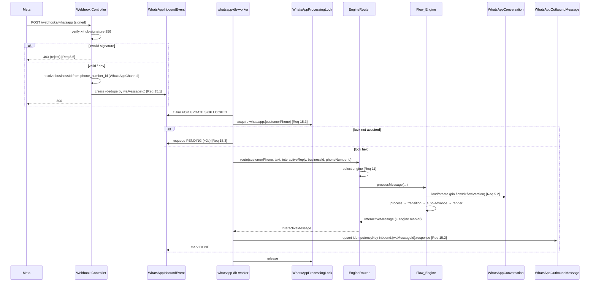
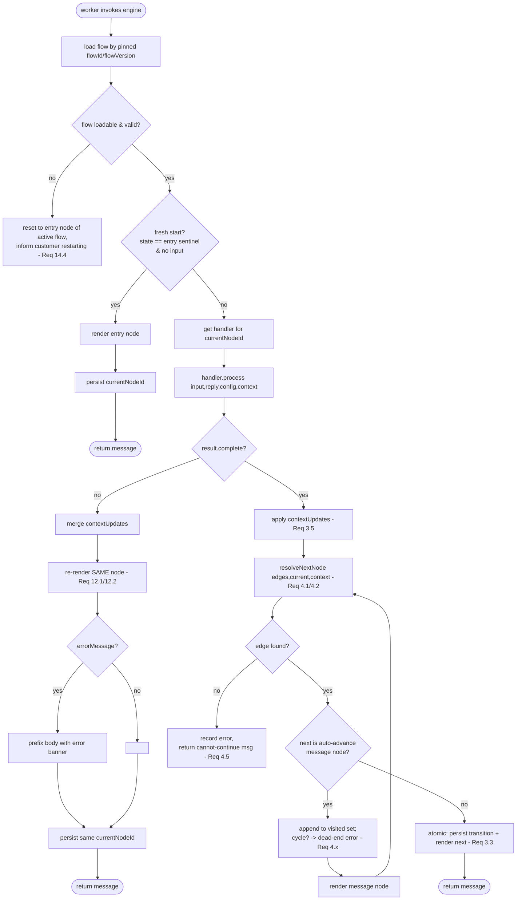

# Design Document

## Overview

This design migrates Salex's hardcoded WhatsApp booking state machine (`apps/api/src/services/conversation.service.ts`) to a dynamic, database-driven, node-based **Flow_Engine**. Each business owns a versioned **Flow_Definition** (a JSON graph of typed nodes and conditional edges) that is executed at runtime using a two-phase render/process lifecycle. A built-in **Default_Flow** reproduces the current legacy booking path so existing businesses see no behavioral change until they customize.

The migration follows a Strangler Fig pattern. The new engine slots into the *existing* durable pipeline as a peer/replacement of `conversationService.processMessage`:

```
webhook controller → WhatsAppInboundEvent (durable inbound queue)
  → whatsapp-db-worker (claim FOR UPDATE SKIP LOCKED, per-customer WhatsAppProcessingLock)
    → EngineRouter selects Flow_Engine | Legacy_Router
      → returns InteractiveMessage
    → idempotent upsert into WhatsAppOutboundMessage (outbox)
  → outbound tick → whatsappService.sendMessage(to, msg, { phoneNumberId })
```

The engine preserves every property the current pipeline depends on: the `InteractiveMessage` interface (`text` | `button` | `list`) so `whatsappService.toMetaPayload` and the outbox keep working unchanged; dedupe by `waMessageId`; the per-customer processing lock; and the idempotent outbound upsert keyed by `inbound:{waMessageId}:response`.

This design is grounded in the **actual codebase**, not only `docs/wb.md`. Where `wb.md` and the real code disagree, this document follows the real code and calls out the correction inline under "⚠️ Correction vs wb.md" notes. The most important corrections are:

1. `WhatsAppFlow` is **not** `businessId @unique` (that would forbid version history required by Req 1.2). It is one row per version, keyed `@@unique([businessId, version])`, with single-active enforcement.
2. `WhatsAppConversation` already uses `cuid`, already has `state @default("GREETING")`, `contextData Json`, an optimistic-lock `version Int`, `lockedAt/lockedBy`, `lastMessageAt`, and `@@unique([customerPhone, businessId])`. We add `flowId String?` and `flowVersion Int?` (pinned flow version) **without touching** the `version` optimistic-lock counter. The pinned flow version is a separate concept from the row's `version`.
3. `WhatsAppChannel` already exists (`mode "SHARED"|"DEDICATED"`, `phoneNumberId @unique`, `businessId? @unique`) and the webhook controller already resolves `businessId` from `phoneNumberId`. We build on this; we do not create it from scratch.

### Goals

- Replace the switch-case state machine with a graph runner that loads flow definitions per business.
- Preserve byte-for-byte parity for businesses on the Default_Flow (Req 9).
- Collapse availability query count from ~200-350 to a bounded handful per interaction while preserving the exact bookable determination (Req 6).
- Add a visual Flow_Editor (React Flow) with authenticated, tenant-isolated CRUD + versioning (Req 10, Req 16).
- Keep the durable queue, per-customer lock, dedupe, idempotent outbox, identity records, audit trail, and 24h timeout intact (Req 13, Req 14, Req 15).

### Non-Goals

- Replacing the Meta send transport (`whatsappService`) or the worker loop (`whatsapp-db-worker.service.ts`).
- Changing the `Booking`/`BookingIntent`/`Resource`/`Staff` data model or the auto-assignment algorithm.
- Building a real-time multiplayer editor; the editor saves discrete versions.

## Architecture

### High-Level Component Diagram

```mermaid
graph TB
    subgraph Meta["Meta WhatsApp Cloud API"]
        WA[Customer WhatsApp]
    end

    subgraph Webhook["Webhook Gateway (existing controller)"]
        VERIFY[GET verify - verify token]
        RECV["POST receive - signature verify"]
        RESOLVE["resolve businessId from phone_number_id\nvia WhatsAppChannel"]
    end

    subgraph Queue["Durable Pipeline (existing, unchanged)"]
        INBOX[(WhatsAppInboundEvent)]
        WORKER[whatsapp-db-worker.service.ts]
        LOCK[(WhatsAppProcessingLock)]
        OUTBOX[(WhatsAppOutboundMessage)]
    end

    subgraph Selection["Engine Selection (new)"]
        ROUTER[EngineRouter / engine-router.service.ts]
        FLAG["whatsappSettings flag on Business\n+ active WhatsAppFlow check\n+ global cutover"]
    end

    subgraph Engines["Conversation Engines"]
        FLOW[Flow_Engine / flow-engine.service.ts]
        LEGACY[Legacy_Router / conversation.service.ts]
    end

    subgraph FlowInternals["Flow_Engine internals (new)"]
        LOADER[FlowLoader + version pinning\nflow.service.ts]
        HANDLERS[NodeHandler map\nmessage/question/service_picker/\nstaff_picker/time_picker/confirmation/booking]
        TPL[TemplateResolver]
        DEFAULT[(DEFAULT_FLOW constant)]
    end

    subgraph Services["Existing Services (reused)"]
        AVAIL[AvailabilityService\n+ getBulkAvailabilityData (new)]
        BOOK[bookingService.create]
        SEND[whatsappService.sendMessage]
    end

    subgraph DB["Postgres (Supabase)"]
        FLOWTBL[(WhatsAppFlow - versioned)]
        CONV[(WhatsAppConversation\n+flowId +flowVersion)]
        INTENT[(BookingIntent)]
        BIZ[(Business / Service / Resource / Staff / Booking)]
    end

    WA --> RECV --> RESOLVE --> INBOX
    VERIFY -. token .-> WA
    WORKER -->|claim SKIP LOCKED| INBOX
    WORKER --> LOCK
    WORKER --> ROUTER
    ROUTER --> FLAG
    ROUTER -->|Flow_Engine selected| FLOW
    ROUTER -->|Legacy selected / fallback| LEGACY
    FLOW --> LOADER --> FLOWTBL
    FLOW --> HANDLERS --> TPL
    LOADER --> DEFAULT
    HANDLERS --> AVAIL --> BIZ
    HANDLERS --> BOOK --> BIZ
    HANDLERS --> INTENT
    FLOW --> CONV
    LEGACY --> CONV
    FLOW -->|InteractiveMessage| WORKER
    LEGACY -->|InteractiveMessage| WORKER
    WORKER -->|idempotent upsert| OUTBOX
    OUTBOX --> SEND --> WA
```

The Flow_Engine and Legacy_Router are **peers** behind the `EngineRouter`. Both return the same `InteractiveMessage` shape, so the worker's outbox upsert and the Meta transport are agnostic to which engine produced the message.

### Inbound Message Sequence



⚠️ **Correction vs wb.md §6.A:** `wb.md` shows the *controller* calling `flowEngine.processMessage` / `legacyRouter.processMessage` directly. In the real system the controller only stores the inbound event; engine invocation happens inside `whatsapp-db-worker.service.ts` after the lock is acquired. The `EngineRouter` therefore lives in the worker path, not the controller. The controller keeps its current single job: signature-verify, resolve business, store event.

### Two-Phase Node Execution Loop



The render-after-transition rule (Req 3.4) and atomicity (Req 3.3) are enforced by performing the conversation state write and capturing the rendered message inside a single logical operation: the persisted `currentNodeId` always equals the node whose `render` output is returned. If render throws, the transition is rolled back and the inbound event is retried by the worker (no partial advance is observable).

### Where new pieces sit relative to existing services

| Component | Location | New/Existing |
| :-- | :-- | :-- |
| Webhook controller | `apps/api/src/controllers/whatsapp-webhook.controller.ts` | Existing — add unmatched `phone_number_id` observability log (Req 7.3, 17.3) |
| Durable worker | `apps/api/src/services/whatsapp-db-worker.service.ts` | Existing — swap direct `conversationService.processMessage` call for `engineRouter.route(...)` |
| EngineRouter | `apps/api/src/services/engine-router.service.ts` | **New** |
| Flow_Engine | `apps/api/src/services/flow-engine.service.ts` | **New** |
| Flow persistence/loader | `apps/api/src/services/flow.service.ts` | **New** |
| Node handlers | `apps/api/src/services/flow-handlers/*.ts` | **New** |
| TemplateResolver | `apps/api/src/services/flow-handlers/template-resolver.ts` | **New** |
| DEFAULT_FLOW constant | `apps/api/src/services/flow-engine/default-flow.ts` | **New** |
| Availability bulk method | `apps/api/src/services/availability.service.ts` | Existing — add `getBulkAvailabilityData` + in-memory filter helper |
| Legacy_Router | `apps/api/src/services/conversation.service.ts` | Existing — retained behind router during migration |
| Flow types + Zod | `packages/shared-types/src/types/flow.ts`, `packages/shared-types/src/schemas/flow.schema.ts` | **New** |
| Conversation context schema | `packages/shared-types/src/schemas/conversation.schema.ts` | Existing — evolve (see Data Models) |
| Flow management API | `apps/api/src/routes/flow.routes.ts`, `apps/api/src/controllers/flow.controller.ts` | **New** |
| Flow Editor UI | `apps/admin-dashboard/src/pages/FlowEditorPage.tsx` + `src/components/flow/*` | **New** |

## Components and Interfaces

### Shared flow types — `packages/shared-types/src/types/flow.ts`

These graph types are placed in `shared-types` so both the API engine and the admin-dashboard editor consume identical definitions.

```typescript
export type NodeType =
  | 'message'         // Static text; auto-advances (no input)
  | 'question'        // Free-text / choice question; waits for reply
  | 'service_picker'  // Lists active services; waits for choice
  | 'staff_picker'    // Lists available staff; waits for choice
  | 'time_picker'     // Lists bookable slots (bulk availability); waits for choice
  | 'confirmation'    // Confirm/cancel buttons; waits for reply
  | 'booking';        // Finalizes booking via bookingService; terminal

// Operators per Req 2.4
export type EdgeOperator = 'eq' | 'neq' | 'contains' | 'gt' | 'lt';

export interface EdgeCondition {
  field: string;            // dot-path into Context_Data, e.g. "responses.confirm"
  operator: EdgeOperator;
  value: string | number | boolean;
}

export interface FlowEdge {
  id: string;
  from: string;             // source node id
  to: string;               // destination node id
  condition?: EdgeCondition; // absent => the single fallback edge for `from` (Req 2.5/2.6)
}

export interface FlowNode {
  id: string;
  type: NodeType;
  // Per-type configuration (message text, list header/footer, prompt copy,
  // validation rules, terminology key, etc.). Validated per-type by Zod.
  config: Record<string, unknown>;
}

export interface FlowDefinition {
  entryNodeId: string;      // Req 2.2 — exactly one
  nodes: FlowNode[];
  edges: FlowEdge[];
}

// Persisted flow record (mirrors WhatsAppFlow row, definition = FlowDefinition)
export interface FlowRecord {
  id: string;
  businessId: string;
  name: string;
  description: string | null;
  version: number;
  isActive: boolean;
  entryNodeId: string;
  definition: FlowDefinition;
  createdBy: string | null;
  createdAt: string;
  updatedAt: string;
}
```

### Node lifecycle — `apps/api/src/services/flow-handlers/types.ts`

```typescript
import type { InteractiveMessage } from '../conversation.service';

// Context accumulated across the conversation (see conversation.schema evolution).
export type FlowContext = Record<string, unknown>;

export interface NodeResult {
  complete: boolean;                  // Req 3.2 — did the node finish?
  contextUpdates?: Record<string, unknown>; // Req 3.5 — merged before transition
  errorMessage?: string;              // Req 12.1 — banner text on validation failure
  // Optional terminal signal for booking node so the engine marks run complete (Req 14.2)
  terminal?: boolean;
}

export interface NodeRenderArgs {
  config: Record<string, unknown>;
  context: FlowContext;
  businessId: string;
}

export interface NodeProcessArgs {
  incomingMessage: string;
  interactiveReply?: { type: string; id: string; title: string };
  config: Record<string, unknown>;
  context: FlowContext;
  businessId: string;
}

export interface NodeHandler {
  type: NodeType;
  // Phase 1 — produce the outbound WhatsApp message (Req 3.1)
  render(args: NodeRenderArgs): Promise<InteractiveMessage>;
  // Phase 2 — interpret the customer's reply (Req 3.2). Omitted for pure
  // auto-advance message nodes, which only render.
  process?(args: NodeProcessArgs): Promise<NodeResult>;
  // True for nodes the engine auto-advances past (Req 4.3). `message` => true.
  autoAdvance: boolean;
}

export type NodeHandlerMap = Record<NodeType, NodeHandler>;
```

⚠️ **Correction vs wb.md §5.B:** the handler interface keeps the same render/process split, but `InteractiveMessage` is imported from the **existing** `conversation.service.ts` (or, preferably during refactor, relocated to `shared-types`) rather than redefined. This guarantees `whatsappService.toMetaPayload` keeps accepting handler output unchanged.

### FlowEngine public surface — `apps/api/src/services/flow-engine.service.ts`

```typescript
export interface FlowEngineResult {
  conversationId: string;
  currentNodeId: string;
  message: InteractiveMessage;     // same shape the outbox already persists
  context: FlowContext;
  engine: 'flow';                  // engine marker (Req 11.5)
  complete: boolean;               // run finished (Req 14.2)
}

export interface FlowEngine {
  /**
   * Drop-in peer of conversationService.processMessage. Same positional
   * signature so the worker can call either through the EngineRouter.
   */
  processMessage(
    customerPhone: string,
    messageText: string,
    interactiveReply: { type: string; id: string; title: string } | undefined,
    businessId: string,                  // Flow_Engine requires a resolved business (Req 16.1)
  ): Promise<FlowEngineResult>;

  // Pure helper, unit/property tested in isolation (Req 4.1/4.2).
  resolveNextNode(
    edges: FlowEdge[],
    fromNodeId: string,
    context: FlowContext,
  ): string | null;                      // null => dead-end (Req 4.5)
}
```

`resolveNextNode` algorithm (Req 4.1, 4.2, 4.5, 2.6):
1. Collect edges whose `from === fromNodeId`, preserving definition order.
2. Evaluate each *conditional* edge in order; return the first whose condition matches `context`.
3. If none match, return the single edge with no `condition` (the fallback).
4. If neither exists, return `null` (dead-end).

Condition evaluation reads `condition.field` as a dot-path into `context`, then applies the operator: `eq`/`neq` strict (in)equality after string coercion; `contains` substring for strings / membership for arrays; `gt`/`lt` numeric comparison after `Number()` coercion (non-numeric => no match, never throws — keeps the function total).

### EngineRouter — `apps/api/src/services/engine-router.service.ts`

```typescript
export type EngineKind = 'flow' | 'legacy';

export interface RouteOutcome {
  conversationId: string;
  message: InteractiveMessage;
  engine: EngineKind;              // recorded for parity verification (Req 11.5)
}

export interface EngineRouter {
  route(input: {
    customerPhone: string;
    messageText: string;
    interactiveReply?: { type: string; id: string; title: string };
    businessId?: string;           // resolved by controller from phone_number_id
    phoneNumberId?: string;
  }): Promise<RouteOutcome>;

  // Pure decision function — unit/property tested (Req 11.1/11.2/11.3).
  selectEngine(input: {
    businessId?: string;
    globalCutover: boolean;
    businessFlagged: boolean;
    hasActiveCustomFlow: boolean;
  }): EngineKind;
}
```

`selectEngine` rules:
- `globalCutover === true` → `flow` for everyone; Flow_Engine uses Default_Flow where no custom flow exists (Req 11.3).
- else if `businessFlagged || hasActiveCustomFlow` → `flow` (Req 11.1).
- else → `legacy` (Req 11.2).
- If `businessId` is undefined (unmatched `phone_number_id`, no routing yet) → `legacy` (shared-number path, Req 7.3).

`route` wraps the selected engine in a try/catch. On a Flow_Engine error it logs and **falls back** to the Legacy_Router so every routable conversation reaches an engine (Req 11.4). The chosen-then-actual engine is returned in `engine` and logged (Req 17.3).

⚠️ **Correction vs wb.md §3:** `wb.md` puts the segmentation flag as a `whatsappSettings` JSON column on `Business`. We adopt that location (see Data Models) but the *decision logic* lives in `selectEngine`, and the global cutover is a platform-level config flag (env/config), not a per-business value, because Req 11.3 is a platform-admin action affecting all businesses.

### AvailabilityService bulk method — `apps/api/src/services/availability.service.ts`

```typescript
export interface BulkBookingRow {
  id: string;
  scheduledAt: Date;
  endAt: Date;
  resourceId: string | null;
  staffId: string | null;
}

export interface BulkAvailabilityData {
  effectiveCapacity: number;       // min(activeResources, activeStaff) (Req 6.3)
  bookings: BulkBookingRow[];       // PENDING|CONFIRMED overlapping [start,end)
  activeResourceCount: number;
  activeStaffCount: number;
}

export interface AvailabilityService {
  // One bounded set of queries for the whole search range (Req 6.1).
  getBulkAvailabilityData(
    businessId: string,
    start: Date,
    end: Date,
  ): Promise<BulkAvailabilityData>;

  // Pure, in-memory, no I/O. Used by the time_picker handler (Req 6.2).
  isSlotBookable(
    data: BulkAvailabilityData,
    slotStart: Date,
    slotEnd: Date,
  ): boolean;
}
```

`getBulkAvailabilityData` fetches, in parallel (4 queries, independent of slot count):
- active resource count + active staff count → `effectiveCapacity = min(...)`,
- all `PENDING|CONFIRMED` bookings with `scheduledAt < end AND endAt > start`, selecting `{ id, scheduledAt, endAt, resourceId, staffId }`.

`isSlotBookable(data, slotStart, slotEnd)`:
```
overlapping = data.bookings.filter(b => b.scheduledAt < slotEnd && b.endAt > slotStart)
return data.effectiveCapacity > 0 && overlapping.length < data.effectiveCapacity
```

This is the **capacity-count** formula from `availabilityService.checkAvailability` (overlap test `scheduledAt < end && endAt > start`, bookable iff `count < effectiveCapacity`). Per Req 6.4/6.5 this is the determination the bulk method must produce.

⚠️ **Parity nuance (Req 6.6) — must be addressed explicitly.** The *legacy time-slot loop* (`conversation.service.ts#generateAvailableTimeSlots`) does **not** call `checkAvailability`. It calls `getAvailabilityWithSuggestions`, whose `available` is:
```
available = availableResources.length > 0 && availableStaff.length > 0
```
where a resource/staff is "available" iff it has **no overlapping PENDING|CONFIRMED booking** (per-entity free). This is the count of *free resources* and *free staff*, which is **subtly different** from `overlappingCount < min(activeResources, activeStaff)`.

Example where they diverge: 2 resources, 2 staff (`effectiveCapacity = 2`), one existing booking that occupies resource R1 but has `staffId = null`. Overlap count = 1 < 2 → capacity formula says **bookable**. But free staff = 2 > 0 and free resources = 1 > 0 → suggestions formula also says **bookable** here. They diverge when, e.g., both staff are individually booked by overlapping bookings but `effectiveCapacity` (min) leaves headroom, or when bookings have null resource/staff. Because the two formulas are not identical in general, "parity" in Req 9.2/6.6 is defined precisely as:

> **Parity definition:** For the Default_Flow, the bulk `time_picker` MUST reproduce the determination that the **current production code path actually produces** — i.e., the legacy `generateAvailableTimeSlots` result, which is driven by `getAvailabilityWithSuggestions.available`. Therefore the Default_Flow's `time_picker` parity mode reproduces the **suggestions-based** "free resource AND free staff" determination in memory, *not* the bare capacity-count formula.

To satisfy both Req 6.5 (capacity-count) and Req 6.6/9.2 (parity with legacy), `getBulkAvailabilityData` returns enough data to compute **both**:
- `isSlotBookable` (capacity-count) — the canonical engine rule going forward, and
- `isSlotBookableLegacyParity(data, slotStart, slotEnd)` — reproduces `availableResources>0 && availableStaff>0` in memory using the bulk `bookings` rows (a resource is free iff no overlapping booking has that `resourceId`; same for staff; using `activeResourceCount`/`activeStaffCount` and the set of busy ids).

The Default_Flow `time_picker` uses `isSlotBookableLegacyParity` so migration is invisible (Req 9.2). Custom flows may opt into the simpler capacity-count rule. Both are pure in-memory functions tested against the legacy loop (see Testing Strategy / Properties 1–2). This divergence and the dual-function choice is the explicit resolution the requirements demand.

### Admin REST API — `apps/api/src/routes/flow.routes.ts` + `flow.controller.ts`

All routes are mounted under `/v1/flows`, require an authenticated owner session (`authMiddleware`, JWT with `role: 'merchant'`), and are tenant-scoped: the controller resolves the caller's business from `req.auth.userId` (owner → `Business.ownerId`) and **ignores any client-supplied businessId**, denying access to flows owned by another business (Req 16.3/16.5).

| Method | Path | Auth | Request | Response | Requirement |
| :-- | :-- | :-- | :-- | :-- | :-- |
| GET | `/v1/flows` | owner | — | `{ flows: FlowSummary[] }` (own business only) | 10.1, 10.5, 16.5 |
| GET | `/v1/flows/:id` | owner | — | `{ flow: FlowRecord }` (404 if not owner's) | 10.1, 16.2 |
| POST | `/v1/flows` | owner | `{ name, description?, definition }` | `{ flow: FlowRecord }` (version 1) | 10.1, 10.3 |
| PUT | `/v1/flows/:id` | owner | `{ name?, description?, definition }` | `{ flow: FlowRecord }` (**new version**, see below) | 10.3, 1.2 |
| POST | `/v1/flows/:id/activate` | owner | — | `{ flow: FlowRecord }` | 10.4, 1.3 |
| POST | `/v1/flows/:id/deactivate` | owner | — | `{ flow: FlowRecord }` | 10.4 |
| DELETE | `/v1/flows/:id` | owner | — | `204` (refuses if active) | 10.1 |
| GET | `/v1/flows/channel/verify-token` | owner | — | `{ verifyToken }` (from config) | 8.4 |

Validation: POST/PUT bodies are validated by `flowDefinitionSchema` (below). If `entryNodeId` or any edge endpoint references a missing node, the controller returns `400 INVALID_FLOW_REFERENCE` with the offending ids and does not persist (Req 10.6).

Versioning semantics (Req 1.2): "save" never mutates an existing version's `definition` in place. `POST` creates version 1; `PUT` inserts a **new** `WhatsAppFlow` row with `version = max(version for business) + 1`, retaining prior versions. `activate` flips `isActive` for the chosen version and clears it on the business's other versions in a transaction (single active flow per business).

```typescript
export interface FlowSummary {
  id: string; name: string; version: number; isActive: boolean; updatedAt: string;
}
```

### Zod schema additions — `packages/shared-types/src/schemas/flow.schema.ts`

```typescript
import { z } from 'zod';

export const edgeOperatorSchema = z.enum(['eq', 'neq', 'contains', 'gt', 'lt']);

export const edgeConditionSchema = z.object({
  field: z.string().min(1),
  operator: edgeOperatorSchema,
  value: z.union([z.string(), z.number(), z.boolean()]),
});

export const nodeTypeSchema = z.enum([
  'message', 'question', 'service_picker', 'staff_picker',
  'time_picker', 'confirmation', 'booking',
]);

export const flowNodeSchema = z.object({
  id: z.string().min(1),
  type: nodeTypeSchema,
  config: z.record(z.unknown()).default({}),
});

export const flowEdgeSchema = z.object({
  id: z.string().min(1),
  from: z.string().min(1),
  to: z.string().min(1),
  condition: edgeConditionSchema.optional(), // absent => fallback edge
});

export const flowDefinitionSchema = z
  .object({
    entryNodeId: z.string().min(1),
    nodes: z.array(flowNodeSchema).min(1),
    edges: z.array(flowEdgeSchema),
  })
  .superRefine((def, ctx) => {
    const ids = new Set(def.nodes.map((n) => n.id));
    if (!ids.has(def.entryNodeId)) {
      ctx.addIssue({ code: 'custom', message: `entryNodeId ${def.entryNodeId} not found`, path: ['entryNodeId'] });
    }
    for (const e of def.edges) {
      if (!ids.has(e.from)) ctx.addIssue({ code: 'custom', message: `edge ${e.id} from-node missing`, path: ['edges'] });
      if (!ids.has(e.to)) ctx.addIssue({ code: 'custom', message: `edge ${e.id} to-node missing`, path: ['edges'] });
    }
    // At most one fallback edge per source node (Req 2.6)
    const fallbackBySource = new Map<string, number>();
    for (const e of def.edges) {
      if (!e.condition) fallbackBySource.set(e.from, (fallbackBySource.get(e.from) ?? 0) + 1);
    }
    for (const [from, count] of fallbackBySource) {
      if (count > 1) ctx.addIssue({ code: 'custom', message: `node ${from} has ${count} fallback edges`, path: ['edges'] });
    }
  });

export const createFlowSchema = z.object({
  name: z.string().min(1).max(100),
  description: z.string().max(500).optional(),
  definition: flowDefinitionSchema,
});

export const updateFlowSchema = createFlowSchema.partial({ name: true, description: true });
```

### Conversation context schema evolution — `packages/shared-types/src/schemas/conversation.schema.ts`

The existing `conversationContextSchema` is a closed object that `conversation.service.ts` calls `.parse(...)` on extensively. The Flow_Engine needs arbitrary node-id-keyed responses and richer context while remaining backward compatible with existing rows and the legacy parser.

Approach (additive, non-breaking):
- Keep `conversationContextSchema` exactly as-is for the Legacy_Router (it still `.parse()`s the same five fields).
- Add a **superset**, permissive schema `flowContextSchema` that the Flow_Engine uses. It keeps the legacy fields (so a conversation can be read by either engine) and adds open-ended flow fields with `.passthrough()` so unknown keys survive round-trips:

```typescript
export const flowContextSchema = conversationContextSchema
  .extend({
    // dynamic per-node responses keyed by node id (Req 5.5)
    responses: z.record(z.unknown()).optional(),
    selectedStaffId: z.string().cuid().optional(),
    // engine bookkeeping
    flowRunId: z.string().optional(),
  })
  .passthrough();

export type FlowContextType = z.infer<typeof flowContextSchema>;
```

- `state` (the `currentNodeId`) can no longer be constrained by `conversationStateSchema` (the fixed enum). The DB column is already `String @default("GREETING")`, so **no migration is needed** for the column itself. We stop validating `state` against the enum in the Flow_Engine path; the engine treats `state` as an opaque node id. `"GREETING"` is retained as the **entry sentinel**: a conversation whose `state === "GREETING"` and that has no `flowId` is treated as "fresh" and is initialized by pinning the active/Default flow and rendering its entry node. This preserves backward compatibility for every pre-existing row (Req 15.6).

⚠️ **Correction vs wb.md:** `wb.md` implies `contextData` shape is freeform. In reality the legacy code enforces `conversationContextSchema`. The compatibility path above (legacy strict schema retained + permissive `flowContextSchema` superset + `state` left unvalidated in the engine path) is required so existing rows and the legacy `compactContext`/`updateState` calls keep working during the Strangler-Fig overlap.

## Data Models

### New model: `WhatsAppFlow` (versioned) — `packages/shared-types/prisma/schema.prisma`

⚠️ **Correction vs wb.md §3 (critical):** `wb.md` proposes `businessId String @unique`, which permits exactly one flow row per business and therefore **cannot** retain multiple versions (violates Req 1.2). We instead store **one row per version** and enforce uniqueness on the pair `[businessId, version]`, with single-active enforced at the application layer (and optionally a partial unique index).

```prisma
model WhatsAppFlow {
  id          String   @id @default(cuid())
  businessId  String
  business    Business @relation(fields: [businessId], references: [id], onDelete: Cascade)
  name        String
  description String?
  version     Int      @default(1)
  isActive    Boolean  @default(false)
  entryNodeId String
  definition  Json                       // FlowDefinition payload (see JSON shape below)
  createdBy   String?                     // owner userId who saved this version
  createdAt   DateTime @default(now())
  updatedAt   DateTime @updatedAt

  @@unique([businessId, version])         // retain history; no dup versions (Req 1.2)
  @@index([businessId, isActive])         // fast "active flow for business" lookup (Req 1.3)
}
```

Single-active rule (Req 1.3, 1.4): at most one `isActive = true` row per `businessId`. Enforced in the `activate` transaction (set target active, set all siblings inactive). A Postgres partial unique index (`CREATE UNIQUE INDEX ... ON "WhatsAppFlow"("businessId") WHERE "isActive"`) is added via a manual migration step to make the invariant DB-enforced. Resolution order for the engine: active custom flow → else `DEFAULT_FLOW` constant (no row needed; the Default_Flow is code, not data).

`Business` gets the back-relation:
```prisma
model Business {
  // ... existing fields unchanged ...
  whatsAppFlows   WhatsAppFlow[]
  // segmentation flag (Req 11.1) — see below
  whatsappSettings Json?            // { "flowEngineEnabled": boolean, ... }
}
```

### Changed model: `WhatsAppConversation` (additive only)

⚠️ **Correction vs wb.md:** `wb.md` re-declares the model with `id @default(cuid())` and `state @default("GREETING")` as if new. These already exist. The only changes are the two **new nullable** columns; everything else (including the optimistic-lock `version Int @default(0)`, `lockedAt/lockedBy`, `lastMessageAt`, `@@unique([customerPhone, businessId])`) stays exactly as-is.

```prisma
model WhatsAppConversation {
  id            String    @id @default(cuid())
  customerPhone String
  businessId    String?
  state         String    @default("GREETING")  // now the dynamic currentNodeId
  contextData   Json      @default("{}")
  version       Int       @default(0)            // OPTIMISTIC LOCK — unchanged, NOT the flow version
  lockedAt      DateTime?
  lockedBy      String?
  lastMessageAt DateTime  @default(now())
  createdAt     DateTime  @default(now())
  updatedAt     DateTime  @updatedAt

  // NEW — version pinning (Req 5.2/5.3)
  flowId      String?     // null => running DEFAULT_FLOW
  flowVersion Int?        // pinned version snapshot; immutable for the run

  customer Customer?         @relation(fields: [customerPhone], references: [phoneNumber])
  business Business?         @relation(fields: [businessId], references: [id])
  messages WhatsAppMessage[]

  @@unique([customerPhone, businessId])
  @@index([customerPhone])
  @@index([businessId])
}
```

- `state`: same column; semantics widen from "fixed enum" to "arbitrary node id". Default `"GREETING"` is the entry sentinel for fresh/legacy rows (backward compat — Req 15.6).
- `flowId` / `flowVersion`: written once when a run begins (Req 5.2). While in progress the engine loads exactly this `(flowId, flowVersion)` regardless of later activations (Req 5.3). For Default_Flow runs `flowId` is null and `flowVersion` records the Default_Flow's internal constant version (e.g. `0`) for observability.
- The optimistic-lock `version` continues to be `{ increment: 1 }`-ed on every `updateState`, untouched by this feature.

### Engine-handled marker (Req 11.5)

To verify parity we must record which engine handled each conversation. Two complementary mechanisms:
- **Per-message**: reuse the existing `WhatsAppMessage` audit row — add `engine` (`"flow" | "legacy"`) into its `content` JSON (no schema change), written by the worker when it stores the outbound audit.
- **Per-conversation (queryable)**: store the last-handling engine in `contextData.__engine` via `flowContextSchema.passthrough()` (no migration). This lets parity tooling diff legacy vs flow handling per conversation without a new column.

No new enum or column is strictly required for Req 11.5; if richer analytics are needed later, a `lastEngine String?` column can be added additively.

### `definition` JSON shape (example)

```json
{
  "entryNodeId": "greeting",
  "nodes": [
    { "id": "greeting", "type": "message",
      "config": { "text": "👋 Welcome to {{businessName}}!" } },
    { "id": "service_selection", "type": "service_picker",
      "config": { "headerTemplate": "📋 {{businessName}}",
                  "bodyTemplate": "Select a {{serviceTerm}} to book:",
                  "buttonTemplate": "View {{servicePluralTerm}}",
                  "emptyText": "😔 This business has no services available at the moment.\n\nPlease try again later." } },
    { "id": "time_selection", "type": "time_picker",
      "config": { "durationField": "totalDuration", "parityMode": "legacy",
                  "header": "⏰ Select Time", "noSlotsText": "No slots are available right now. Please try again later or contact the business directly." } },
    { "id": "confirmation", "type": "confirmation",
      "config": { "confirmId": "btn_confirm_booking", "cancelId": "btn_cancel_booking" } },
    { "id": "finalize", "type": "booking", "config": {} }
  ],
  "edges": [
    { "id": "e1", "from": "greeting", "to": "service_selection" },
    { "id": "e2", "from": "service_selection", "to": "time_selection" },
    { "id": "e3", "from": "time_selection", "to": "confirmation" },
    { "id": "e4", "from": "confirmation", "to": "finalize",
      "condition": { "field": "responses.confirmation", "operator": "eq", "value": "confirm" } },
    { "id": "e5", "from": "confirmation", "to": "service_selection" }
  ]
}
```

### Migration via Prisma (Supabase)

The repo uses Supabase Postgres; `apps/api` build runs `pnpm --filter @salex/shared-types build` then `tsc`, and Prisma is the migration tool (`DATABASE_URL` pooler for runtime, `DIRECT_URL` for migrations). Migration steps:
1. Add `WhatsAppFlow` model, `Business.whatsappSettings`, `Business.whatsAppFlows` relation, and `WhatsAppConversation.flowId/flowVersion` to `schema.prisma`.
2. Generate a migration (`prisma migrate dev` locally against `DIRECT_URL`; `prisma migrate deploy` in CI). `wb.md` mentions `prisma db push` — acceptable for the dev sandbox, but **`migrate deploy` is required for production** so history is tracked.
3. Add the partial unique index for single-active flow as a hand-written SQL step inside the migration.
4. All new columns are nullable / have defaults, so the migration is **non-destructive** and pre-existing conversation rows keep working untouched (Req 15.6).

Backward compatibility: existing conversations have `flowId = NULL`, `flowVersion = NULL`, `state` in the old enum set. On their next inbound message the engine treats a null-`flowId` row as a fresh run candidate; if `state` is a legacy enum value (e.g. `SERVICE_SELECTION`) and the conversation is mid-flight, the EngineRouter keeps such rows on the Legacy_Router until they complete or time out (24h), avoiding mid-conversation engine swaps. Only conversations that start after activation are pinned to the new engine (Req 5.4).

## Correctness Properties

*A property is a characteristic or behavior that should hold true across all valid executions of a system — essentially, a formal statement about what the system should do. Properties serve as the bridge between human-readable specifications and machine-verifiable correctness guarantees.*

The Flow_Engine has substantial pure logic (graph traversal, condition evaluation, availability filtering, idempotency, versioning) that is well suited to property-based testing. Each property below is universally quantified, names its inputs and invariant, and references the requirement it validates. They are derived from the prework analysis (redundant criteria were consolidated).

### Property 1: Availability parity with the legacy calculation

*For any* business configuration (counts of active resources and active staff), *any* set of `PENDING|CONFIRMED` bookings, and *any* candidate slot `[slotStart, slotEnd)`, the Default_Flow's in-memory `isSlotBookableLegacyParity(getBulkAvailabilityData(...), slotStart, slotEnd)` SHALL return the same bookable/unbookable result that the legacy slot-by-slot path (`getAvailabilityWithSuggestions(...).available`) returns for that same slot.

**Validates: Requirements 6.2, 6.6, 9.2**

### Property 2: Capacity invariant

*For any* effective capacity `c = min(activeResources, activeStaff)`, *any* set of bookings, and *any* candidate slot, `isSlotBookable` SHALL return true iff `c > 0` and the number of bookings overlapping the slot (where `booking.scheduledAt < slotEnd && booking.endAt > slotStart`) is strictly less than `c`.

**Validates: Requirements 6.3, 6.4, 6.5**

### Property 3: Transition determinism and totality

*For any* node and *any* Context_Data (already including the current node's context updates), `resolveNextNode` SHALL return the destination of the first conditional edge (in definition order) whose condition evaluates true; if no conditional edge matches it SHALL return the destination of the single fallback edge; and if neither exists it SHALL return `null` (the dead-end signal). The function SHALL be total — it never throws for any input, including malformed condition values.

**Validates: Requirements 2.5, 2.6, 3.5, 4.1, 4.2, 4.5**

### Property 4: Auto-advance termination

*For any* flow graph and starting node, the auto-advance loop SHALL terminate (never loop forever): it advances only through static message nodes, tracks visited message nodes, and SHALL halt either on the first node that requires input, on a terminal node, or by raising a dead-end error when it detects a cycle among message nodes or a dead-end.

**Validates: Requirements 4.3, 4.4**

### Property 5: Render-after-transition and atomicity

*For any* flow run step: (a) when the current node's process reports completion, the conversation's persisted `currentNodeId` after the step SHALL equal the id of the node whose rendered message is returned, and if rendering the next node fails the persisted `currentNodeId` SHALL remain the pre-step node (no partial advance); (b) when process reports a validation failure, the returned message SHALL be the current node re-rendered with the error banner prefixed, and the persisted `currentNodeId` SHALL remain unchanged.

**Validates: Requirements 3.1, 3.3, 3.4, 12.1, 12.2**

### Property 6: Version pinning

*For any* conversation that has started a run pinned to `(flowId, flowVersion)`, and *any* subsequent sequence of flow activations for that business, the engine SHALL continue to load and execute exactly `(flowId, flowVersion)` for that conversation; while *any* conversation that starts after an activation SHALL be pinned to the then-active version.

**Validates: Requirements 5.3, 5.4**

### Property 7: Idempotent booking and hold

*For any* booking confirmation submitted one or more times with the same idempotency key (same conversation, services, and requested time), the engine SHALL finalize at most one Booking and SHALL maintain at most one active Booking_Hold for that key.

**Validates: Requirements 13.1, 13.4**

### Property 8: Tenant isolation (no cross-tenant leakage)

*For any* flow, conversation, availability, or booking operation performed for a resolved business `B`, the engine SHALL only read or write data belonging to `B`; *for any* flow owned by business `A` and *any* request acting for business `B ≠ A`, the operation SHALL be denied (load/get returns not-found/denied and no mutation occurs).

**Validates: Requirements 1.5, 10.5, 16.1, 16.2, 16.5**

### Property 9: Flow definition validation

*For any* candidate Flow_Definition, validation SHALL succeed iff the `entryNodeId` references an existing node, every edge's `from` and `to` reference existing nodes, and each source node has at most one fallback (condition-less) edge; when validation fails it SHALL report the offending node/edge identifier.

**Validates: Requirements 2.2, 2.6, 10.6**

### Property 10: Version monotonicity and retention

*For any* sequence of N saves of a business's flow, the persisted versions SHALL be exactly the strictly increasing sequence ending at N (each save = previous max + 1), and every previously saved version SHALL remain retrievable.

**Validates: Requirements 1.2, 10.3**

### Property 11: Single active version

*For any* set of saved versions for a business and *any* activate target version `v`, after activation exactly one version SHALL be active and it SHALL be `v`; after a deactivate, no version SHALL be active.

**Validates: Requirements 10.4, 1.3**

### Property 12: Engine selection

*For any* combination of (global cutover flag, business-flagged flag, has-active-custom-flow flag, resolved business presence), `selectEngine` SHALL return `flow` when global cutover is on, otherwise `flow` when the business is flagged or has an active custom flow, otherwise `legacy`; and when no business is resolved (unmatched `phone_number_id`) it SHALL return `legacy` (shared-number path) rather than rejecting.

**Validates: Requirements 1.3, 1.4, 7.2, 7.3, 7.4, 11.1, 11.2, 11.3**

### Property 13: Engine-failure fallback totality

*For any* inbound message whose selected engine throws during processing, `route` SHALL still return a valid `InteractiveMessage` produced by the fallback engine, so that every routable conversation reaches an engine.

**Validates: Requirements 11.4**

### Property 14: Context monotonicity

*For any* conversation and *any* sequence of completed node steps, a value written to Context_Data SHALL remain present in subsequent steps unless explicitly cleared by a handler, so selected/entered values accumulate across the run.

**Validates: Requirements 5.5**

### Property 15: Timeout reset boundary

*For any* conversation with a recorded last-message time, when the next inbound message arrives more than 24 hours later the engine SHALL reset the conversation to the entry node and begin a new run; when it arrives within 24 hours the engine SHALL preserve the current node and context.

**Validates: Requirements 14.1**

### Property 16: Invalid pinned-flow reset

*For any* in-progress conversation whose pinned `(flowId, flowVersion)` cannot be loaded or fails validation, the engine SHALL reset the conversation to the entry node of the business's currently active flow and return a customer-facing "restarting" message rather than erroring out.

**Validates: Requirements 14.4**

### Property 17: Inbound dedupe

*For any* set of inbound webhook deliveries containing duplicate `waMessageId` values, the durable inbound queue SHALL persist exactly one event per distinct `waMessageId`.

**Validates: Requirements 15.1**

### Property 18: Per-customer serialization

*For any* set of concurrently-claimable inbound events for the same customer phone, at most one SHALL be processed at a time (per-customer lock held); and *for any* event whose lock cannot be acquired, it SHALL be left in the inbound queue for a later attempt rather than processed concurrently.

**Validates: Requirements 15.3**

### Property 19: Legacy-row backward compatibility

*For any* pre-existing conversation row (null `flowId`/`flowVersion`, legacy enum `state`, arbitrary legacy `contextData`), the engine SHALL process an inbound message without throwing and without losing existing `contextData` values.

**Validates: Requirements 15.6**

### Property 20: Webhook security (verify token + signature)

*For any* verification request, the gateway SHALL respond successfully iff the supplied verify token equals the configured token; and *for any* inbound message payload, the gateway SHALL accept it iff its signature validates against the configured signing secret (and reject otherwise).

**Validates: Requirements 8.3, 8.5**

### Property 21: Default-flow message parity

*For any* sequence of customer inputs driving a Default_Flow run for a business with no custom flow, the sequence of outbound `InteractiveMessage` values produced by the Flow_Engine SHALL be equivalent to those the legacy state machine produces for the same inputs (equal type/header/body/action where Req 9.2 demands equivalence).

**Validates: Requirements 9.2**

### Property 22: Terminology resolution

*For any* business category, the TemplateResolver SHALL resolve service terminology to the clinic terms when the category indicates a clinic, the salon terms when it indicates a salon, and generic terms otherwise.

**Validates: Requirements 9.3**

### Property 23: Secret redaction in logs

*For any* inbound content and configuration, log records emitted by the engine and gateway SHALL never contain the configured verify token, signing secret, or raw message-body secrets.

**Validates: Requirements 17.4**

### Property 24: Bounded availability query count

*For any* number of candidate slots evaluated in a single time-selection interaction, the number of database queries issued by the availability path SHALL be a constant that does not grow with the number of candidate slots.

**Validates: Requirements 6.1**

### Property 25: Single active conversation per (phone, business)

*For any* sequence of inbound messages for a given customer phone and business, the system SHALL maintain at most one conversation row for that `(customerPhone, businessId)` pair.

**Validates: Requirements 14.3**

## Error Handling

The engine's overriding error principle: **a customer always gets a reply, and the durable pipeline is never corrupted.** Every failure path below resolves to a standard `InteractiveMessage` (`text` | `button` | `list`) returned through the same `EngineRouter → worker → WhatsAppOutboundMessage` outbox. Because error responses use the identical shape, `whatsappService.toMetaPayload`, the idempotent outbound upsert (`inbound:{waMessageId}:response`), and the Meta transport are unaffected — they neither know nor care that a given message originated from an error branch.

Error handling is layered to match the pipeline:
- **Inside a node** (validation, business-state checks) → handled by re-render / informational message; the run stays alive on a known node.
- **Inside the FlowEngine step** (dead-end, invalid pinned flow, render-after-transition failure) → handled by reset/dead-end message or transition rollback.
- **At the EngineRouter** (engine throws, unknown `phone_number_id`) → fall back to Legacy_Router / shared-number path.
- **At the worker** (lock contention, exhausted retries) → existing durable-queue semantics (requeue PENDING with backoff, or mark FAILED at `MAX_ATTEMPTS = 5`). The engine does **not** alter the worker's retry/backoff schedule (`[10, 30, 120, 600, 1800]s`).

| # | Failure mode (trigger) | Layer | Engine response | Customer-facing outcome | Requirement |
| :- | :- | :- | :- | :- | :- |
| E1 | `resolveNextNode` returns `null` (no conditional edge matched and no fallback edge) — dead-end | FlowEngine step | Record error with `conversationId` + `nodeId` (no secrets); do **not** transition; leave `currentNodeId` unchanged | A `text` message: "Sorry, this conversation can't continue right now. Please try again later." | 17.2, 4.5 |
| E2 | Pinned `(flowId, flowVersion)` cannot be loaded or fails `flowDefinitionSchema` validation | FlowEngine load | Reset conversation to the entry node of the business's **currently active** flow (or DEFAULT_FLOW), re-pin a fresh run, log error with `conversationId` + pinned id | A `text` "restarting" message, then the entry node's rendered message in the same cycle | 14.4 (Property 16) |
| E3 | `process` reports validation failure (`complete = false`, `errorMessage` set) | Node process | Re-render the **same** node; prefix `body.text` with the error banner; persist unchanged `currentNodeId` | Same node's message with an error banner explaining the problem; customer retries | 12.1, 12.2 (Property 5b) |
| E4 | Booking_Hold expired at confirmation (`expiresAt <= now` or status ≠ PENDING) | `booking`/`confirmation` handler | Expire the hold (`updateMany status PENDING → EXPIRED`), clear `requestedTime`/`bookingIntentId`, transition back to the `time_picker` node | A `text` "your hold expired, please pick a fresh time" message followed by the time picker | 13.2 |
| E5 | Slot taken between selection and confirm — overlapping bookings reached `effectiveCapacity` | `booking` handler | Re-check via `getBulkAvailabilityData` + `isSlotBookable`; if unbookable, do not finalize; return to `time_picker` | A `text` "that slot was just taken, please choose another" message followed by the time picker | 13.3 |
| E6 | No active services for the business at `service_picker` | `service_picker` handler | Do **not** advance, do **not** create a hold; stay on the picker node | A `text` "no services available" message | 12.3 |
| E7 | Business inactive / not accepting orders when customer attempts to book | `service_picker`/`booking` handler | Do **not** create a Booking_Hold; stay on a safe node | A `text` "booking is unavailable for this business right now" message | 12.4 |
| E8 | Flow_Engine throws anywhere during `processMessage` | EngineRouter `route` try/catch | Catch, log chosen-vs-actual engine (`chosen: 'flow'`, `actual: 'legacy'`), invoke `Legacy_Router.processMessage` for the same input | Whatever the legacy engine renders for that input — customer still receives a valid reply | 11.4 (Property 13) |
| E9 | Unknown `phone_number_id` (no matching DEDICATED channel), signature already validated | EngineRouter / gateway | `selectEngine` returns `legacy` (shared-number path); log unmatched `phone_number_id` for observability; signature was still enforced upstream | Shared-number routing-code prompt (Legacy_Router), not a rejection | 7.3, 8.5 |
| E10 | Per-customer processing lock not acquired (`acquireProcessingLock` returns false) | Worker | Requeue inbound event `status = PENDING`, clear `lockedAt/lockedBy`, set `nextAttemptAt = now + 2s`; do not process concurrently | No message this tick; the event is retried after backoff, preserving per-customer serialization | 15.3 (Property 18) |
| E11 | `render` throws **after** a transition was computed | FlowEngine step (atomicity) | Roll back the transition so the persisted `currentNodeId` remains the pre-step node (no partial advance); propagate the error to the worker | No partial advance is observable; the worker retries the inbound event on its existing backoff | 3.3 (Property 5a) |
| E12 | Worker max attempts exhausted (`attempts >= MAX_ATTEMPTS = 5`) | Worker | Existing `whatsapp-db-worker` semantics: mark inbound event `FAILED`, store error string; engine does **not** change retry/backoff | No further automatic reply for that event; surfaced via observability/logs | 15.1–15.3 (existing worker behavior) |

Notes:
- **Atomicity (E11) restated:** the engine guarantees the persisted `currentNodeId` always equals the node whose rendered message is returned. The transition write and the captured render are treated as a single logical outcome — both succeed or neither does — which is exactly what Property 5a asserts.
- **No silent drops:** there is no path where a routable, locked inbound event produces neither an outbound message nor a logged failure. Dead-ends (E1), invalid pinned flows (E2), and engine crashes (E8) all resolve to a customer-facing message.
- **Secret hygiene in error logs (Req 17.4 / Property 23):** error records carry `conversationId`, `nodeId`, engine markers, and serialized error messages only — never the verify token, signing secret, or raw message-body content.
- **Idempotency under retry:** because the outbound upsert is keyed by `inbound:{waMessageId}:response`, a retried inbound event that re-enters the engine cannot produce a duplicate outbound row; at most one response per inbound message is enqueued (consistent with Property 7's idempotency intent for the booking path and Req 15.1/15.2).

## Testing Strategy

Testing is grounded in the repository's **actual** setup: **Vitest** (`apps/api/vitest.config.ts` with `setupFiles: ['./src/test/setup-env.ts']`, which seeds `WHATSAPP_*`/Supabase env vars for tests), the `@salex/shared-types` path alias, and the existing scripts `"test": "vitest run"` / `"test:watch": "vitest"`. Run the API suite with `pnpm --filter api test`. Shared-type schema/logic tests live alongside `packages/shared-types`.

We use a **dual approach**: example-based unit tests for concrete behavior, edge cases, and integration wiring; property-based tests for the engine's substantial pure logic. The Flow_Engine is a strong PBT fit (graph traversal, condition evaluation, availability filtering, versioning, idempotency), while the queue/lock/webhook-security concerns are better served by integration tests.

### Property-based testing library

Add **`fast-check`** as a `devDependency` to `apps/api` (and to `packages/shared-types` for schema property tests). It is the idiomatic PBT library for a TypeScript/Vitest stack and integrates directly inside `test(...)` blocks via `fc.assert(fc.property(...))`. Do **not** hand-roll a generator framework.

Conventions for every property test:
- Minimum **100 runs** per property (`fc.assert(prop, { numRuns: 100 })` or higher for cheap pure functions).
- Each test is tagged with a comment of the form
  `// Feature: whatsapp-flow-engine, Property {n}: {property text}`
  so it traces back to the design property it validates.
- Property tests that may run many cases are flagged in their describe block name (e.g. `describe('[pbt] resolveNextNode', ...)`) so they can be filtered/observed.

### Unit tests (Vitest, example-based)

Pure functions and isolated logic, mostly without DB access:
- `resolveNextNode` — first-matching-conditional-then-fallback-then-null ordering; definition order respected.
- Condition operator evaluation — `eq`/`neq`/`contains`/`gt`/`lt`, including malformed/non-numeric inputs for `gt`/`lt` (must return "no match", never throw — totality).
- `isSlotBookable` — capacity-count formula at boundaries (`count === c-1`, `count === c`, `c === 0`).
- `isSlotBookableLegacyParity` — free-resource-AND-free-staff determination, including null `resourceId`/`staffId` booking rows.
- `selectEngine` — the full truth table (global cutover, flagged, active custom flow, business present/absent).
- `flowDefinitionSchema` — accept/reject around `entryNodeId`, dangling edge endpoints, and the at-most-one-fallback-edge rule, asserting the offending id is reported.
- `TemplateResolver` — clinic/salon/generic terminology resolution and `{{placeholder}}` substitution.

### Property-based tests (fast-check) — coverage map

Each Correctness Property is mapped to its PBT approach (generators + invariant) or to an integration test where PBT is not the right tool. Properties **1, 2, 3, 4, 5, 6, 7, 9, 10, 11, 12, 14** are prime fast-check targets.

| Property | Approach | Generators | Invariant / oracle |
| :- | :- | :- | :- |
| P1 — Availability parity | fast-check (parity harness) | random active resource/staff counts, random `PENDING\|CONFIRMED` bookings (incl. null resource/staff), random candidate slot | `isSlotBookableLegacyParity(bulk, s, e) === getAvailabilityWithSuggestions(...).available` for that slot |
| P2 — Capacity invariant | fast-check | `c = min(r, s)`, random bookings, random slot | `isSlotBookable === (c > 0 && overlapCount < c)` recomputed independently |
| P3 — Transition determinism & totality | fast-check | random edge sets (conditional + ≤1 fallback), random context incl. malformed condition values | returns first matching conditional, else fallback, else null; **never throws** |
| P4 — Auto-advance termination | fast-check | random message-node chains incl. cycles | loop halts on input node / terminal / dead-end; cycles raise dead-end, never infinite-loop (bounded steps) |
| P5 — Render-after-transition & atomicity | fast-check (engine step over in-memory/mock store) | random flows + random process outcomes (complete / validation-fail / render-throws) | (a) persisted `currentNodeId` == rendered node; render-throw ⇒ pre-step node retained; (b) validation-fail ⇒ same node + banner, `currentNodeId` unchanged |
| P6 — Version pinning | fast-check | random activation sequences after a run starts | in-progress run always loads pinned `(flowId, flowVersion)`; runs started post-activation pin the then-active version |
| P7 — Idempotent booking/hold | fast-check + integration | repeated confirms with same idempotency key | at most one Booking finalized; at most one active hold per key (asserted against mock/store) |
| P8 — Tenant isolation | integration (see below) | random business pairs A/B | cross-tenant load/get ⇒ not-found/denied; no mutation crosses tenants |
| P9 — Flow definition validation | fast-check | random definitions (valid + malformed) | schema accepts iff all references resolve and ≤1 fallback edge; reports offending id otherwise |
| P10 — Version monotonicity & retention | fast-check + integration | random N-save sequences | persisted versions == strictly increasing `1..N`; all prior versions retrievable |
| P11 — Single active version | fast-check + integration | random save/activate/deactivate sequences | after activate(v): exactly one active == v; after deactivate: none active |
| P12 — Engine selection | fast-check | full boolean cross-product of flags + business presence | matches `selectEngine` spec table exactly |
| P13 — Engine-failure fallback | integration | engine stub that throws | `route` still returns a valid `InteractiveMessage` from legacy |
| P14 — Context monotonicity | fast-check | random sequences of context updates (with occasional explicit clears) | written values persist across steps unless explicitly cleared |
| P15 — Timeout reset boundary | fast-check (clock injected) | random last-message timestamps around the 24h boundary | `> 24h` ⇒ reset to entry/new run; `<= 24h` ⇒ node + context preserved |
| P16 — Invalid pinned-flow reset | fast-check + integration | random unloadable/invalid pinned flows | reset to active flow entry + "restarting" message, never throws to caller |
| P17 — Inbound dedupe | integration | duplicate `waMessageId` deliveries | exactly one `WhatsAppInboundEvent` per distinct `waMessageId` |
| P18 — Per-customer serialization | integration | concurrent claimable events, same phone | at most one processed at a time; un-acquired lock ⇒ requeued PENDING, not concurrent |
| P19 — Legacy-row backward compatibility | fast-check + integration | random legacy rows (null flowId/flowVersion, enum `state`, arbitrary contextData) | processes without throwing; existing `contextData` values preserved |
| P20 — Webhook security | integration | random verify tokens / signed & tampered payloads | accept iff token/signature valid; reject otherwise |
| P21 — Default-flow message parity | parity/golden (see below) | random valid input sequences | Flow_Engine outbound sequence equivalent to legacy for same inputs |
| P22 — Terminology resolution | fast-check | random business categories | clinic/salon/generic terms resolved correctly |
| P23 — Secret redaction in logs | unit + integration (log spy) | inbound content + config with secrets | emitted log records never contain verify token / signing secret / raw body |
| P24 — Bounded availability query count | integration (query counter/spy) | random candidate-slot counts | DB query count is constant, independent of slot count |
| P25 — Single active conversation | integration | random inbound sequences per (phone, business) | at most one conversation row per `(customerPhone, businessId)` |

### Parity / golden tests

Two parity harnesses verify the migration is invisible (the highest-risk requirement):

1. **Message parity (Property 21 / Req 9.2):** drive the same input sequences through `Default_Flow` on the Flow_Engine and through the legacy `conversation.service.ts`, then compare the resulting `InteractiveMessage` sequences for equivalence (type, header, body, action). Build these as **golden fixtures**: a table of input sequences → expected `InteractiveMessage[]`, captured from the legacy engine and asserted against the Flow_Engine. fast-check generates additional randomized input sequences feeding both engines as a differential ("model-based") test, with the legacy engine as the oracle.
2. **Availability parity (Property 1 / Req 6.6):** a harness over randomized booking/capacity sets comparing `isSlotBookableLegacyParity(getBulkAvailabilityData(...), s, e)` against the legacy `getAvailabilityWithSuggestions(...).available` for the same slot. This is the explicit reconciliation of the capacity-count vs free-resource/free-staff divergence documented in Components and Interfaces; golden fixtures cover the known divergence cases (null resource/staff, both-staff-booked-with-min-headroom) and fast-check covers the broad space.

### Integration tests

Exercise the full durable pipeline with a test database (env seeded by `setup-env.ts`):
- **End-to-end path:** webhook → `WhatsAppInboundEvent` → worker (claim + per-customer lock) → `EngineRouter` → Flow_Engine → `WhatsAppOutboundMessage` outbox. Assert dedupe by `waMessageId` (Property 17) and idempotent outbound upsert keyed `inbound:{waMessageId}:response` (one response per inbound, even on retry).
- **Engine-failure fallback:** stub the Flow_Engine to throw; assert the worker still enqueues a legacy-produced message (Property 13) and the engine markers record `chosen: flow`, `actual: legacy`.
- **Unknown `phone_number_id`:** assert routing to the Legacy_Router shared-number path and that the unmatched id is logged (Properties 12/20 boundary; Req 7.3).
- **Lock contention:** two claimable events for the same phone; assert serialized processing and PENDING requeue with `nextAttemptAt ≈ now + 2s` (Property 18).
- **Tenant isolation & test-data isolation (Property 8):** seed two businesses A and B; assert flow/conversation/availability/booking reads and writes for B never touch A's rows, and that flow-management requests targeting another business are denied. Each test runs in an isolated transaction/teardown so tenant fixtures don't bleed across cases.

### Running the tests

- Full API suite: `pnpm --filter api test` (alias for `vitest run`).
- Watch mode for local iteration: `pnpm --filter api test:watch`. Use `--run` (already implied by `vitest run`) for single-shot CI execution; avoid watch mode in CI.
- Property-based tests can execute many cases per assertion; they are flagged via `[pbt]` describe-block prefixes so they can be filtered (`vitest run -t '[pbt]'`) and so reviewers know those suites fan out over generated inputs. Seed reproducibility: on failure, fast-check prints the seed and counterexample; pin the seed in a regression test when reproducing a specific failure.

## Migration & Rollout

The rollout follows `wb.md`'s four-phase **Strangler Fig** plan, reconciled with the real pipeline: the `EngineRouter` lives in the **worker path** (`whatsapp-db-worker.service.ts`), not the controller (see the ⚠️ correction in Architecture). The controller keeps its single job — signature-verify, resolve business, store the inbound event — throughout all phases.

### Phase 1 — Decoupling (no behavior change)

- Add `getBulkAvailabilityData` + the in-memory `isSlotBookable` / `isSlotBookableLegacyParity` helpers to `AvailabilityService`. The legacy path keeps calling its existing methods; the new helpers are dormant until the engine uses them.
- Add schema via Prisma: `WhatsAppFlow` (versioned, `@@unique([businessId, version])`), `WhatsAppConversation.flowId/flowVersion` (nullable), `Business.whatsappSettings` (nullable JSON) + `whatsAppFlows` relation. Apply with `prisma migrate deploy` (production) / `migrate dev` (local against `DIRECT_URL`); add the partial unique index for single-active flow as a hand-written SQL step. All columns nullable/defaulted ⇒ **non-destructive** (Req 15.6).
- Add shared-types flow types (`types/flow.ts`) and Zod schemas (`schemas/flow.schema.ts`) + the `flowContextSchema` superset.
- **Outcome:** schema and helpers exist; every conversation still runs on the legacy engine. No customer-visible change.

### Phase 2 — Engine build (still defaulting to legacy)

- Implement `FlowEngine`, the `NodeHandler` map, `TemplateResolver`, the `DEFAULT_FLOW` constant, `flow.service.ts` (loader + version pinning + versioned CRUD), and the `EngineRouter` with `selectEngine` **defaulting everyone to legacy** (no business flagged, global cutover off).
- Land the property tests and both parity harnesses (message + availability). **Gate:** parity and property suites must be green before any traffic is routed to the engine.
- **Outcome:** the engine is fully built and tested but receives no production traffic.

### Phase 3 — Segmented routing (verify parity on real traffic)

- Enable the Flow_Engine only for explicitly flagged businesses / internal sandbox channels (`whatsappSettings.flowEngineEnabled = true`) or businesses that have published an active custom flow. Everyone else stays on legacy via `selectEngine`.
- Verify parity continuously using the per-message/per-conversation **engine marker** (Req 11.5): diff Flow_Engine vs legacy handling and run golden comparisons against captured legacy output.
- **Outcome:** a controlled subset runs on the new engine; production majority remains on legacy while parity is confirmed.

### Phase 4 — Full cutover + cleanup

- Flip the **global cutover** config flag → all businesses route to the Flow_Engine, using `DEFAULT_FLOW` where no custom flow exists (Req 11.3).
- Allow in-flight legacy-enum conversations to **drain**: rows whose `state` is a legacy enum value and that are mid-flight stay on the Legacy_Router until they complete or hit the 24h timeout, avoiding mid-conversation engine swaps.
- After a soak/verification window with parity confirmed, remove the legacy switch-case handlers from `conversation.service.ts`, leaving the file (or its successor) only with whatever shared helpers remain needed. The `EngineRouter` and fallback path can be simplified once legacy is gone.
- **Outcome:** the Flow_Engine is the sole engine; legacy code is retired.

### Parity verification before cutover & rollback

- **Before cutover:** parity is established by (1) golden tests comparing Default_Flow output to legacy output for fixed input sequences, and (2) live engine-marker diffing during Phase 3, where the same conversation type is observed on both engines and compared. Cutover proceeds only after these show equivalence (Property 21 / Req 9.2).
- **Rollback:** flip the global cutover flag (and/or per-business `flowEngineEnabled`) back to `false`. Because runs are **version-pinned** (`flowId`/`flowVersion` written once at run start, Req 5.2/5.3), in-flight Flow_Engine conversations are unaffected by the flag flip — new conversations route back to legacy while existing flow runs continue on their pinned version until they complete or time out. The engine-failure try/catch fallback (Property 13) provides an additional automatic safety net independent of the manual flag.
