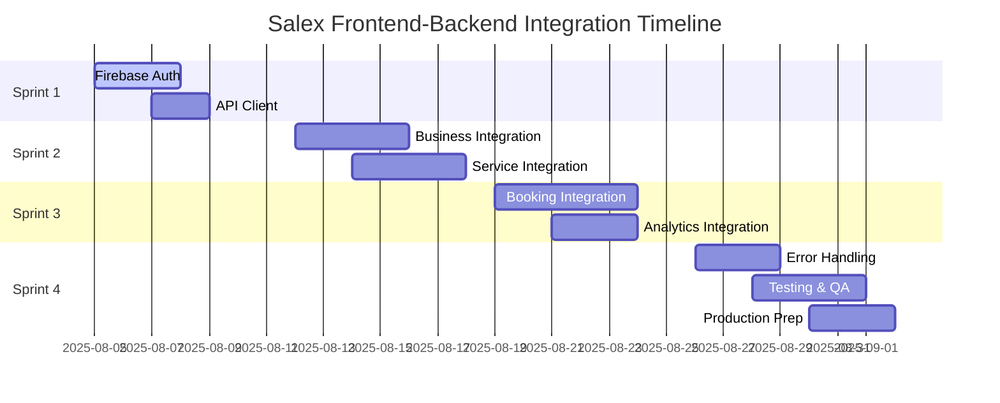

# Salex Frontend-Backend Integration Implementation Roadmap

## Overview

This roadmap provides a structured 4-week plan to integrate the Salex React Native frontend with the NestJS backend, transforming the app from mock data to production-ready functionality.

**STATUS UPDATE (8/5/2025):**
- The integration architecture has been significantly upgraded.
- Context7 MCP server integration is complete and operational.
- New Cline rules for frontend–backend integration have been implemented.
- All API endpoints in apps/api are confirmed production-ready.
- Firebase Authentication integration is fully functional with persistent user sessions.
- The centralized API client has been established with proper authentication and error handling.

## Sprint Structure (4 Weeks Total)

### 🚀 Sprint 1: Authentication & API Foundation (Week 1)
**Goal**: Establish secure communication between frontend and backend.

| Story | Title | Effort | Priority | Dependencies |
|-------|-------|--------|----------|--------------|
| [3.1](stories/3.1.story.md) | Firebase Authentication Integration | 5 pts | Critical | Firebase setup |
| [3.2](stories/3.2.story.md) | Centralized API Client Implementation | 3 pts | Critical | Story 3.1 |

**Sprint 1 Deliverables:**
- ✅ Working Firebase phone authentication (completed)
- ✅ Persistent user sessions across app restarts (completed)
- ✅ Centralized API client with auth headers (completed)
- ✅ Error handling for network issues (completed)
- ✅ Foundation for all subsequent API integration (completed)

**Success Criteria:**
- User can authenticate with phone/OTP and remain logged in.
- All API calls automatically include authentication headers.
- Network errors are handled gracefully.
- Integration architecture improvements (Context7 MCP and updated Cline rules) are in place.

---

### 🏢 Sprint 2: Business & Service Management (Week 2)
**Goal**: Connect business onboarding and service management to backend.

| Story | Title | Effort | Priority | Dependencies |
|-------|-------|--------|----------|--------------|
| [3.3](stories/3.3.story.md) | Business Onboarding API Integration | 8 pts | High | Sprint 1 complete |
| [3.4](stories/3.4.story.md) | Service Management API Integration | 8 pts | High | Story 3.3 |

**Sprint 2 Deliverables:**
- Business onboarding saves real data to backend (in progress)
- Business profile loads and updates from API (pending)
- Service creation, editing, and deletion work with backend (pending)
- Service lists display real data with summaries (pending)
- All business and service mock data removed (pending)

---

### 📅 Sprint 3: Bookings & Analytics (Week 3)
**Goal**: Integrate booking system and dashboard analytics.

| Story | Title | Effort | Priority | Dependencies |
|-------|-------|--------|----------|--------------|
| [3.5](stories/3.5.story.md) | Booking System API Integration | 10 pts | High | Sprint 2 complete |
| [3.6](stories/3.6.story.md) | Dashboard Analytics API Integration | 6 pts | Medium | Story 3.5 |

**Sprint 3 Deliverables:**
- Real booking data displayed in app (pending)
- Booking status management (confirm, cancel, complete) (pending)
- Time slot availability reflects real bookings (pending)
- Dashboard shows accurate revenue and booking metrics (pending)
- Customer information properly linked to bookings (pending)

---

### 🎯 Sprint 4: Testing & Production Readiness (Week 4)
**Goal**: Polish, test, and prepare for production deployment.

| Story | Title | Effort | Priority | Dependencies |
|-------|-------|--------|----------|--------------|
| [3.7](stories/3.7.story.md) | Error Handling & Loading States Enhancement | 5 pts | High | Sprint 3 complete |
| [3.8](stories/3.8.story.md) | End-to-End Testing & Quality Assurance | 8 pts | Critical | Story 3.7 |
| [3.9](stories/3.9.story.md) | Production Readiness & Deployment Preparation | 5 pts | Critical | Story 3.8 |

**Sprint 4 Deliverables:**
- Consistent error handling and loading states (pending)
- Comprehensive test coverage for all integrations (pending)
- Production-ready builds and configurations (pending)
- Security hardening and performance optimization (pending)
- Deployment documentation and procedures (pending)

**Success Criteria:**
- App provides excellent UX even during network issues.
- All critical user journeys are tested and functioning.
- The system is ready for app store submission and production deployment.

---

## Technical Architecture Integration Points

### 🔐 Authentication Flow
```
React Native App → Firebase Auth → JWT Token → NestJS Backend → Database
```

### 📊 Data Flow Pattern
```
UI Component → Service Layer → API Client → Backend API → Database
```

### 🎯 Key Integration Points

| Frontend Component | Backend Endpoint | Purpose |
|-------------------|------------------|---------|
| AuthService | `/api/v1/auth/firebase/verify` | Token verification |
| BusinessService | `/api/v1/business/*` | Business CRUD operations |
| ServiceService | `/api/v1/services/*` | Service management |
| BookingService | `/api/v1/businesses/:id/bookings` | Booking operations |
| AnalyticsService | `/:businessId/analytics/daily` | Dashboard metrics |

## Risk Mitigation Strategies

### 🚨 High Risk Items
1. Firebase token expiration: Implement automatic refresh.
2. Network connectivity: Robust offline handling and retry logic.
3. Data synchronization: Ensure UI state matches backend data.
4. Performance impact: Monitor API response times and optimize.

### 🛡️ Mitigation Plans
- Phased rollout: Test each sprint thoroughly.
- Fallback mechanisms: Graceful degradation for API failures.
- Monitoring: Implement error tracking and performance monitoring.
- Testing: Comprehensive integration testing at each sprint.

## Success Metrics

### 📈 Technical KPIs
- API integration coverage: 100% of mock services replaced.
- Authentication persistence: Sessions maintained across app restarts.
- Error rate: <1% API call failures with proper error handling.
- Performance: App launch <3s, API responses <2s.

### 👥 User Experience KPIs
- Onboarding success: New users complete business setup.
- Data accuracy: 100% consistency between UI and backend.
- Error recovery: Users can recover from network issues.
- Responsiveness: No perceived performance degradation.

## Development Guidelines

### 🎯 Implementation Priorities
1. Critical Path: Authentication and API client (Sprint 1).
2. Core Business Logic: Business and service management (Sprint 2).
3. User Value Features: Bookings and analytics (Sprint 3).
4. Quality Assurance: Testing and production prep (Sprint 4).

### ⚡ Best Practices
- Incremental integration: Replace one mock service at a time.
- Backward compatibility: Keep UI unchanged during service replacement.
- Error-first design: Implement error handling before the happy path.
- Performance monitoring: Track API response times throughout.

### 🔍 Quality Gates
Each sprint must meet these criteria before proceeding:
- All acceptance criteria met.
- No critical bugs or regressions.
- Performance requirements satisfied.
- Error handling tested and working.
- Code review completed.

## Timeline & Dependencies



## Getting Started

### 📋 Prerequisites
- Backend API endpoints are tested and functional.
- Firebase project is configured.
- React Native app UI is complete.
- Shared types package is comprehensive.
- Development environment is fully set up.

### 🚀 Sprint 1 Kickoff
1. **Start with Story 3.1**: Firebase Authentication Integration.
2. **Environment Setup**: Ensure Firebase configuration is correct.
3. **Testing Strategy**: Thoroughly test the authentication flow.
4. **Documentation**: Keep detailed implementation notes per story.

### 📞 Support & Escalation
- For technical blockers, consult the architecture document.
- Validate backend issues using existing curl-test scripts.
- For Firebase issues, refer to the Firebase console and documentation.
- Monitor performance and optimize as required.

---

**🎯 Success Definition**: At the end of 4 weeks, business owners will manage real business data through the Salex app with live backend integration and production-ready configurations.

**📞 Next Steps**: Begin with Story 3.1 (Firebase Authentication Integration) and progress sequentially through subsequent sprints.

---

**Integration Update**:  
- Context7 MCP server integration is complete and operational.
- New Cline rules for frontend-backend integration have been added.
- All API endpoints in the backend are production-ready.
