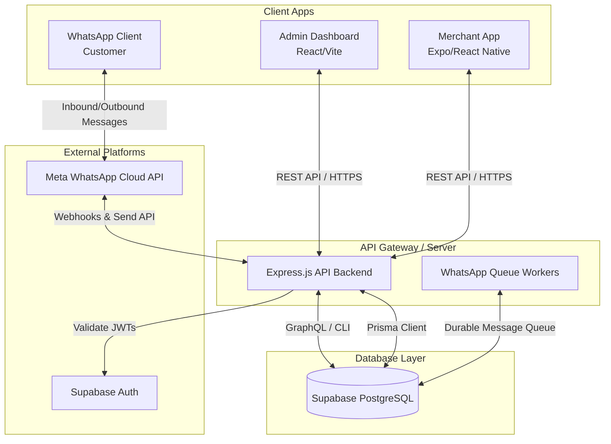
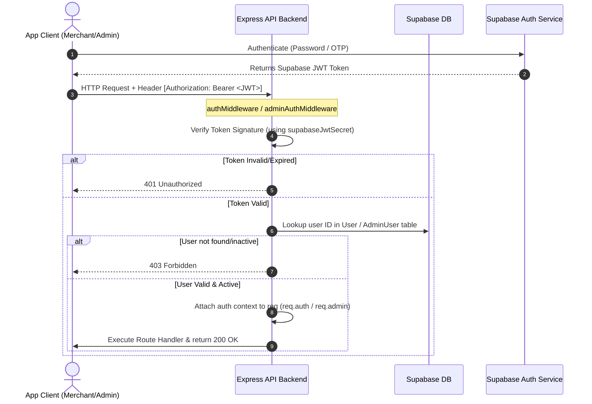
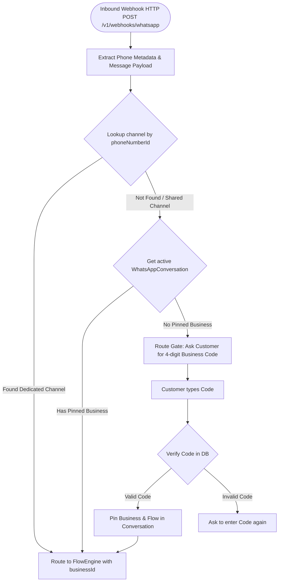
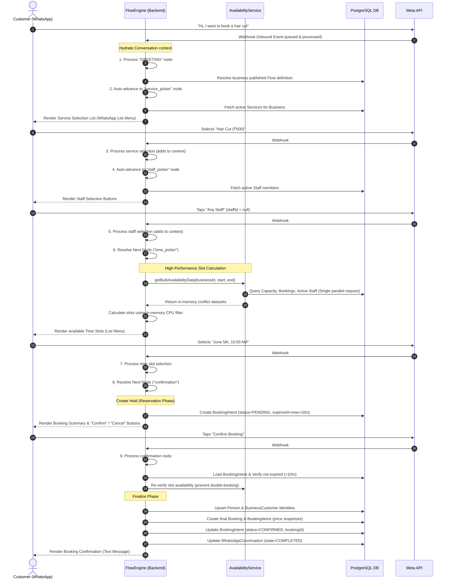
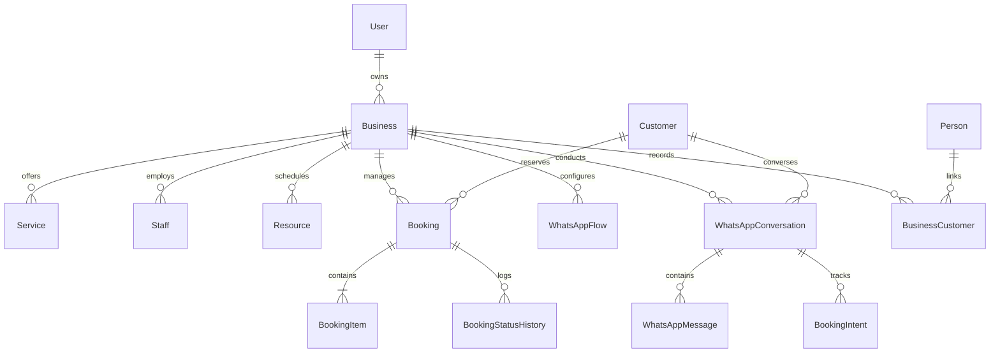

# Salex Product Flow & Technical Architecture

This document provides a comprehensive walkthrough of the end-to-end architecture, API data flows, database schemas, authentication mechanisms, and booking lifecycles of the Salex platform.

---

## 1. Product Topology & System Actors

The platform contains four main application boundaries coordinating to manage merchants, build conversation flows, and facilitate bookings:



### Actors & Roles
1. **End-User (Customer)**: Interacts solely through WhatsApp. They don't install an app; they follow a chat flow to query availability, select services/staff, and book appointments.
2. **Merchant (Salon/Clinic Owner or Staff)**: Uses the native **Merchant App** (built on Expo) to manage their business settings, services, staff directories, and check/modify incoming bookings.
3. **Platform Admin**: Uses the web-based **Admin Dashboard** to onboard merchants, verify subscription payments, configure custom WhatsApp conversation flows (via visual flow editor), and manage dedicated WhatsApp channels.
4. **Aggregator (Salex Platform API)**: Serves as the central backend engine hosted on Railway. It handles gateway webhook routing, executes the WhatsApp flow state machine, runs slots availability logic, and secures access tokens.

---

## 2. Authentication Mechanics

Salex uses JWT authentication signed by the Supabase project secret. This secures endpoints across different roles:



### Authentication Contexts

#### A. Merchant App Authentication (`auth.middleware.ts`)
* Uses `authMiddleware` to decode the JWT.
* Hydrates `req.auth` with:
  ```typescript
  export interface AuthContext {
    userId: string;
    phone: string;
    role: string; // 'owner' | 'staff'
  }
  ```
* Enforces that the user exists and has an `ACTIVE` status in `prisma.user`.

#### B. Admin Dashboard Authentication (`admin-auth.middleware.ts`)
* Uses `adminAuthMiddleware` to decode the JWT and extract the user email.
* Hydrates `req.admin` with:
  ```typescript
  export interface AdminContext {
    adminId: string;
    email: string;
    name: string;
    role: AdminRole; // 'ADMIN' | 'SUPER_ADMIN'
  }
  ```
* Enforces role requirements (e.g. `SUPER_ADMIN` for sensitive platform adjustments) via `requireAdminRole`.

#### C. Development Bypass (`enableAuth = false`)
* During local development, setting `ENABLE_AUTH=false` bypasses verification and injects mock user profiles:
  * **Mock Merchant**: `{ userId: 'dev-test-user-id', phone: '+919876543210', role: 'merchant' }`
  * **Mock Admin**: `{ adminId: 'dev-admin-id', email: 'dev@salex.com', name: 'Dev Admin', role: 'SUPER_ADMIN' }`

---

## 3. WhatsApp Gateway & Routing Flow

Salex supports both **Shared Channel Mode** (all businesses use one central Salex WhatsApp number and customers route via short 4-digit codes) and **Dedicated Channel Mode** (businesses register their own independent Meta App credentials). 



### Inbound Webhook Execution Pipeline
1. **Extraction**: `whatsapp-webhook.controller.ts` receives payload from Meta/Twilio. It extracts the customer's phone number (`customerPhone`) and the Meta `phone_number_id` (the recipient number).
2. **Channel Resolution**: Queries the `WhatsAppChannel` model.
   * If a match is found with `mode = DEDICATED`, it extracts the associated `businessId`.
   * If it is a shared number, it checks `WhatsAppConversation` for an active `businessId`. If none exists, it triggers the routing gate requesting the customer to provide the salon's 4-digit routing code.
3. **Queueing**: Once the `businessId` and `customerPhone` are identified, the webhook writes the payload into the `WhatsAppInboundEvent` table (durable queue).
4. **Execution**: The background queue worker locks the event, processes the message sequentially through `EngineRouter` to prevent concurrency issues, and calls the `FlowEngine` to transition the state.

---

## 4. The Dynamic Node-Based Flow Engine

Instead of hardcoding a state machine, Salex uses a dynamic graph runner that reads visual configurations constructed by platform administrators inside the visual builder.

### Two-Phase Execution Loop
Every node handler implements a strict **Render** (Phase 1) and **Process** (Phase 2) split:

```
[Customer Input] ──> [Process Phase] ──> [Resolve Next Node] ──> [Render Phase] ──> [Send Outbound]
                          │                                           ▲
                          └─────── (Validation Failed: Re-render) ────┘
```

1. **Process Phase**: Evaluates the customer's response against the current active node config (e.g. validating if the selected service exists, checking slot formatting, or evaluating button IDs).
   * **Success**: Returns `complete: true` and updates `contextData` (e.g. stores the selected staff ID or slot time).
   * **Failure**: Returns `complete: false` along with an `errorMessage` banner.
2. **Next Node Resolution**: If processing completes, the engine evaluates conditional edges in the database graph (`resolveNextNode`) to select the next state.
3. **Auto-Advance Steps**: If the next node is an auto-advance node (e.g., a static `message` node), the engine renders and advances automatically. It repeats this loop until it lands on an interactive node (e.g. staff selection list). A cycle guard restricts this loop to **50 steps** to prevent infinite loops.
4. **Render Phase**: Compiles the target node's templates into WhatsApp Interactive Payload format (text, buttons, or list structures) and triggers outbound dispatch.

---

## 5. End-to-End Booking Lifecycle

The following sequence diagram outlines the data flow when a customer initiates a booking flow on WhatsApp:



### Detailed Breakdown of the Booking Subsystems

#### 1. In-Memory Slot Availability Calculations (`availability.service.ts`)
To prevent database CPU exhaustion, Salex avoids slot-by-slot query loops. Instead, it runs an in-memory scheduler:
* **Bulk Retrieval**: It fetches the business's effective capacity, all active bookings, and scheduled resources/staff for the target search range in a single database step.
* **In-Memory Filtering**: The engine generates slot ranges (e.g., every 30 mins) and evaluates overlaps in CPU memory. A slot is bookable if:
  $$\text{Overlapping Bookings} < \text{Effective Capacity}$$
  And (if requested) the target staff member does not have overlapping bookings.

#### 2. The Hold (Reservation) Phase (`confirmation.ts`)
When a slot is selected, the engine places a 10-minute hold by creating a `BookingIntent` record in the database.
* This locks the slot for the customer.
* If they don't confirm within 10 minutes, the hold is marked `EXPIRED`, releasing the capacity for other users.

#### 3. Identity Verification & Booking Finalization (`booking.ts`)
* When the user confirms, the engine checks the `BookingIntent` state.
* It verifies the slot is still available (re-running the bulk availability filter to ensure no double bookings occurred during edge latency).
* It creates or links global and merchant-specific identities:
  * `Person` (Unique telephone lookup record)
  * `BusinessCustomer` (Local merchant-customer record)
* Finally, it inserts the `Booking` and copies price information into `BookingItem` snapshots (to preserve pricing history if service rates change later).

---

## 6. Database Schema & Relationships

Below are the key models defined in the database schema ([schema.prisma](file:///Users/manny/Desktop/Mega_Projects/salex_app/salex/packages/shared-types/prisma/schema.prisma)) that control this workflow:

### Entities Model Layout


---

## 7. Key REST API Endpoints & Payload Schema Reference

Below is a reference of the core API routes utilized by the Admin Dashboard, Merchant Apps, and External webhook events:

### A. Authentication Routes
#### `POST /api/v1/auth/otp/send`
* **Purpose**: Request OTP.
* **Payload**:
  ```json
  { "phone": "+919876543210" }
  ```
#### `POST /api/v1/auth/otp/verify`
* **Purpose**: Verify OTP and retrieve access tokens.
* **Response**:
  ```json
  {
    "token": "eyJhbGciOi...",
    "user": { "id": "usr_123", "phone": "+919876543210" }
  }
  ```

### B. Admin Flow Configuration Endpoints
#### `POST /api/v1/admin/businesses/:businessId/flows`
* **Purpose**: Save a new version of a visual flow graph.
* **Payload**:
  ```json
  {
    "name": "Default Booking Flow",
    "entryNodeId": "node_greet",
    "definition": {
      "nodes": [
        { "id": "node_greet", "type": "message", "config": { "text": "Welcome to our salon!" } },
        { "id": "node_services", "type": "service_picker", "config": {} }
      ],
      "edges": [
        { "id": "edge_1", "source": "node_greet", "target": "node_services" }
      ]
    }
  }
  ```

### C. Booking Operations
#### `POST /api/v1/bookings`
* **Purpose**: Manually insert an appointment from the Merchant App.
* **Payload**:
  ```json
  {
    "businessId": "biz_123",
    "customerPhone": "9876543210",
    "serviceIds": ["srv_haircut"],
    "scheduledAt": "2026-06-05T10:00:00.000Z",
    "staffId": "stf_alex",
    "source": "manual"
  }
  ```

### D. Inbound Webhook
#### `POST /v1/webhooks/whatsapp`
* **Purpose**: Accept real messages from Meta's API gateway.
* **Payload (Example Meta structure)**:
  ```json
  {
    "object": "whatsapp_business_account",
    "entry": [
      {
        "id": "waba_123",
        "changes": [
          {
            "value": {
              "messaging_product": "whatsapp",
              "metadata": { "display_phone_number": "1234567890", "phone_number_id": "wa_phone_id" },
              "contacts": [{ "profile": { "name": "Jane Doe" }, "wa_id": "919876543210" }],
              "messages": [
                {
                  "from": "919876543210",
                  "id": "wam_msg_id_123",
                  "timestamp": "1780225441",
                  "type": "text",
                  "text": { "body": "I would like to book a haircut" }
                }
              ]
            },
            "field": "messages"
          }
        ]
      }
    ]
  }
  ```
