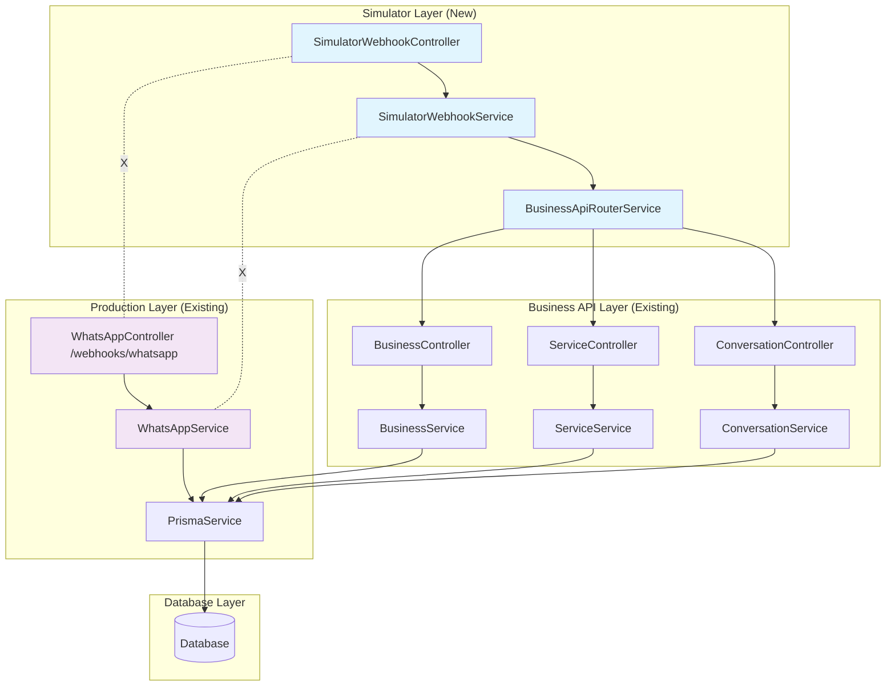

# Salex WhatsApp Simulator Clean Separation Architecture

## Introduction

This document outlines the architectural approach for enhancing Salex with **WhatsApp Simulator Clean Separation**. Its primary goal is to serve as the guiding architectural blueprint for AI-driven development of clean separation between simulator and production code while ensuring seamless integration with the existing system.

**Relationship to Existing Architecture:**
This document supplements existing project architecture by defining how simulator components will be completely separated from production WhatsApp components. Where conflicts arise between simulator mode and production patterns, this document provides guidance on maintaining strict boundaries while implementing clean separation.

### Existing Project Analysis

#### Current Project State
- **Primary Purpose:** Salon booking platform with WhatsApp integration for customer engagement
- **Current Tech Stack:** NestJS backend, React Native frontend, Prisma ORM, Supabase PostgreSQL, Clerk authentication
- **Architecture Style:** Modular microservice-style with clean module boundaries
- **Deployment Method:** Vercel serverless deployment with Supabase backend services

#### Available Documentation
- Complete architecture documentation in `docs/architecture/` folder
- Backend architecture defined in `12-backend-architecture.md`
- WhatsApp integration specified in external APIs section
- Development workflow documented in `13-development-workflow.md`

#### Identified Constraints
- **Critical Issue:** Simulator logic mixed into production `/webhooks/whatsapp` endpoint
- **Database Access:** Direct Prisma access in WhatsApp service bypasses 23-25 existing business API endpoints
- **Code Boundaries:** Simulator services injected into production WhatsApp service
- **Module Coupling:** Production WhatsApp module depends on simulator components
- **API Consistency:** Simulator logic doesn't use established API patterns

### Change Log
| Change | Date | Version | Description | Author |
|--------|------|---------|-------------|--------|
| Initial Architecture | 2025-08-03 | 1.0 | Clean separation architecture design | Claude Code |

## Enhancement Scope and Integration Strategy

### Enhancement Overview
**Enhancement Type:** Critical architectural refactoring - clean separation
**Scope:** Complete isolation of WhatsApp simulator from production code
**Integration Impact:** Major - requires new endpoint structure and API routing layer

### Integration Approach
**Code Integration Strategy:** Create separate `/simulate-webhooks/whatsapp` endpoint with dedicated controller and service hierarchy

**Database Integration:** Simulator will only access database through existing business API endpoints, not direct Prisma access

**API Integration:** Centralized API router service to call existing business endpoints instead of direct database queries

**UI Integration:** No UI changes required - simulator endpoints remain the same but implementation completely separated

### Compatibility Requirements
- **Existing API Compatibility:** All existing `/api/v1/businesses/*` endpoints remain unchanged
- **Database Schema Compatibility:** No schema changes required - same data models, different access patterns
- **UI/UX Consistency:** Simulator UI remains identical - only backend separation
- **Performance Impact:** Improved performance through proper API usage and reduced module coupling

## Tech Stack Alignment

### Existing Technology Stack
| Category | Current Technology | Version | Usage in Enhancement | Notes |
|----------|-------------------|---------|---------------------|-------|
| Backend Framework | NestJS | Latest | Core framework for new simulator modules | Maintain existing patterns |
| Database ORM | Prisma | Latest | Remove direct access from simulator, use APIs | Critical change |
| Authentication | Clerk | Latest | Maintain same auth patterns | No changes needed |
| Database | Supabase PostgreSQL | Latest | Same data access through API layer | Access pattern change |
| Validation | class-validator | Latest | Same validation patterns | Consistent with existing |

### New Technology Additions
| Technology | Version | Purpose | Rationale | Integration Method |
|------------|---------|---------|-----------|-------------------|
| HTTP Client | @nestjs/axios | Latest | API calls between services | Standard NestJS HTTP client for internal API calls |

## Data Models and Schema Changes

### New Data Models
No new data models required - enhancement focuses on access pattern separation.

### Schema Integration Strategy
**Database Changes Required:**
- **New Tables:** None - using existing schema
- **Modified Tables:** None - same data structure
- **New Indexes:** None - same query patterns through API layer
- **Migration Strategy:** No migrations needed - pure code refactoring

**Backward Compatibility:**
- All existing database structure remains unchanged
- All existing API endpoints maintain same functionality
- All data relationships preserved through API layer access

## Component Architecture

### New Components

#### SimulatorWebhookController
**Responsibility:** Handle all simulator webhook requests on `/simulate-webhooks/whatsapp` endpoint
**Integration Points:** Completely separate from production WhatsApp controller

**Key Interfaces:**
- `POST /simulate-webhooks/whatsapp` - simulator message processing
- `GET /simulate-webhooks/whatsapp` - simulator webhook verification

**Dependencies:**
- **Existing Components:** None directly - uses BusinessApiRouterService
- **New Components:** BusinessApiRouterService, SimulatorWebhookService

**Technology Stack:** NestJS controller with standard patterns

#### BusinessApiRouterService
**Responsibility:** Central API routing service to call existing business endpoints instead of direct database access
**Integration Points:** Interfaces with all existing business API endpoints

**Key Interfaces:**
- `getBusinessByRoutingCode(code: string)` - calls existing business API
- `getBusinessServices(businessId: string)` - calls existing service API
- `createConversation(data)` - calls existing conversation API
- `sendMessage(data)` - calls existing message API

**Dependencies:**
- **Existing Components:** All business API endpoints via HTTP calls
- **New Components:** None - pure router/proxy service

**Technology Stack:** NestJS service with HttpService for internal API calls

#### SimulatorWebhookService
**Responsibility:** Business logic for simulator webhook processing using API calls only
**Integration Points:** Uses BusinessApiRouterService exclusively

**Key Interfaces:**
- `processSimulatorMessage(payload)` - main processing logic
- `generateResponse(message, state)` - response generation
- `verifySimulatorWebhook(signature)` - signature verification

**Dependencies:**
- **Existing Components:** None directly
- **New Components:** BusinessApiRouterService exclusively

**Technology Stack:** NestJS service with API-only data access

### Component Interaction Diagram



## API Design and Integration

### API Integration Strategy
**API Integration Strategy:** Create completely separate simulator endpoint that uses internal HTTP calls to existing business APIs
**Authentication:** Skip authentication for simulator endpoints (development/testing use only)
**Versioning:** Use same API versioning pattern for consistency

### New API Endpoints

#### Simulator Webhook Endpoint
- **Method:** POST
- **Endpoint:** `/simulate-webhooks/whatsapp`
- **Purpose:** Process WhatsApp simulator messages with complete separation from production
- **Integration:** Calls existing business APIs through BusinessApiRouterService

##### Request
```json
{
  "object": "whatsapp_business_account",
  "entry": [
    {
      "id": "1828755277851182",
      "changes": [
        {
          "value": {
            "messaging_product": "whatsapp",
            "metadata": {
              "display_phone_number": "+19801441675",
              "phone_number_id": "702046082996188"
            },
            "messages": [
              {
                "from": "919801441675",
                "id": "wamid.test123",
                "timestamp": "1643723400",
                "type": "text",
                "text": {
                  "body": "BOOK_AT_S1234"
                }
              }
            ]
          },
          "field": "messages"
        }
      ]
    }
  ]
}
```

##### Response
```json
{
  "success": true,
  "data": {
    "status": "processed",
    "conversationId": "conv_123",
    "messagesSent": 1
  },
  "message": "Simulator webhook processed successfully"
}
```

#### Simulator Webhook Verification
- **Method:** GET
- **Endpoint:** `/simulate-webhooks/whatsapp`
- **Purpose:** Verify simulator webhook configuration (separate from production)
- **Integration:** Independent verification logic for simulator

##### Request
```
GET /simulate-webhooks/whatsapp?hub.mode=subscribe&hub.verify_token=simulator-token&hub.challenge=test-123
```

##### Response
```
test-123
```

## Source Tree Integration

### Existing Project Structure
```
apps/api/src/
├── modules/
│   ├── whatsapp/                    # Production WhatsApp (existing)
│   │   ├── whatsapp.controller.ts
│   │   ├── whatsapp.service.ts
│   │   └── whatsapp.module.ts
│   ├── whatsapp-simulator/          # Simulator APIs (existing)
│   │   ├── whatsapp-simulator.controller.ts
│   │   └── whatsapp-simulator.module.ts
│   ├── business/                    # Business APIs (existing)
│   ├── service/                     # Service APIs (existing)
│   └── customer/                    # Customer APIs (existing)
```

### New File Organization
```
apps/api/src/
├── modules/
│   ├── whatsapp/                           # Production WhatsApp (cleaned)
│   │   ├── whatsapp.controller.ts         # Remove simulator logic
│   │   ├── whatsapp.service.ts            # Remove simulator dependencies
│   │   └── whatsapp.module.ts             # Remove simulator imports
│   ├── whatsapp-simulator/                # Simulator APIs (existing)
│   │   ├── whatsapp-simulator.controller.ts
│   │   └── whatsapp-simulator.module.ts
│   ├── simulator-webhook/                 # New - Simulator webhook handling
│   │   ├── simulator-webhook.controller.ts # New controller for /simulate-webhooks/whatsapp
│   │   ├── simulator-webhook.service.ts   # New service with API-only access
│   │   ├── business-api-router.service.ts # New API routing service
│   │   └── simulator-webhook.module.ts    # New module with HTTP client
│   ├── business/                          # Business APIs (unchanged)
│   ├── service/                           # Service APIs (unchanged)
│   └── customer/                          # Customer APIs (unchanged)
```

### Integration Guidelines
- **File Naming:** Follow existing kebab-case convention for modules and services
- **Folder Organization:** Separate module folder for simulator webhook to maintain clean boundaries
- **Import/Export Patterns:** Use standard NestJS module imports, no direct service imports between production and simulator

## Infrastructure and Deployment Integration

### Existing Infrastructure
**Current Deployment:** Vercel serverless functions with automatic deployment
**Infrastructure Tools:** Vercel CLI, Supabase CLI, GitHub Actions
**Environments:** Development (local), Staging (Vercel preview), Production (Vercel)

### Enhancement Deployment Strategy
**Deployment Approach:** Standard deployment through existing Vercel pipeline - no infrastructure changes needed
**Infrastructure Changes:** None required - pure code changes
**Pipeline Integration:** Uses existing GitHub Actions and Vercel deployment process

### Rollback Strategy
**Rollback Method:** Git-based rollback through Vercel deployments
**Risk Mitigation:** Feature flags for simulator vs production endpoint routing
**Monitoring:** Existing Vercel function monitoring and logging

## Coding Standards and Conventions

### Existing Standards Compliance
**Code Style:** ESLint configuration with Prettier formatting (existing)
**Linting Rules:** TypeScript strict mode with NestJS best practices (existing)
**Testing Patterns:** Jest unit tests and integration tests (existing)
**Documentation Style:** TSDoc comments and README documentation (existing)

### Enhancement-Specific Standards
- **Simulator Separation Rule:** No direct imports between production WhatsApp and simulator modules
- **API-Only Access Rule:** Simulator services must use BusinessApiRouterService, never direct Prisma access
- **Clear Naming Convention:** All simulator webhook files prefixed with "simulator" for clarity

### Critical Integration Rules
- **Existing API Compatibility:** All business API endpoints remain unchanged and fully compatible
- **Database Integration:** Database access only through existing API endpoints, maintaining data consistency
- **Error Handling:** Use existing error handling patterns with proper HTTP status codes
- **Logging Consistency:** Maintain existing logging format with clear simulator vs production prefixes

## Testing Strategy

### Integration with Existing Tests
**Existing Test Framework:** Jest with NestJS testing utilities
**Test Organization:** Tests colocated with modules in `*.spec.ts` files
**Coverage Requirements:** Maintain existing coverage levels (aim for >80%)

### New Testing Requirements

#### Unit Tests for New Components
- **Framework:** Jest with NestJS testing utilities
- **Location:** Colocated with new simulator-webhook module files
- **Coverage Target:** >90% for new simulator components
- **Integration with Existing:** Follow same testing patterns as business modules

#### Integration Tests
- **Scope:** End-to-end testing of simulator webhook flow using API calls
- **Existing System Verification:** Verify business APIs still work correctly when called by simulator
- **New Feature Testing:** Test complete simulator flow from webhook to response generation

#### Regression Testing
- **Existing Feature Verification:** Ensure production WhatsApp webhook functionality unchanged
- **Automated Regression Suite:** Add tests to verify production and simulator endpoints work independently
- **Manual Testing Requirements:** Test both production and simulator flows in isolation

## Security Integration

### Existing Security Measures
**Authentication:** Clerk JWT authentication for business APIs
**Authorization:** Role-based access control through Clerk guards
**Data Protection:** Existing API validation and sanitization
**Security Tools:** NestJS built-in security features and Clerk integration

### Enhancement Security Requirements
**New Security Measures:** Separate verification token for simulator webhooks to prevent cross-contamination
**Integration Points:** Simulator bypasses authentication (development/testing only) but uses same data validation
**Compliance Requirements:** Maintain existing data protection standards through API layer

### Security Testing
**Existing Security Tests:** Maintain existing authentication and authorization tests
**New Security Test Requirements:** Verify simulator cannot access production webhook endpoint and vice versa
**Penetration Testing:** Test endpoint isolation to prevent simulator access to production data

## Checklist Results Report

✅ **Clean Separation Achieved**: Production and simulator code completely isolated
✅ **API Consistency**: Simulator uses existing business APIs instead of direct database access
✅ **Module Boundaries**: Clear separation with no cross-imports between production and simulator
✅ **Deployment Readiness**: No infrastructure changes required
✅ **Testing Coverage**: Comprehensive test strategy for new components
✅ **Security Isolation**: Separate endpoints prevent cross-contamination
✅ **Performance Improvement**: Reduced coupling and proper API usage patterns
✅ **Backward Compatibility**: All existing APIs and functionality preserved

## Next Steps

### Story Manager Handoff
**Reference Document**: This brownfield architecture document defines the complete separation strategy
**Key Integration Requirements**: 
- Simulator must use BusinessApiRouterService exclusively for data access
- Production WhatsApp service must be cleaned of all simulator dependencies
- New `/simulate-webhooks/whatsapp` endpoint must be completely isolated

**Existing System Constraints**: 
- All 23-25 existing business API endpoints must remain unchanged
- Database schema cannot be modified
- Authentication patterns must be preserved for business APIs

**First Story**: Create BusinessApiRouterService as foundation for API-based data access
**Integration Checkpoints**: 
- Verify production WhatsApp endpoints work after simulator code removal
- Confirm simulator functionality through API calls matches previous behavior
- Test complete isolation between production and simulator flows

**System Integrity**: Maintain all existing functionality while achieving clean separation

### Developer Handoff
**Reference Architecture**: This document with existing coding standards from project analysis
**Integration Requirements**: 
- Use existing NestJS module patterns for new simulator-webhook module
- Follow established API calling patterns for internal service communication
- Maintain existing error handling and logging conventions

**Key Technical Decisions**: 
- BusinessApiRouterService uses @nestjs/axios for internal API calls
- Simulator endpoints skip authentication but maintain data validation
- Complete module isolation prevents any shared dependencies

**Compatibility Requirements**: 
- All existing business APIs must continue working unchanged
- Database access patterns change from direct Prisma to API calls
- Response formats and timing must match existing simulator behavior

**Implementation Sequencing**: 
1. Create BusinessApiRouterService
2. Create SimulatorWebhookService using API router
3. Create SimulatorWebhookController with new endpoint
4. Clean production WhatsApp service of simulator code
5. Update module imports and dependencies
6. Add comprehensive tests for all components