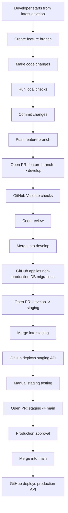
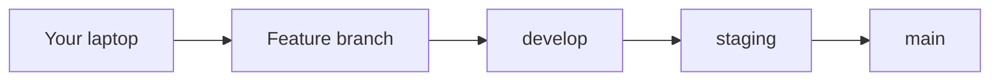
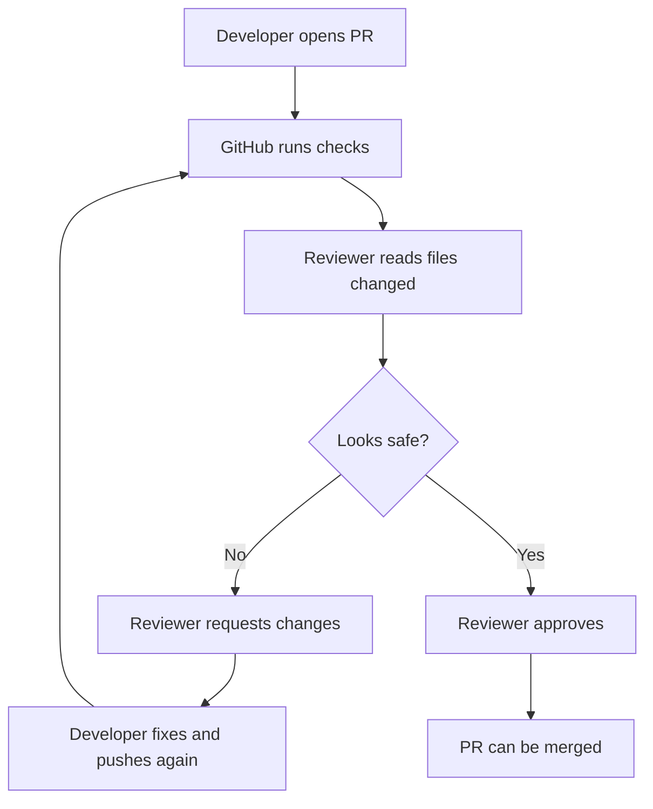
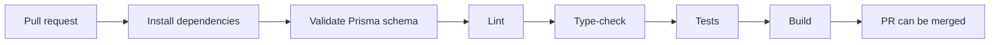
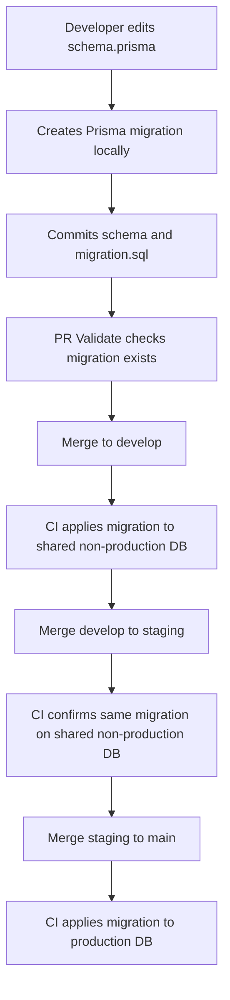
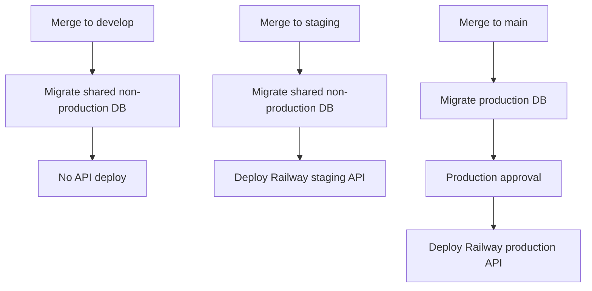
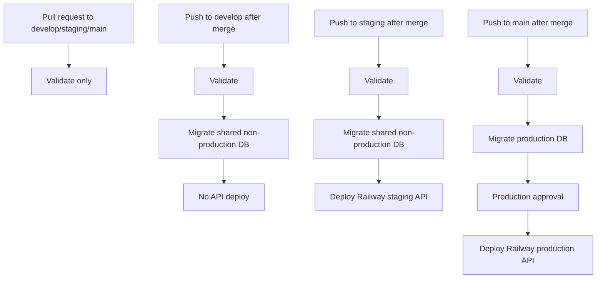

# Beginner Developer Onboarding: Git, Pull Requests, and CI/CD

This guide explains how a new Salex developer should move code from their laptop into the deployed product.

It assumes you are new to Git workflows, pull requests, code review, and CI/CD.

## The Big Picture

Salex does not allow developers to push directly into important branches.

Instead, every change moves through a controlled path:

```text
feature branch -> develop -> staging -> main
```

Meaning:

| Branch | What it means | Who uses it |
| --- | --- | --- |
| `feature branch` | Your private working branch for one task. | One developer or one coding agent. |
| `develop` | Shared development integration branch. | Developers combine reviewed work here. |
| `staging` | Testing environment branch. | Team tests deployed features here before production. |
| `main` | Production branch. | Real users depend on this. |

The rule is simple:

```text
Never push directly to develop, staging, or main.
Always use pull requests.
```

## Visual Flow



## What Actually Flows Through The System

There are five different flows a developer should understand:

```text
code flow
review flow
CI check flow
database migration flow
deployment flow
```

### 1. Code Flow

Code moves from your laptop into GitHub branches.



The code flow should only move forward:

```text
feature branch -> develop -> staging -> main
```

Do not skip `develop`.

Do not skip `staging`.

Do not send feature branches directly to `main`.

### 2. Review Flow

Review happens before code enters protected branches.



The reviewer is checking:

```text
Does the code do what the PR says?
Are tests/checks passing?
Are there database changes?
Are there secrets/private files?
Could this break staging or production?
```

### 3. CI Check Flow

CI checks run inside GitHub Actions.



If one step fails, the PR should not be merged.

The developer fixes the issue locally, commits again, and pushes the same branch. GitHub reruns CI automatically.

### 4. Database Migration Flow

Database structure changes are stored as Prisma migrations.



Important:

```text
schema.prisma change without migration = bad
migration.sql committed with schema.prisma = good
```

### 5. Deployment Flow

Deployments happen only after branch merges.



That means:

| Branch merge | Database | API deployment |
| --- | --- | --- |
| Feature branch into `develop` | Shared non-production DB after `develop` push | No deploy |
| `develop` into `staging` | Shared non-production DB | Railway staging deploy |
| `staging` into `main` | Production DB | Railway production deploy |

### 6. Secret Flow

Secrets are not stored in code.

They live in GitHub Actions secrets and Railway environment variables.

GitHub Actions uses these repository secrets:

```text
STAGING_DATABASE_URL
STAGING_DIRECT_URL
PRODUCTION_DATABASE_URL
PRODUCTION_DIRECT_URL
RAILWAY_STAGING_TOKEN
RAILWAY_PRODUCTION_TOKEN
```

Local `.env` files are for local development only.

Never commit:

```text
.env
private keys
PEM files
access tokens
Supabase service role keys
Railway tokens
WhatsApp access tokens
```

## Important Words

### Branch

A branch is a separate line of work.

Example:

```text
develop
codex/add-booking-reminders
codex/fix-whatsapp-worker
```

You create a branch so your unfinished work does not disturb everyone else.

### Commit

A commit is a saved checkpoint of your changes.

Example:

```bash
git commit -m "Add booking reminder template"
```

### Pull Request

A pull request, or PR, is a request to merge one branch into another branch.

In GitHub, every PR has two important fields:

```text
base    = where code is going
compare = where code is coming from
```

Example:

```text
base: develop
compare: codex/add-booking-reminders
```

This means:

```text
Move codex/add-booking-reminders into develop.
```

### CI/CD

CI/CD is GitHub Actions automatically checking and deploying code.

CI means continuous integration:

```text
install -> lint -> type-check -> test -> build
```

CD means continuous deployment:

```text
merge to staging -> deploy staging
merge to main -> deploy production
```

## One-Time Local Setup

Install dependencies:

```bash
pnpm install
```

This also installs Husky Git hooks through the `prepare` script.

Check that you are authenticated with GitHub:

```bash
gh auth status
```

If you are not logged in:

```bash
gh auth login
```

Check your current branch:

```bash
git branch --show-current
```

Check your working tree:

```bash
git status
```

If `git status` shows files you do not understand, stop and ask before committing them.

Important: never commit private keys, passwords, `.env` secrets, or PEM files.

## Starting a New Feature

Always start from the latest `develop`.

```bash
git checkout develop
git pull origin develop
```

Create a new feature branch:

```bash
git checkout -b codex/add-booking-reminders
```

Use a clear branch name:

```text
codex/add-booking-reminders
codex/fix-redis-worker-retry
codex/improve-flow-editor-validation
codex/add-salon-staff-filter
```

Good branch names describe one task.

Avoid vague names:

```text
fix
changes
new-code
final
test
```

## Making Changes

Edit the code.

Then check what changed:

```bash
git status
```

See a file-by-file summary:

```bash
git diff --stat
```

See exact changes:

```bash
git diff
```

If you changed Prisma schema, create a migration:

```bash
pnpm db:migrate -- --name describe_your_change
```

Never use this for shared/staging/production databases:

```bash
pnpm db:push
```

`db:push` is disabled in this repo because it can change a database without creating a proper migration history.

## Before Committing

Run the normal checks:

```bash
pnpm lint
pnpm type-check
pnpm test
pnpm build
```

For a very small documentation-only change, you can skip runtime checks, but mention that in your PR.

Example:

```text
Tests not run because this PR only updates documentation.
```

## Commit Your Work

Stage files:

```bash
git add path/to/file
```

Or stage all changed files:

```bash
git add .
```

Before committing, check again:

```bash
git status
```

Commit:

```bash
git commit -m "Add booking reminder flow"
```

Use a clear commit message:

```text
Add booking reminder flow
Fix Redis outbound worker retry handling
Document staging deployment process
```

Avoid:

```text
update
fix
changes
done
final final
```

## What Happens During Commit

The repo has a pre-commit hook.

It runs:

```bash
pnpm db:check-migration
pnpm exec lint-staged
```

This protects the repo from two common mistakes:

1. Changing Prisma schema without committing a migration.
2. Committing unformatted staged files.

If the commit fails, read the terminal message, fix the issue, stage again, and commit again.

## Push Your Feature Branch

Push your branch:

```bash
git push origin codex/add-booking-reminders
```

The repo has a pre-push hook.

It blocks direct pushes to:

```text
develop
staging
main
```

It also runs:

```bash
pnpm lint
pnpm type-check
pnpm test
pnpm build
```

If any check fails, fix the problem before opening the PR.

There is an emergency skip for expensive local checks:

```bash
SALEX_SKIP_PRE_PUSH_CHECKS=1 git push origin codex/add-booking-reminders
```

Use this rarely. GitHub Actions will still run the full checks.

This skip does not allow direct pushes to `develop`, `staging`, or `main`.

## Create PR: Feature Branch To Develop

Open GitHub and create a pull request.

Set:

```text
base: develop
compare: codex/add-booking-reminders
```

This means:

```text
Move my feature branch into develop.
```

If GitHub shows:

```text
base: main
```

stop and change it. Most mistakes happen because GitHub defaults to `main`.

## PR Direction Cheat Sheet

| Goal | Base | Compare |
| --- | --- | --- |
| Merge feature work into development | `develop` | your feature branch |
| Promote development to staging | `staging` | `develop` |
| Promote staging to production | `main` | `staging` |

Remember:

```text
base = destination
compare = source
```

## Create PR From Terminal

You can also create the PR with GitHub CLI:

```bash
gh pr create \
  --base develop \
  --head codex/add-booking-reminders \
  --title "Add booking reminder flow" \
  --body "Adds WhatsApp booking reminder flow and related tests."
```

Open the PR in your browser:

```bash
gh pr view --web
```

## What GitHub Checks On A PR

Pull requests into `develop`, `staging`, and `main` run the `Validate` job.

The workflow file is:

```text
.github/workflows/ci-cd.yml
```

`Validate` runs:

```bash
pnpm install --frozen-lockfile
pnpm db:check-migration -- --ci <base-branch>
pnpm --filter @salex/shared-types exec prisma validate
pnpm lint
pnpm type-check
pnpm exec turbo run test -- --passWithNoTests
pnpm build
```

What these mean:

| Check | Meaning |
| --- | --- |
| install | Dependencies install exactly from the lockfile. |
| migration check | Prisma schema changes include a migration. |
| Prisma validate | Database schema syntax is valid. |
| lint | Code style and common errors are checked. |
| type-check | TypeScript types must be valid. |
| test | Automated tests must pass. |
| build | Apps/packages must compile successfully. |

## How To Review A PR

Open the PR and check:

1. The PR direction is correct.
2. GitHub checks are green.
3. The changed files are expected.
4. No secrets are committed.
5. No private key files are committed.
6. The code does what the title says.
7. Database migrations are included when schema changed.
8. The PR description explains how it was tested.

Common dangerous files:

```text
.env
*.pem
private.key
service-role-key.txt
flow_private.pem
```

If you see any of these, stop and ask.

## Why The Author Cannot Approve Their Own PR

GitHub branch protection can require review from another person.

If you created the PR, GitHub may say:

```text
Pull request authors cannot approve their own pull request.
```

That is normal.

Ask another reviewer with write access to approve.

## Merge Feature PR Into Develop

Only merge after:

```text
Validate passed
Reviewer approved
No unexpected files
No unresolved comments
```

Then click:

```text
Merge pull request
```

After merging into `develop`, GitHub runs a push workflow.

For `develop`, CI does this:

```text
Validate
Apply committed Prisma migrations to shared non-production DB
No API deployment
```

This means `develop` updates the shared non-production database migration state, but it does not deploy the Railway API.

## Promote Develop To Staging

When `develop` is clean and ready for deployed QA, open a PR:

```text
base: staging
compare: develop
```

Meaning:

```text
Move develop into staging.
```

From terminal:

```bash
gh pr create \
  --base staging \
  --head develop \
  --title "Promote develop to staging" \
  --body "Promotes tested develop changes to staging for deployed QA."
```

After the PR checks pass and it is reviewed, merge it.

After merging into `staging`, GitHub runs:

```text
Validate
Apply committed Prisma migrations to shared non-production DB
Deploy staging API to Railway service salex-api-staging
```

## Staging Smoke Test Checklist

After `staging` deploys, test the real deployed system.

Minimum smoke test:

```text
[ ] Staging admin dashboard opens
[ ] Staging API health endpoint works
[ ] Railway staging logs show clean API startup
[ ] Redis/BullMQ workers start
[ ] WhatsApp webhook endpoint responds
[ ] Booking flow can create an appointment
[ ] Owner/admin can see the booking
[ ] WhatsApp response is sent
[ ] No obvious errors in Railway logs
```

If staging fails, do not fix directly on `staging`.

Correct fix flow:

```text
new fix branch from develop
-> PR to develop
-> PR develop to staging
-> test staging again
```

## Promote Staging To Production

Only do this after staging has been tested.

Open a PR:

```text
base: main
compare: staging
```

Meaning:

```text
Move staging into production.
```

From terminal:

```bash
gh pr create \
  --base main \
  --head staging \
  --title "Promote staging to production" \
  --body "Promotes staging after successful end-to-end QA."
```

Before merging:

```text
[ ] Staging was tested end-to-end
[ ] Production reviewer approved
[ ] Validate checks passed
[ ] No unsafe migration
[ ] No secrets or private files
[ ] Rollback plan is understood
```

After merging into `main`, GitHub runs:

```text
Validate
Apply committed Prisma migrations to production DB
Deploy production API to Railway service salex-api-production
```

Production uses the GitHub `production` environment and may require approval before deployment continues.

## CI/CD By Branch



## Database Migration Rules

Salex uses Prisma migrations.

If you edit:

```text
packages/shared-types/prisma/schema.prisma
```

you usually need a migration.

Create migration locally:

```bash
pnpm db:migrate -- --name add_booking_reminder_table
```

Commit both:

```text
packages/shared-types/prisma/schema.prisma
packages/shared-types/prisma/migrations/<timestamp>_<name>/migration.sql
```

CI applies migrations with:

```bash
pnpm db:migrate:deploy
```

Do not manually edit production DB unless there is an emergency and the migration history is repaired afterward.

If CI says:

```text
column already exists
```

or:

```text
failed migration
```

stop. This means database schema and Prisma migration history may be out of sync.

Do not create random new migrations to hide the problem.

## Common Mistakes And Fixes

### Mistake: GitHub PR Shows Base Main

Problem:

```text
base: main
compare: my-feature
```

This would send your feature directly to production.

Fix:

```text
base: develop
compare: my-feature
```

### Mistake: Develop To Staging Is Reversed

Wrong:

```text
base: develop
compare: staging
```

This means staging goes backward into develop.

Correct:

```text
base: staging
compare: develop
```

### Mistake: Trying To Push Directly To Main

Wrong:

```bash
git push origin main
```

Correct:

```text
Open PR: base main, compare staging
```

### Mistake: You Forgot To Pull Latest Develop

Fix:

```bash
git checkout develop
git pull origin develop
git checkout your-feature-branch
git merge develop
```

Resolve conflicts if Git asks you to.

Then:

```bash
pnpm lint
pnpm type-check
pnpm test
pnpm build
git push origin your-feature-branch
```

### Mistake: Checks Fail On GitHub

Open the failed job and read the first real error.

Common fixes:

```bash
pnpm lint
pnpm type-check
pnpm test
pnpm build
```

Run the same command locally.

Fix the error, commit, and push again:

```bash
git add .
git commit -m "Fix CI failure"
git push origin your-feature-branch
```

GitHub will automatically rerun checks.

## Daily Developer Commands

Start new work:

```bash
git checkout develop
git pull origin develop
git checkout -b codex/my-feature
```

Check current state:

```bash
git status
git branch --show-current
```

Run checks:

```bash
pnpm lint
pnpm type-check
pnpm test
pnpm build
```

Commit:

```bash
git add .
git commit -m "Describe the change"
```

Push:

```bash
git push origin codex/my-feature
```

Create feature PR:

```bash
gh pr create --base develop --head codex/my-feature
```

Open PR:

```bash
gh pr view --web
```

Watch latest workflow:

```bash
gh run list --limit 5
gh run watch
```

## Release Commands

Promote develop to staging:

```bash
gh pr create \
  --base staging \
  --head develop \
  --title "Promote develop to staging" \
  --body "Promotes develop changes to staging for deployed QA."
```

Promote staging to production:

```bash
gh pr create \
  --base main \
  --head staging \
  --title "Promote staging to production" \
  --body "Promotes staging after successful end-to-end QA."
```

## Final Mental Model

Code should move in one direction:

```text
your branch -> develop -> staging -> main
```

Do not skip steps.

Do not reverse PR direction.

Do not directly push protected branches.

Do not commit secrets.

Do not deploy to production until staging has been tested.
