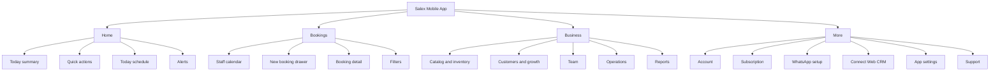
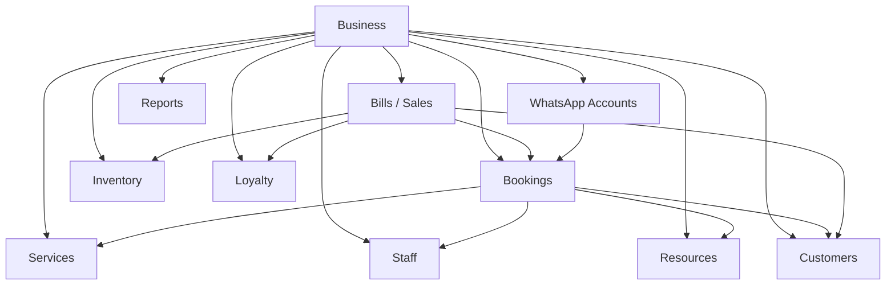

# Salex Salon Premium App Master Plan

Document status: Planning source of truth  
Audience: Product, design, junior developers, and coding agents  
Prepared on: 2026-06-10  
Implementation status: Not started

## 1. Why This Document Exists

This document combines the product planning for the Salex salon premium app revamp into one place.

Earlier planning explored multiple directions, including a five-tab app structure. The final direction for the mobile app is now a simpler four-tab structure:

```text
Home
Bookings
Business
More
```

This document supersedes older tab-placement ideas from earlier drafts. Those older docs are still useful for reference, but this file should be treated as the current product plan when implementation starts.

The main goal is to keep Salex extremely easy for salon owners while making it valuable enough for premium customers.

Salex is not trying to become a heavy generic CRM. Salex is becoming:

```text
The easiest salon operating app, powered by WhatsApp booking.
```

## 2. Product Principle

The most important Salex principle is:

```text
Booking engine first. Business operations around it. WhatsApp as the customer channel.
```

Communication channels will keep changing. WhatsApp APIs, WhatsApp Flows, Embedded Signup, dedicated numbers, shared numbers, webviews, and Meta platform behavior may evolve over time.

The Salex fundamentals should stay stable:

```text
Business
Services
Customers
Bookings
Staff
Resources
Bills
Payments
Inventory
Loyalty
Reports
WhatsApp messages
```

All of these should be connected through the same `businessId`. The Salex database remains the source of truth.

Do not create separate product databases for shared-number booking, dedicated-number CRM, WhatsApp Flows, or future web workspace. Those are channels and surfaces around the same business records.

## 3. Target User Story

Imagine a salon owner named Asha. She runs Glow Studio with three staff members, two chairs, basic product stock, and customers who mostly message on WhatsApp.

Before Salex, Asha's work is scattered:

```text
WhatsApp chats
Paper notes
UPI screenshots
Staff phone calls
Memory
```

After the revamp, Asha should open Salex and run her day from one simple app.

In the morning, she opens `Home` and sees what matters today. When someone calls, she taps `New Booking`. When a WhatsApp booking arrives, she confirms it. When a service finishes, she completes the booking and records paid, unpaid, or partial payment. Customer history updates automatically. If loyalty is enabled, the customer earns visits and points. If stock is low, Salex tells her. At night, she checks reports.

The app should feel like:

```text
A calm salon diary that also remembers customers, manages bookings, and helps the owner grow.
```

Not:

```text
A complicated CRM
A custom workflow builder for every salon
A heavy accounting tool
A generic WhatsApp inbox
```

## 4. Final App Structure

The final mobile app has four bottom tabs:

```text
Home
Bookings
Business
More
```

High-level meaning:

```text
Home      = daily command center
Bookings  = calendar and appointment operations
Business  = salon modules and business setup
More      = account, WhatsApp setup, CRM connection, settings, support
```

Architecture view:



## 5. Feature Placement

Use this placement table when implementing navigation.

| Feature | Final Location |
| --- | --- |
| Daily revenue summary | Home |
| Today's bookings | Home |
| Quick new booking | Home and Bookings |
| Quick expense | Home and Business |
| Booking calendar | Bookings |
| Booking filters | Bookings |
| Booking detail | Bookings, reusable from all entry points |
| Services | Business > Catalog and Inventory |
| Inventory | Business > Catalog and Inventory |
| Service consumables | Business > Catalog and Inventory |
| Packages | Business > Customers and Growth |
| Customers | Business > Customers and Growth |
| Loyalty | Business > Customers and Growth |
| Staff | Business > Team |
| Attendance | Business > Team |
| Commission | Business > Team |
| Permissions | Business > Team |
| Expenses | Business > Operations |
| Reminders/messages config | Business > Operations or More > WhatsApp depending on context |
| Reports | Business > Reports |
| Business profile and hours | Business header/edit screen |
| Subscription | More |
| Booking QR and share link | More > WhatsApp |
| WhatsApp connection | More > WhatsApp |
| Web CRM QR connect | More > Connect Web CRM |
| Notifications/language/security | More > App Settings |
| Help/support/diagnostics | More > Support |
| Logout | More |

## 6. Home Tab Plan

Home is the daily command center. It should answer one question:

```text
What needs my attention today?
```

Home should not become a giant dashboard. It should show only the most useful information for daily salon operation.

Recommended Home layout:

```text
Business greeting
Today date

Summary cards
- Today's sales
- Today's bookings
- Pending requests or new customers

Quick actions
- New Booking
- New Bill or Complete Sale later
- Attendance
- Add Expense

Today schedule
- Next few bookings
- Pending WhatsApp bookings highlighted

Alerts
- Low stock
- Overdue bookings
- Pending dues
- Reminder failures
```

Home should reuse backend summaries as the app grows. Do not calculate all business analytics forever inside React Native components.

Important Home behavior:

- The owner should be able to create a manual booking in one or two taps.
- Pending WhatsApp bookings should be visible immediately.
- Empty states should be calm, not noisy.
- Home should not show every advanced module.
- Home should send the owner to the right module when action is needed.

## 7. Bookings Tab Plan

Bookings is the operational calendar.

The default view should be:

```text
Today staff calendar
```

This is better than a revenue-style booking list because salon owners think in time, staff, and slots.

Recommended Bookings layout:

```text
Header
- Title: Bookings
- Today button
- Add button
- Filter button

Date strip
- Today selected by default
- Swipe or tap to change date

View switch
- Day
- Week
- Month

Calendar body
- Staff lanes
- Business hours
- Booking cards
- Current time line
- Empty slots
```

Default time range:

```text
Business hours
```

Booking card should show:

```text
Customer name or phone
Source: Walk-in / WhatsApp / Manual
Service
Time and duration
Status
```

Filters should live in a filter drawer:

```text
Date range
Staff
Resource
Service
Status
Source
Customer search
Payment state
Assignment state
```

### New Booking

The `+` button opens a bottom drawer or full-height sheet.

Fields:

```text
Customer optional
Service required
Date required
Time required
Staff optional
Resource optional
Notes optional
```

Default values:

```text
Customer: Walk-in / No customer selected
Staff: Any available staff
Resource: Any available resource
Status: Confirmed for manual bookings
```

If the owner taps an empty calendar slot, the new booking drawer opens with date and time prefilled.

### Booking Detail

Booking detail should be one reusable surface used from:

```text
Home
Bookings calendar
Customer profile
WhatsApp notification
Reports
```

Use a hybrid model:

```text
Quick drawer for common actions
Full screen for deep detail/history
```

Status-based actions:

```text
Pending:
- Confirm
- Reject

Confirmed:
- Complete
- Reschedule
- Cancel
- Call customer

Completed:
- View bill/payment
- Send receipt

Cancelled / No-show:
- View reason/history
- Book again
```

### Reschedule

Mobile v1 should not use drag/drop rescheduling.

Reschedule flow:

```text
Tap booking
Tap Reschedule
Choose new date/time
Check availability
Create new linked booking
Cancel old booking as rescheduled
Send WhatsApp update if customer has WhatsApp
```

### Overdue Bookings

If the booking time has passed and the booking is still confirmed, show an overdue action state.

Actions:

```text
Complete
Collect payment
Cancel/hide
Mark no-show
```

At day close, unhandled confirmed bookings can be auto-marked as no-show if the business setting is enabled.

## 8. Business Tab Plan

Business is the operating system area. It contains all salon modules.

Business should not look like a random settings page. It should feel like:

```text
Everything needed to configure and grow this salon.
```

Recommended Business top:

```text
Business logo
Business name
Category
Address summary
Edit button
```

Tapping edit opens the business edit screen.

Business edit fields:

```text
Logo
Business name
Phone
Category
Address/location
Business hours
Capacity basics
```

Business sections:

```text
Catalog and Inventory
Customers and Growth
Team
Operations
Reports
```

### Catalog And Inventory

Modules:

```text
Services
Inventory
Service Consumables
Product Categories
Stock Movements
Tax Groups
```

Services should appear first because booking depends on services.

Service fields:

```text
Name
Category
Duration
Price
Description optional
Online booking enabled
Active/inactive
Tax group optional
Consumables optional later
```

Do not hard delete services with history. Use inactive/archived state.

Inventory/product fields:

```text
Product name
Product type: Retail / Consumable
Category
Unit
Opening stock
Low-stock threshold
Purchase price
Selling price
Tax group optional
Active/inactive
```

Stock movement types:

```text
OPENING
PURCHASE
SALE
SERVICE_CONSUMPTION
ADJUSTMENT
RETURN
```

Service consumables should link:

```text
Service -> Product -> Quantity -> Unit
```

Consumables should be deducted after a service is completed and billed, not when a pending booking is created.

### Customers And Growth

Modules:

```text
Customers
Loyalty
Packages
Campaigns later
```

Customers screen:

```text
Search by name or phone
Customer list
Filters later: due, inactive, birthday, package active, reward available
```

Customer row:

```text
Name
Phone
Last visit
Visit count
Due or loyalty status
```

Customer profile:

```text
Name and phone
Call / WhatsApp action
Total visits
Total spend
Total due
Loyalty balance
Active packages
Past bookings
Bills/payments
Notes
Actions: Book again, New bill, Collect due
```

Packages:

```text
Package name
Price
Included services
Service quantities
Validity
Active/inactive
```

When sold to customer:

```text
CustomerPackage created
Redemptions tracked when services are used
```

Campaigns should wait until customer, billing, loyalty, and package data are reliable.

### Team

Modules:

```text
Staff
Attendance
Commission
Permissions
Resources
```

Staff fields:

```text
Name
Phone
Role optional
Active/inactive
Login enabled optional
Linked resource optional
Commission rule optional
```

Attendance v1:

```text
Geofence-based check-in/check-out
Date picker
Staff list
Attendance settings
```

Attendance should not block bookings in v1.

Commission v1:

```text
Based on paid service amount
Payable only after payment
Global default rule
Staff/service override later
```

Permission presets:

```text
Owner
Manager
Receptionist
Staff
Accountant
```

Do not expose a huge checkbox matrix in v1 unless the preset is not enough.

### Operations

Modules:

```text
Expenses
Message/reminder settings
Operational rules
```

Expenses should be simple:

```text
Category
Description
Amount
Date
Payment method optional later
```

Default categories:

```text
Supplies
Salaries
Marketing
Maintenance
Rent
Other
```

Do not turn expenses into full accounting software.

Messages/reminders in Business are operational settings:

```text
Reminder timing
Reminder enabled/disabled
Confirmation message
Cancellation message
No-show follow-up message
```

WhatsApp account connection and booking QR live in More, not here.

### Reports

Reports should be a menu of business questions.

Report types:

```text
Sales summary
Appointment summary
Customer visits
Staff performance
Commission
Stock report
Expense report
Package report
Loyalty report
Campaign report later
```

Each report should support:

```text
Date range
Simple summary
Detailed rows
CSV export
PDF export later
```

Reports should come from backend endpoints as the product grows, not client-side guesses.

## 9. Loyalty Plan

Loyalty lives in:

```text
Business -> Customers and Growth -> Loyalty
```

It should also appear contextually in:

```text
Customer Profile
Billing / Complete Booking
Reports
WhatsApp messages later
```

Loyalty should be simple for salon owners.

The chosen v1 direction:

```text
Visit loyalty + spend points
```

But the UI should hide complexity. The owner should not think in rules-engine terms.

Owner setup screen:

```text
Loyalty Program

[Enable Loyalty]

Visit Reward
After [5] completed visits
Give [Rs 100] discount

Spend Points
Earn [1] point for every [Rs 100] paid

[Save Loyalty Program]
```

Show a preview:

```text
Example:
Riya completes 5 visits.
Salex gives her Rs 100 reward.
When Riya visits again, you can apply it during billing.
```

Default preset:

```text
Every completed visit = 1 visit stamp
Every Rs 100 paid = 1 point
After 5 visits, customer gets Rs 100 off
```

Earning rule:

```text
Loyalty is earned only after a booking/bill is completed.
```

Do not give loyalty for:

```text
Pending bookings
Cancelled bookings
No-show bookings
Unpaid bookings, unless owner chooses to allow it later
```

Customer profile should show:

```text
Visits: 4 / 5
Points: 36
Available reward: None
```

After reward unlock:

```text
Visits: 5 / 5
Points: 48
Available reward: Rs 100 off
```

Billing should show:

```text
Apply Rs 100 loyalty reward?
[Apply] [Skip]
```

Do not build in loyalty v1:

```text
Complex tiers
Multiple loyalty programs
Expiry dates
Referral rewards
Birthday rewards
Product-specific points
Automatic campaign builder
```

Suggested data concepts:

```text
LoyaltyProgram
CustomerLoyaltyBalance
LoyaltyLedger
```

Ledger events should record:

```text
Booking/bill source
Points delta
Visits delta
Reward delta
Redemption
Manual adjustment
```

## 10. More Tab Plan

More is the quiet control room.

More should contain:

```text
Account
Subscription
WhatsApp setup
Booking QR
Connect Web CRM
App settings
Support
Legal
Logout
```

More should not contain daily operating modules like services, inventory, staff, reports, or customers. Those belong in Business.

Recommended More layout:

```text
Owner profile header
Business name
Plan badge
WhatsApp status badge

Account
- Owner Profile
- Business Profile shortcut
- Subscription and Billing

WhatsApp
- Booking QR and Share Link
- WhatsApp Connection
- Connect Web CRM
- Message Settings shortcut

App Settings
- Notifications
- Language
- Security / App Lock

Support
- Help Center
- Contact Support
- Diagnostics

Legal
- Privacy Policy
- Terms
- App Version

Logout
```

Current Profile screen responsibilities should be split:

| Current Profile Item | New Location |
| --- | --- |
| Business info/edit | Business header/edit screen |
| Business hours | Business edit screen |
| Resources | Business > Team |
| Staff | Business > Team |
| Ledger | Business > Reports |
| QR Code | More > WhatsApp |
| Subscription | More |
| Notifications/language/help | More |
| Logout | More |

### Booking QR And Share Link

This screen shows the public booking entry point.

Owner actions:

```text
View QR code
Share QR code
Copy booking link
See routing code if shared Salex number is used
Preview customer message
```

This is useful for:

```text
Shop counter
Instagram bio
Google profile
Printed cards
Walk-in customers
```

### WhatsApp Connection

This screen shows channel status.

States:

```text
Shared Salex Number
Dedicated Number Pending
Dedicated Number Connected
Disconnected
Limited
```

Do not expose Meta technical terms to salon owners unless needed for support.

### Connect Web CRM

Premium CRM should be desktop-first, connected through mobile approval.

QR login flow:

```text
Owner opens Salex CRM website on laptop
Website shows QR code
Owner opens mobile app
More -> Connect Web CRM
Mobile scans QR
App shows device/browser/location info
Owner taps Approve
Desktop browser logs in automatically
```

Security rules:

```text
QR expires quickly
QR can be used only once
Mobile owner approval is required
Session is scoped to businessId and owner role
Owner can revoke sessions
```

Suggested data concepts:

```text
WebLoginRequest
WebSession
```

## 11. Billing And Completion Logic

Booking completion and payment are related but not identical.

When a booking is finished, the app should ask:

```text
Paid
Unpaid
Partial
```

For v1, a formal invoice screen can come later if needed, but the system should still create a lightweight sale/payment record behind the scenes for reports.

Completion flow:

```text
Booking completed
Payment state selected
Sale/payment record created
Customer spend/due updated
Inventory deducted if applicable
Loyalty updated if enabled
Reports updated
WhatsApp receipt/reminder optional
```

Rules:

```text
Dues require a known customer
Walk-in without customer can be paid revenue, but cannot hold customer dues
Loyalty should depend on completed and paid business
Consumable inventory should deduct after completion/billing
```

## 12. Shared WhatsApp Number Booking Flow

Shared-number booking is the main acquisition engine.

This is the default path for most salons.

Core shared-number flow:

```text
Customer enters Salex WhatsApp
Customer finds/selects salon
Customer selects service
Customer selects time
Booking is created in Salex
Owner sees booking in app
Customer receives WhatsApp confirmation
```

Recommended future entry UX:

```text
Customer messages Salex
Bot sends button: Search Salon
Customer taps button
Webview opens inside WhatsApp
Customer searches area/salon/service
Customer selects salon
Booking continues
```

This solves the routing-code problem because the customer does not need to remember a code.

Shared-number booking rules:

```text
One service only in v1
Customer name optional
Phone comes from WhatsApp
5-minute slot hold
7-day advance booking window
30-minute start intervals
Service duration controls end time
Auto-confirm by default unless business requires approval
Booking can stay unassigned to staff/resource
```

Capacity:

```text
Default capacity comes from active staff/resources
Owner can set max capacity override
Availability counts pending/confirmed bookings
Staff-specific hours do not affect v1 slot availability
Business hours are the first source of truth
```

When a shared WhatsApp booking is created, it should be the same `Booking` model as a manual booking. It should not create a separate WhatsApp-only appointment type.

## 13. Dedicated Number And Premium WhatsApp CRM

Most customers should use the shared Salex number.

Premium salons can later use:

```text
Dedicated WhatsApp number
Premium WhatsApp CRM
Campaigns
Loyalty/reactivation flows
Web workspace
```

Do not make the shared-number booking system complicated for the minority of premium customers.

The correct architecture is:

```text
Core booking engine
Core business database
Shared WhatsApp connector
Dedicated WhatsApp connector
Web CRM workspace
Mobile app
```

All surfaces use the same source of truth:

```text
businessId
customers
bookings
services
bills
loyalty
messages
```

Premium CRM should focus on growth:

```text
Inbox
Campaigns
Customer segments
Loyalty campaigns
Repeat customer reactivation
Template management
Dedicated number status
```

Mobile should stay focused on operations:

```text
Bookings
Approvals
Quick billing/completion
Customers
Business setup
Notifications
QR sharing
```

## 14. Dedicated Number Upgrade Flow

When an existing Salex business upgrades to a dedicated number, do not create a new business.

Upgrade flow:

```text
Existing business chooses premium/dedicated plan
Salex creates WhatsApp channel connection for same businessId
Owner completes WhatsApp onboarding
Dedicated phoneNumberId / account identifiers are stored
Business keeps existing services, customers, bookings, loyalty, and settings
Outbound messages resolve the correct channel by businessId and use case
```

Channel model should support:

```text
Shared Salex number
Dedicated new number
Existing business app connected
Multi-partner shared number later
```

Do not hardcode message sending as:

```text
sendMessage(phoneNumberId, to, text)
```

Use a business-aware service shape:

```text
sendBusinessWhatsAppMessage({
  businessId,
  to,
  messageType,
  useCase,
  text,
  templateName,
  metadata
})
```

Internally resolve:

```text
businessId
primary WhatsApp account
phoneNumberId
paidMessagingAccountId later
provider/access token
billing/status checks
send message
log event
```

## 15. WhatsApp Flow Strategy

WhatsApp Flows are useful for premium dedicated clients, but they introduce friction because flows must be created/published inside the WhatsApp business account.

Do not rebuild the whole app around WhatsApp Flows yet.

Recommended strategy:

```text
Shared number:
Use chat/webview booking where needed.

Premium dedicated number:
Use standard booking flow templates and optional WhatsApp Flows later.
```

Booking should remain standard across salons:

```text
Select service
Select date/time
Confirm booking
Owner notification
Reminder
Completion
```

Avoid custom booking journeys per salon. Customization should come from data:

```text
Services
Prices
Staff
Hours
Capacity
Reminder settings
Loyalty
Campaigns
```

Dynamic slots should not be hardcoded into a published flow as static options if those slots can become booked.

If WhatsApp Flows are used, available slots should come from a dynamic endpoint or from a fresh availability check before final booking confirmation. The final submit must re-check availability server-side before creating the booking.

## 16. Data Source Of Truth

The source of truth is Salex DB.

Core relationships:



Developer rules:

```text
Every business-owned record needs businessId.
Customer-facing WhatsApp records must map back to businessId.
Booking source can differ, but booking model stays common.
Reports must read from real transactions/statuses, not separate manual totals.
Premium features unlock by entitlement, not by creating a separate data universe.
```

## 17. Suggested Rollout Phases

### Phase 1: Daily Operating Loop

Build the app around daily salon work:

```text
Home summary
Bookings calendar
New booking
Booking detail
Complete booking with paid/unpaid/partial
Customer list/profile
Business tab shell
More tab cleanup
```

### Phase 2: Business Modules

Add the modules that make premium useful:

```text
Services polish
Staff/team polish
Inventory basics
Expenses
Reports
Packages
Loyalty
```

### Phase 3: Growth Tools

After reliable customer and billing data:

```text
WhatsApp reminders
Customer segments
Loyalty messages
Reactivation campaigns
Premium web CRM
QR desktop login
Dedicated number status
```

### Phase 4: Dedicated Number And Advanced WhatsApp

For premium clients:

```text
Dedicated WhatsApp onboarding
Embedded signup later
PMA/WACK-ready account model
Conversation ownership
WhatsApp Flow templates
PMA-level metrics
Campaign billing controls
```

## 18. What Not To Build Yet

Avoid these until the core loop is stable:

```text
Custom booking flow per salon
Full CRM inbox inside mobile app
Complex loyalty tiers
Complex accounting
Vendor purchase orders
Full payroll
Large permission matrix
WhatsApp Flow compiler for every salon
Campaign builder before customer data is reliable
Multiple disconnected databases for CRM and booking
```

The product should stay easy.

## 19. Acceptance Criteria For The Revamp

The revamp is going in the right direction when:

```text
Owner can create a booking in 1-2 taps.
Owner can understand today's work from Home.
WhatsApp bookings appear in the same booking calendar.
Business modules are easy to find but not overwhelming.
Loyalty can be enabled without understanding technical rules.
Booking QR and WhatsApp setup are easy to find in More.
Premium CRM does not make the mobile app heavy.
Every important record stays scoped to the same businessId.
Reports come from real booking/payment/customer data.
```

## 20. Final Mental Model

Use this mental model while implementing:

```text
Home is for today.
Bookings is for time.
Business is for running the salon.
More is for account, WhatsApp setup, and support.

WhatsApp brings customers in.
Bookings organize demand.
Billing/completion records money.
Customers remember history.
Loyalty brings people back.
Reports prove value.
```

That is Salex.

