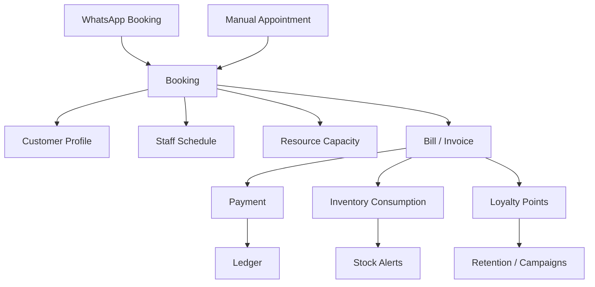
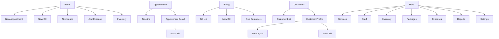

# Salex Salon Merchant App Revamp PRD

Document status: Draft  
Audience: Product, design, engineering, and coding agents  
Reference folder: `tremoora_ref/`  
Prepared on: 2026-06-09

## 1. Why This Revamp Exists

The current Salex merchant app has a strong beginning:

- WhatsApp-first appointment booking.
- Merchant onboarding.
- Service setup.
- Staff and resource setup.
- Basic booking list and booking actions.
- Manual walk-in booking creation.
- Basic revenue/ledger views.

But the Tremoora reference frames show that a salon owner needs more than booking. They need a small operating system for daily salon work:

- Make appointments quickly.
- Make bills quickly.
- Save customers automatically.
- Track visits, dues, packages, and loyalty.
- Track inventory and low stock.
- Track expenses.
- Track staff, attendance, and commissions.
- See reports.
- Give controlled access to staff.

The revamp goal is not to make the app complicated. The goal is to make the app feel complete while keeping the daily workflow simple enough for a non-technical salon owner.

The product principle:

```text
Daily work must be 1-2 taps.
Advanced tools must stay hidden until needed.
WhatsApp booking remains the main acquisition engine.
Salon operations become the retention and revenue engine.
```

## 2. Current Salex Baseline

Current app and backend already support these foundations:

| Area | Current Support |
| --- | --- |
| Business account | `Business`, owner login, category, phone, hours, active status |
| Services | Create, list, update, soft delete |
| Staff | Create, list, update, deactivate/reactivate, link to resources |
| Resources | Create/list/update, capacity model |
| Bookings | Multi-service booking, status flow, staff/resource allocation, manual creation |
| WhatsApp | Shared-number customer booking, conversation state, Redis/BullMQ queue |
| Flow engine | Versioned graph-based WhatsApp chat flows |
| Customers | Global `Customer`, `Person`, business-scoped `BusinessCustomer`, but no full mobile CRM screen |
| Subscription | Basic subscription model and app cards |
| Ledger | App-level booking revenue summaries, not full invoicing/accounting |

Current gaps:

- No invoice/bill domain.
- No product inventory domain.
- No package/membership domain.
- No loyalty/wallet domain.
- No expense domain.
- No attendance domain.
- No staff commission domain.
- No sub-user permission system beyond broad `OWNER`/`STAFF`.
- No customer CRM screen in the merchant app.
- No full report center.
- No standard mobile IA for advanced modules.

## 3. Product Direction

Salex should become:

```text
The easiest salon operating app, powered by WhatsApp booking.
```

Not:

```text
A generic WhatsApp CRM.
A custom flow-builder app.
A heavy accounting app.
```

The booking flow should be standard for all salons:

```text
Customer -> service -> staff optional -> date/time -> owner approval optional -> booking -> reminder -> checkout/bill
```

Customization should happen in salon operations and retention:

- Services and prices.
- Staff and working hours.
- Resource capacity.
- Reminder timing.
- Customer segments.
- Loyalty rules.
- Campaigns.
- Packages.
- Inventory thresholds.

## 4. Proposed Information Architecture

The reference product uses five bottom tabs:

```text
Home
Appointments
Billing
Customers
More
```

This is a better structure for Salex than placing everything inside Profile or Services.

Recommended Salex mobile IA:

```text
Home
Appointments
Billing
Customers
More
```

`More` should contain advanced modules:

```text
Services
Staff
Inventory
Expenses
Attendance
Packages
Reports
Settings
WhatsApp Workspace
```

Mobile app responsibility:

```text
Run the salon day.
```

Web workspace responsibility:

```text
Grow the salon business: campaigns, segments, loyalty, CRM, reports.
```

## 5. Core Data Flow



The source of truth remains the Salex database. WhatsApp, mobile app, and future web workspace are channels around the same business records.

## 6. Frame Inventory Note

The reference folder contains 29 images:

```text
1.jpeg through 12.jpeg
14.jpeg through 30.jpeg
```

`13.jpeg` is not present in the folder.

## 7. Frame-by-Frame Feature Analysis

### Frame 1: Home Dashboard

Reference feature:

- Home screen with salon name.
- Today's sales.
- Appointment count.
- Monthly summary.
- Quick actions.
- Today's schedule.
- Bottom navigation.

Existing Salex relation:

- Current `HomeScreen` has revenue block and today's schedule.
- Current app lacks quick action grid, low stock alerts, and task alerts on Home.

Expected inputs:

- Active business.
- Today's bookings.
- Completed bookings.
- Invoices/bills.
- New customers.
- Discounts.
- Low-stock products.
- Open alerts/tasks.

Expected outputs:

- Dashboard metrics.
- Quick navigation to New Bill, New Appointment, Attendance, Add Expense, Inventory, Services.
- Today's schedule list.
- Alert cards.

Product requirement:

- Home must become the daily command center.
- Owner should be able to start the two most common actions in one tap: `New Appointment` and `New Bill`.
- Secondary actions should be visible but not visually heavy.

Acceptance criteria:

- Home loads useful data even if inventory/expenses are not enabled yet.
- Empty states are calm and actionable.
- Tapping each quick action opens the right creation flow.

### Frame 2: Side Menu / Account Drawer

Reference feature:

- Current salon card.
- Change salon.
- Subscription plan.
- Delete account.
- Contact us.
- Help/FAQ/how-to-use.
- Web app links.
- Rate app.
- Logout.

Existing Salex relation:

- Current `ProfileScreen` has business profile, subscription cards, settings, and logout.
- No full account drawer.
- No salon switcher.
- No app help center.

Expected inputs:

- Logged-in user.
- Active business.
- User's business list.
- Subscription status.
- App version.
- Support contact links.

Expected outputs:

- Switch salon action.
- Open subscription management.
- Open help/support.
- Logout.

Product requirement:

- Account tools should move out of the daily Home screen.
- Use a drawer or `More -> Account` pattern.
- Do not make owner search inside settings for important support actions.

### Frame 3: Switch Salon

Reference feature:

- List all salons attached to the user.
- Show selected salon.
- Create new salon.

Existing Salex relation:

- Prisma `User` already has `businesses`.
- Merchant app currently behaves like one active business via `getBusinessMe`.

Expected inputs:

- User ID.
- Business memberships.
- Current active business ID.

Expected outputs:

- Active business selection saved locally and server-side where needed.
- App reloads services, staff, resources, bookings, and reports for selected business.

Product requirement:

- Multi-salon support should be a first-class model.
- For now, keep this behind account/menu, not on Home.

Needed backend/domain:

- `BusinessMember` model is recommended long term instead of direct owner-only relation.
- Permissions can later attach to `BusinessMember`.

### Frame 4: Upgrade / Subscription Plans

Reference feature:

- Current plan.
- Monthly/annual toggle.
- Number of salons toggle.
- Plan cards with limits for bills, services, products.

Existing Salex relation:

- `Subscription`, `PaymentRecord`, plan/status exist.
- App has subscription UI components.
- Entitlement limits are not fully modeled.

Expected inputs:

- Current subscription.
- Usage counts: salons, bills, services, products.
- Plan catalog.
- Billing cycle.

Expected outputs:

- Selected plan.
- Payment/update request.
- Entitlement state.

Product requirement:

- Plan limits must be tied to actual product value.
- Suggested limits:
  - Free/basic: low bill count, limited products/services.
  - Starter: enough for one salon.
  - Growth: staff, reports, reminders, inventory.
  - Premium: WhatsApp CRM, campaigns, loyalty, web workspace.

### Frame 5: Expanded Home Command Center

Reference feature:

- Today's sales.
- Appointments.
- Monthly summary.
- Quick actions.
- Today's schedule.
- Low stock products.
- Alerts/tasks.

Existing Salex relation:

- Partial support through current Home and booking store.
- No stock/task models.

Expected inputs:

- Same as Frame 1, plus inventory thresholds and alert queue.

Expected outputs:

- Prioritized operational cards:
  - Bookings needing action.
  - Low stock.
  - Pending dues.
  - Attendance missing.
  - Subscription warnings.

Product requirement:

- Home should not be a feature directory only.
- It should tell the owner what needs attention today.

### Frame 6: Appointments Timeline

Reference feature:

- Appointment calendar/timeline.
- Date filter.
- Staff/resource/service filters.
- Day view with time axis.
- `+ New` appointment.

Existing Salex relation:

- Current `BookingsScreen` is a revenue pipeline list.
- It does not provide a true day timeline.
- Booking data has `scheduledAt`, `endAt`, `staffId`, `resourceId`.

Expected inputs:

- Date/date range.
- Staff filter.
- Status filter.
- Resource filter.
- Booking list.

Expected outputs:

- Timeline blocks positioned by time.
- Tap booking -> detail.
- Tap empty slot -> create appointment at that time.

Product requirement:

- Appointments tab should prioritize schedule understanding, not just revenue.
- Day view is essential for salons.

Acceptance criteria:

- Owner can see free/busy time quickly.
- Overlapping bookings are visually clear.
- Creating a booking from a time slot pre-fills date/time.

### Frame 7: New Appointment

Reference feature:

- Select customer.
- Add services.
- Select date/time.
- Set status.
- Add notes.
- Show total.
- Save appointment.

Existing Salex relation:

- Current `SlotCreatorDrawer` supports services, time, notes, resource/staff, availability.
- It lacks customer selection and explicit status selection.
- It is a bottom drawer, not full screen.

Expected inputs:

- Customer or walk-in.
- Services.
- Date/time.
- Staff/resource optional.
- Status: pending/confirmed/in progress/completed.
- Notes.

Expected outputs:

- `Booking`.
- `BookingItem` snapshots.
- Optional customer linkage.
- Status history entry.

Product requirement:

- New appointment must support both:
  - ultra-fast walk-in booking.
  - known customer appointment.

Recommended UX:

- Default customer can be `Walk-in`.
- Service chips should show top/frequent services first.
- Time should default to `Now` or selected calendar slot.
- Owner should not fill 8 fields for normal walk-ins.

### Frame 8: New Bill

Reference feature:

- Select customer.
- Add service, product, or package.
- Overall discount.
- Tax after discount toggle.
- Notes.
- Payment method.
- Full/partial payment.
- Summary: subtotal, line discount, overall discount, tax, grand total, paid, due.
- Generate invoice.

Existing Salex relation:

- Current checkout only completes bookings with payment mode.
- No invoice/billing model.
- No products/packages/discount/tax/due.

Expected inputs:

- Customer.
- Bill items:
  - services.
  - products.
  - packages.
- Quantity.
- Price.
- Discounts.
- Tax group.
- Payment method.
- Paid amount.
- Notes.

Expected outputs:

- `Invoice` or `Bill`.
- `InvoiceItem`.
- `Payment`.
- Customer due update.
- Inventory stock movement for sold/consumed products.
- Loyalty points.
- WhatsApp/SMS invoice message.

Product requirement:

- Billing should become the second core workflow after appointment booking.
- Completed appointment should be convertible into bill.
- Bill can also be created without appointment for retail/walk-in purchase.

### Frame 9: Appointment Details

Reference feature:

- Customer card with call button.
- Service item breakdown.
- Staff assigned.
- Time.
- Status.
- Notes.

Existing Salex relation:

- Current `BookingDetailDrawer` supports details, call action utilities, and status actions.
- Customer name support is weak because bookings often show phone/walk-in only.

Expected inputs:

- Booking ID.
- Customer profile.
- Booking items.
- Staff/resource.
- Status history.

Expected outputs:

- Detail view.
- Call customer.
- Status action.
- Bill generation action if applicable.

Product requirement:

- Appointment detail must clearly answer:
  - who is coming?
  - when?
  - what service?
  - who will serve?
  - what is next action?

### Frame 10: Appointment Completion to Bill

Reference feature:

- Appointment detail bottom action: `Mark Completed -> Make Bill`.
- Cancel appointment.

Existing Salex relation:

- Current flow has `complete` with payment mode.
- It skips a real bill.

Expected inputs:

- Booking ID.
- Completion action.

Expected outputs:

- Booking status transitions to `COMPLETED` or `IN_PROGRESS -> COMPLETED`.
- Bill draft generated from booking services.
- Owner confirms payment and invoice.

Product requirement:

- Do not treat completion and billing as the same thing.
- Completion should lead into bill, especially when products, discounts, packages, or dues are involved.

### Frame 11: Customers List

Reference feature:

- Search customers.
- Filter/sort.
- Add customer.
- Customer card with visits, spend, last date.

Existing Salex relation:

- Backend has `Customer`, `Person`, `BusinessCustomer`.
- Merchant app has no customer list screen.

Expected inputs:

- Business ID.
- Search query.
- Filters: all, due, recent, inactive, birthday, package active.
- Sort: recent, spend, visits, name.

Expected outputs:

- Paginated customer list.
- Customer profile navigation.
- Customer creation.

Product requirement:

- Customers tab should become the owner memory.
- Every WhatsApp/manual booking should enrich this list automatically.

### Frame 12: Customer Profile

Reference feature:

- Customer name and phone.
- Total spend.
- Total due.
- Visits.
- Wallet points.
- Edit/delete actions.
- Past visits.
- Notes.
- Packages/memberships.

Existing Salex relation:

- `BusinessCustomer` has displayName, notes, preferences.
- Bookings can link to `BusinessCustomer`.
- No due, wallet, package, visit aggregation screen.

Expected inputs:

- Customer ID.
- Bookings.
- Invoices/payments.
- Loyalty ledger.
- Package memberships.
- Notes.

Expected outputs:

- Aggregated profile.
- Edit customer.
- Add note.
- Start appointment.
- Start bill.
- Send WhatsApp message later.

Product requirement:

- Customer profile is the foundation for premium retention/campaign features.
- Do not build campaign UI until this customer data is reliable.

### Frame 14: Salon Profile

Reference feature:

- Salon name.
- Business type.
- Address fields.
- Phone.
- Logo upload.

Existing Salex relation:

- `Business` supports name, phone, category, hours.
- Local app type includes address but Prisma `Business` does not currently show address in the inspected schema.
- No logo field in current core model.

Expected inputs:

- Salon name.
- Business type.
- Address.
- Phone.
- Logo/photo.
- Location.

Expected outputs:

- Updated business profile.
- Public marketplace profile data.
- Invoice header data.
- WhatsApp/customer-facing identity.

Product requirement:

- Salon profile must serve three surfaces:
  - merchant app.
  - customer booking/search.
  - invoice/receipt.

### Frame 15: Add Customer

Reference feature:

- Full name.
- Phone.
- Email optional.
- Gender.
- Birthday.
- Notes.

Existing Salex relation:

- Current `Customer` is minimal.
- Current `BusinessCustomer` can store notes/preferences but lacks typed fields.

Expected inputs:

- Name.
- Phone.
- Email.
- Gender.
- Birthday.
- Notes.

Expected outputs:

- `Person`.
- `BusinessCustomer`.
- Optional global customer update by phone.

Product requirement:

- Phone number remains the primary identity because WhatsApp is central.
- Extra fields should be optional.

### Frame 16: Inventory List and Add Sheet

Reference feature:

- Inventory page.
- Product/category search.
- Add bottom sheet:
  - add product category.
  - add product.

Existing Salex relation:

- No inventory domain.

Expected inputs:

- Product list.
- Category list.
- Stock status.
- Search and filters.

Expected outputs:

- Product inventory list.
- Low stock alerts.
- Category creation flow.
- Product creation flow.

Product requirement:

- Inventory should support both retail products and consumables used during services.

### Frame 17: Add Product

Reference feature:

- Product name.
- Category.
- Product type.
- Opening stock.
- Low stock alert.
- Purchase price.
- Selling price.
- Tax group.
- Product photo.

Existing Salex relation:

- No product model.
- No stock ledger.
- No tax model.

Expected inputs:

- Product name.
- Category.
- Product type.
- Measurement.
- Opening stock.
- Low stock threshold.
- Purchase/selling price.
- Tax group.
- Photo.

Expected outputs:

- Product record.
- Initial stock movement.
- Low stock rule.

Recommended models:

- `Product`
- `ProductCategory`
- `StockMovement`
- `TaxGroup`

### Frame 18: Product Type Selector

Reference feature:

- Sale product.
- Consumption product used in services.

Existing Salex relation:

- No inventory model.

Expected inputs:

- Product type choice.

Expected outputs:

- Product behavior:
  - `RETAIL`: appears in bill as sellable product.
  - `CONSUMABLE`: can be linked to services and deducted when service bill completes.

Product requirement:

- This is critical for salons because color, shampoo, wax, gloves, creams, and disposables affect cost.

### Frame 19: Add Staff

Reference feature:

- Name.
- Phone.
- Role.
- Salary.
- Enable login.
- Staff photo.
- Documents/certificates.
- Working hours.
- Commission rules.

Existing Salex relation:

- `Staff` has name, phone, active.
- `UserRole` only has `OWNER` and `STAFF`.
- No staff salary, role, login, docs, hours, commissions.

Expected inputs:

- Staff identity.
- Phone.
- Role.
- Login enabled.
- Salary.
- Working hours.
- Commission rules.
- Photo/doc uploads.

Expected outputs:

- Staff profile.
- Optional user login/member account.
- Staff schedule constraints.
- Commission calculation inputs.

Product requirement:

- Do not overload the normal owner with every field.
- Use progressive disclosure:
  - minimum: name and phone.
  - advanced: login, salary, commission, documents, working hours.

### Frame 20: Attendance Settings

Reference feature:

- Enable attendance.
- Attendance mode.
- Geofence radius.
- Salon location.
- Use current location.
- Explanation of geofence.

Existing Salex relation:

- No attendance model.

Expected inputs:

- Attendance enabled.
- Mode: manual/geofence/QR/future.
- Latitude/longitude.
- Radius.
- Staff list.

Expected outputs:

- Attendance policy.
- Daily attendance sessions.
- Staff mark-in/mark-out behavior.

Product requirement:

- Attendance should be optional.
- It should not block booking setup.

### Frame 21: Packages List

Reference feature:

- Package search.
- Add package.
- Empty state.

Existing Salex relation:

- No package/membership model.

Expected inputs:

- Business packages.
- Search query.

Expected outputs:

- Package list.
- Add/edit package.

Product requirement:

- Packages are important for retention and prepaid revenue.

### Frame 22: Add Package

Reference feature:

- Package name.
- Price.
- Tax group.
- Add services.
- Validity.

Existing Salex relation:

- Services exist.
- No package model.

Expected inputs:

- Name.
- Price.
- Tax group.
- Services included.
- Validity days.

Expected outputs:

- Package template.
- Future customer package purchase/membership.

Recommended models:

- `Package`
- `PackageService`
- `CustomerPackage`
- `CustomerPackageRedemption`

### Frame 23: Add Expense

Reference feature:

- Expense category.
- Description.
- Amount.
- Expense date.

Existing Salex relation:

- No expense model.

Expected inputs:

- Category.
- Description.
- Amount.
- Date.
- Optional vendor/payment mode later.

Expected outputs:

- Expense record.
- Finance report updates.

Product requirement:

- Add Expense should be a Home quick action.
- Keep it very fast.

### Frame 24: Expenses List

Reference feature:

- Category filter.
- Date range filter.
- Total.
- Add expense.
- Empty state.

Existing Salex relation:

- No expense model.

Expected inputs:

- Business expenses.
- Category filter.
- Start/end date.

Expected outputs:

- Expense list.
- Total expense amount.
- Export/report data.

Product requirement:

- Expenses should feed reports but not become a full accounting system.

### Frame 25: Expense Category Picker

Reference feature:

- Searchable option sheet.
- Categories:
  - supplies.
  - salaries.
  - marketing.
  - maintenance.
  - other.

Existing Salex relation:

- No expense category model.

Expected inputs:

- Category list.
- Search.

Expected outputs:

- Selected category.

Product requirement:

- Provide default categories.
- Allow custom categories later.

### Frame 26: Add Sub User and Permissions

Reference feature:

- Create staff/sub-user account.
- Name, email, phone, password.
- Role presets.
- Permission matrix:
  - appointments.
  - attendance.
  - billing.
  - customers.
  - expenses.
  - inventory.
  - loyalty.
  - memberships.
  - services.
  - staff.

Existing Salex relation:

- Current `User` supports broad role only.
- No business membership/permission model.

Expected inputs:

- User identity.
- Business ID.
- Role preset.
- Permission checkboxes.

Expected outputs:

- Business member user.
- Permission grants.
- Login credentials/invite.

Product requirement:

- Use presets first:
  - Owner.
  - Manager.
  - Receptionist.
  - Staff.
  - Accountant.
- Advanced checkbox matrix can be hidden behind `Customize permissions`.

Recommended models:

- `BusinessMember`
- `Role`
- `Permission`
- `BusinessMemberPermission`

### Frame 27: Permission Matrix Continued

Reference feature:

- Additional permission groups such as tax groups and vendors.
- Create sub-user final action.

Existing Salex relation:

- No vendor/tax permission model.

Expected inputs:

- Same as Frame 26.
- Permission groups for future finance/inventory modules.

Expected outputs:

- Permissioned app access.

Product requirement:

- RBAC should be built before exposing inventory, expenses, billing, and staff salary data to employees.

### Frame 28: Reminders

Reference feature:

- Reminder wallet balance.
- Add credits.
- Message templates:
  - bill to customer.
  - appointment details to customer.
- SMS cost per message.

Existing Salex relation:

- WhatsApp outbound messages and templates are already a strategic direction.
- No reminder wallet/credits in merchant app.

Expected inputs:

- Reminder balance/credits.
- Message template settings.
- Channel preference: WhatsApp first, SMS fallback later.
- Booking and bill data.

Expected outputs:

- Reminder messages.
- Usage ledger.
- Customer notifications.

Product requirement:

- In Salex, this should be WhatsApp-first, not SMS-first.
- For premium dedicated clients, reminders/campaigns become monetization.

Recommended wording:

```text
Messages & Reminders
```

not only:

```text
SMS Reminders
```

### Frame 29: Reports

Reference feature:

- Report center grouped by category:
  - Sales summary.
  - Customer visits.
  - Staff commission.
  - Stock report.
  - Expenses.
  - Appointment summary.

Existing Salex relation:

- Current `LedgerScreen` calculates some revenue/staff/service aggregates client-side.
- No complete report API.

Expected inputs:

- Date range.
- Bookings.
- Bills.
- Payments.
- Customers.
- Staff.
- Products.
- Expenses.

Expected outputs:

- Report cards.
- Detail report screens.
- Export later.

Product requirement:

- Reports should answer owner questions:
  - How much did I earn?
  - Which staff performed best?
  - Which service sells most?
  - Which products are low?
  - How many customers returned?
  - How much did I spend?

### Frame 30: Attendance

Reference feature:

- Attendance screen.
- Settings card.
- Date picker.
- Staff attendance list.
- Empty state.

Existing Salex relation:

- No attendance model.
- Staff list exists.

Expected inputs:

- Attendance settings.
- Date.
- Staff list.
- Attendance records.

Expected outputs:

- Daily attendance record.
- Mark present/absent/late.
- Attendance report.

Product requirement:

- Staff attendance should be optional.
- It becomes more valuable when tied to salary/commission later.

## 8. New Domain Model Requirements

The current database is booking-first. The revamp requires these new domains.

### 8.1 Billing / Invoice

Purpose:

- Create bills from appointments or direct walk-in/retail sales.
- Track discount, tax, paid amount, due amount, and payment method.

Core models:

```text
Invoice
InvoiceItem
Payment
CustomerDueLedger
```

Important fields:

```text
Invoice:
businessId
customerId/businessCustomerId
bookingId optional
invoiceNumber
subtotal
lineDiscountTotal
overallDiscount
taxTotal
grandTotal
paidAmount
dueAmount
status: DRAFT | ISSUED | PARTIALLY_PAID | PAID | CANCELLED
notes
createdBy

InvoiceItem:
invoiceId
itemType: SERVICE | PRODUCT | PACKAGE
referenceId
nameSnapshot
quantity
unitPrice
discount
tax
total
```

### 8.2 Customers

Purpose:

- Turn bookings into long-term customer records.

Core models:

```text
Person
BusinessCustomer
CustomerNote
CustomerTag
```

New fields recommended:

```text
email
gender
birthday
lastVisitAt
totalSpendCached
totalDueCached
visitCountCached
```

Use cached totals for fast mobile screens, recalculated from invoices/bookings.

### 8.3 Inventory

Purpose:

- Track retail products and consumables.
- Alert low stock.
- Deduct stock after invoice/service completion.

Core models:

```text
ProductCategory
Product
StockMovement
ServiceProductConsumption
```

Product types:

```text
RETAIL
CONSUMABLE
```

Stock movement types:

```text
OPENING
PURCHASE
SALE
SERVICE_CONSUMPTION
ADJUSTMENT
RETURN
```

### 8.4 Packages / Memberships

Purpose:

- Sell prepaid packages.
- Track validity and redemptions.

Core models:

```text
Package
PackageService
CustomerPackage
CustomerPackageRedemption
```

### 8.5 Loyalty

Purpose:

- Encourage repeat visits.
- Later power campaigns.

Core models:

```text
LoyaltyRule
LoyaltyLedger
```

Simple v1 rule:

```text
Earn X points per Rs Y paid.
Redeem points as discount.
```

### 8.6 Expenses

Purpose:

- Let owner track simple business expenses.

Core models:

```text
ExpenseCategory
Expense
Vendor optional later
```

### 8.7 Staff Operations

Purpose:

- Staff profiles, attendance, commission, roles.

Core models:

```text
BusinessMember
StaffProfileExtension
AttendancePolicy
AttendanceRecord
CommissionRule
CommissionLedger
```

### 8.8 Reports

Purpose:

- Serve report screens from stable server-side aggregations.

Recommended endpoints:

```text
GET /businesses/:businessId/reports/sales-summary
GET /businesses/:businessId/reports/customer-visits
GET /businesses/:businessId/reports/staff-commission
GET /businesses/:businessId/reports/stock
GET /businesses/:businessId/reports/expenses
GET /businesses/:businessId/reports/appointments
```

## 9. Revamped Daily Workflows

### 9.1 Create Appointment in 1-2 Taps

Target flow:

```text
Home -> New Appt
Default customer: Walk-in
Tap service
Tap time/Now
Save
```

Advanced fields should be optional:

- Customer.
- Staff.
- Resource.
- Notes.
- Status.

### 9.2 WhatsApp Booking to Owner App

Target flow:

```text
Customer books on WhatsApp
Booking appears in Appointments
Owner taps booking
Owner confirms/rejects
Customer gets WhatsApp update
At visit completion, owner taps "Make Bill"
```

### 9.3 Appointment to Bill

Target flow:

```text
Appointment detail
Tap Mark Completed -> Make Bill
Bill opens with services prefilled
Owner adds products/package/discount if needed
Owner selects payment
Generate invoice
Customer receives WhatsApp receipt/reminder
```

### 9.4 Direct Bill

Target flow:

```text
Home -> New Bill
Select customer optional
Add service/product/package
Payment
Generate invoice
```

### 9.5 Customer Retention

Target flow:

```text
Bill paid
Customer profile updates
Visit count/spend/loyalty updates
Customer becomes available for future campaign/loyalty segment
```

## 10. Mobile vs Web Responsibility

Mobile should include:

- Home command center.
- Appointments.
- New appointment.
- New bill.
- Customers.
- Customer profile.
- Basic inventory.
- Add expense.
- Attendance.
- Basic reports.

Web workspace should include later:

- Campaign builder.
- Advanced customer segmentation.
- WhatsApp CRM inbox.
- Loyalty setup.
- Bulk customer import.
- Detailed reports.
- Multi-branch admin.
- Permission management at scale.

QR-based web login remains a strong UX direction:

```text
Owner opens web workspace
Scans QR from mobile
Approves
Web opens without another password login
```

## 11. Recommended Build Phases

### Phase 1: Daily Operating Loop

Goal:

Make Salex useful every day even before CRM/campaigns.

Build:

- New mobile IA: Home, Appointments, Billing, Customers, More.
- Home quick actions and alerts shell.
- Appointment timeline day view.
- Improved New Appointment with customer optional.
- Bill/Invoice MVP.
- Appointment -> Make Bill.
- Customer list and basic customer profile.

Why first:

- This creates immediate salon value.
- This keeps WhatsApp booking connected to real salon operations.

### Phase 2: Customer Retention Foundation

Build:

- Customer spend/visit/due aggregation.
- Packages.
- Loyalty ledger.
- Reminder/message settings.
- WhatsApp receipt/reminder templates.

Why second:

- Campaigns are only valuable after customer data is clean.

### Phase 3: Inventory and Expenses

Build:

- Product categories.
- Products.
- Stock movements.
- Low stock alerts.
- Expenses.
- Expense reports.

Why third:

- Inventory and expenses improve operational value but are not required to validate booking/billing.

### Phase 4: Staff Operations

Build:

- Staff extended profile.
- Staff login/member model.
- Attendance.
- Commission rules.
- Staff commission reports.
- Permission presets.

Why fourth:

- Staff operations add complexity and need RBAC.

### Phase 5: Premium WhatsApp Workspace

Build:

- Dedicated number management.
- WhatsApp inbox.
- Campaigns.
- Segments.
- Loyalty campaigns.
- Web dashboard.
- QR web login.

Why fifth:

- This monetizes premium clients after the core data engine is useful.

## 12. Navigation Proposal



## 13. Design Principles For The Revamp

1. Daily actions must be large, obvious, and few.
2. Advanced modules belong in `More`.
3. Customer-facing WhatsApp booking must stay standard.
4. Every booking should create or enrich a customer record.
5. Every bill should update customer spend/due and optional inventory/loyalty.
6. Reports should come from the same source of truth, not client-side guesses.
7. Role-based permissions must arrive before giving staff access to money-sensitive modules.
8. Mobile app is for operating the salon; web workspace is for growth and advanced CRM.

## 14. Engineering Notes

### 14.1 Reuse Existing Strengths

Keep and extend:

- Current booking service.
- Availability checks.
- Staff/resource allocation.
- WhatsApp booking pipeline.
- Subscription guardrails.
- Revenue/ledger UI ideas.

### 14.2 Avoid These Mistakes

Do not:

- Build custom booking flows per salon.
- Put campaigns before customer data quality.
- Put all CRM features inside mobile Home.
- Create separate CRM database detached from `businessId`.
- Let staff access billing/inventory before RBAC exists.
- Treat bill generation as a small UI wrapper around booking completion.

### 14.3 API Direction

New APIs should be business-scoped:

```text
/api/v1/businesses/:businessId/customers
/api/v1/businesses/:businessId/invoices
/api/v1/businesses/:businessId/products
/api/v1/businesses/:businessId/stock-movements
/api/v1/businesses/:businessId/packages
/api/v1/businesses/:businessId/expenses
/api/v1/businesses/:businessId/attendance
/api/v1/businesses/:businessId/reports/*
```

Every route must enforce business membership and permissions once RBAC exists.

## 15. Success Metrics

Product usage:

- Time to create walk-in appointment: under 20 seconds.
- Time to generate bill from appointment: under 30 seconds.
- Percent of bookings linked to customer profile.
- Percent of completed bookings converted to invoice.
- Daily active merchant usage.

Business value:

- Repeat customer rate.
- Appointments completed per month.
- Bills generated per month.
- WhatsApp bookings converted to paid invoices.
- Campaign-driven repeat bookings later.

Operational health:

- Low stock alert accuracy.
- Due amount tracked.
- Staff attendance adoption.
- Expense entry adoption.

## 16. Final Recommendation

The revamp should not chase feature count blindly. It should build a clean operating loop:

```text
Appointment -> Service -> Bill -> Customer History -> Retention
```

Then expand into:

```text
Inventory
Expenses
Staff attendance
Reports
Campaigns
Premium WhatsApp workspace
```

This makes the app valuable even for non-technical salon owners, while keeping WhatsApp booking as the main growth engine.

