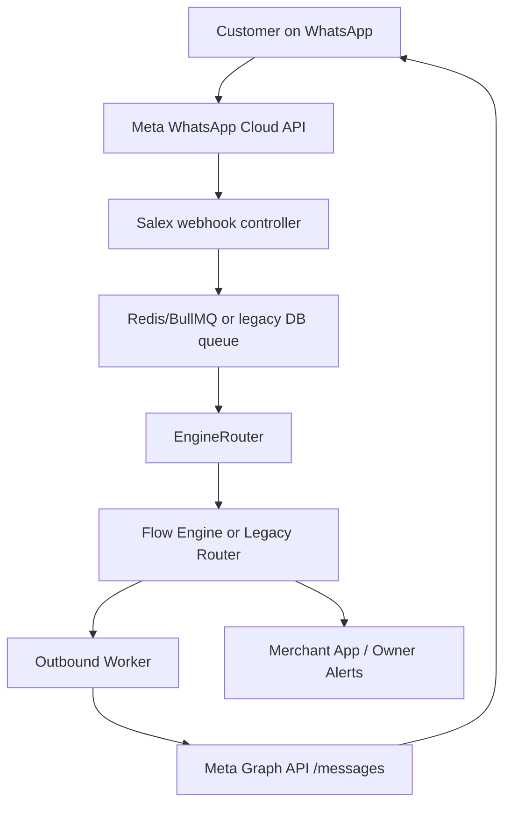

# Salex x Meta WhatsApp Platform Strategy

Document version: 1.0  
Prepared for: Salex product and engineering  
Last reviewed: 2026-06-06  
Status: Architecture strategy and implementation guidance

## 1. Executive Summary

Meta is moving WhatsApp Business from a simple messaging provider into a shared business infrastructure layer. The most important direction for Salex is clear:

> Salex should become the appointment intelligence layer for a salon's existing WhatsApp number.

Salex should not try to become a generic WhatsApp CRM. Interakt, WATI, AiSensy, agencies, inbox tools, and future Meta agents may all coexist around the same business number. Salex's role should be narrower and stronger:

- detect booking intent,
- collect service, staff, date, and slot details,
- notify the owner,
- wait for owner approval where required,
- confirm the booking on WhatsApp,
- update business reporting automatically.

The target product promise is:

Same WhatsApp number. No customer app. Instant owner alerts. Confirmed appointments. Daily business clarity.

## 2. Current Salex Architecture Baseline

The current WhatsApp system is documented in this folder:

- `docs/whatsapp/01-architecture-overview.md`
- `docs/whatsapp/02-webhook-message-pipeline.md`
- `docs/whatsapp/04-flow-engine.md`
- `docs/whatsapp/08-shared-vs-dedicated.md`
- `docs/whatsapp/12-redis-bullmq-queue.md`

Current runtime flow:



Current strengths:

- queue-based webhook processing,
- Redis/BullMQ support for lower latency and concurrency,
- per-customer/business locking,
- stale outbound message guard,
- shared-number and dedicated-number modes,
- versioned flow definitions,
- encrypted dedicated channel credentials.

Current limitations:

- `WhatsAppChannel` models only today's shared/dedicated channel shape;
- outbound sending is still centered on `phoneNumberId` plus optional `businessId`;
- there is no first-class account model for embedded signup, billing mode, account health, or multi-partner ownership;
- there is no conversation ownership system, so Salex can still behave like the only automation on a number;
- account update webhooks are not represented as a separate integration surface;
- message usage, billing category, and monthly value reporting are not first-class yet.

## 3. Meta Platform Changes: Verification Notes

This section separates confirmed architecture direction from provisional terminology.

| Topic | Verification status | Engineering interpretation |
| --- | --- | --- |
| Embedded Signup | Confirmed by Meta documentation/API collections. | Salex should move from manual channel setup to `Connect WhatsApp` onboarding. |
| Existing WhatsApp Business App onboarding/coexistence | Confirmed direction in Meta docs and developer material. | Salex should support connecting a business's existing number instead of forcing a new number. |
| Multi-partner number sharing | Confirmed by Meta multi-partner/developer material. | Salex must assume other tools may share the same number. |
| Account update webhooks | Confirmed webhook concept. | Salex needs account-status ingestion and admin alerts. |
| Pricing categories | Confirmed: template categories are marketing, utility, and authentication; customer-service-window/non-template messages are handled differently. | Every outbound message should carry an internal category/use case. Salex may use `SERVICE` internally, but should not treat it as a current template category. |
| Meta Business AI Agents | Confirmed product direction. | Salex should remain vertical-specific: booking, availability, owner approval, reports. |
| Graph API v25 | Current code already defaults to `v25.0`. | New integrations should keep API version centralized. |
| `paid_messaging_account_id` | Not confirmed from public docs reviewed. | Add nullable/provisional schema fields, but do not hardcode send-payload behavior until verified against Meta's official API docs or partner transcript. |
| `WACK` naming | Not confirmed from public docs reviewed. | Store as forward-compatible metadata, but avoid treating it as a stable public API term in product copy or migrations without confirmation. |

## 4. Product Positioning

Old Salex pitch:

Use a new dedicated WhatsApp booking number.

New Salex pitch:

Connect your existing salon WhatsApp number. Salex handles booking requests on the same number.

This matters in India because many salons already have one WhatsApp number printed on Google Maps, Instagram, visiting cards, staff phones, shop boards, and customer contact lists. Asking a salon to change that number creates unnecessary fear.

Salex should sell coexistence, not replacement:

- Keep Interakt/WATI/AiSensy for campaigns or inbox.
- Keep staff/human WhatsApp usage where needed.
- Use Salex only for appointment capture, booking flow, owner approval, reminders, and reports.

## 5. Target WhatsApp Account Model

The current `WhatsAppChannel` model should eventually become or be wrapped by a richer account model.

Recommended model:

```prisma
model BusinessWhatsAppAccount {
  id        String @id @default(cuid())
  businessId String

  provider       String // META_CLOUD, TWILIO, DIALOG360, SHARED_SALEX
  connectionType String
  // SHARED_SALEX_NUMBER
  // DEDICATED_NEW_NUMBER
  // EXISTING_BUSINESS_APP_CONNECTED
  // MULTI_PARTNER_SHARED_NUMBER

  phoneNumber        String?
  displayPhoneNumber String?
  phoneNumberId      String?

  // Legacy and forward-compatible Meta identifiers.
  legacyWabaId             String?
  metaBusinessId           String?
  wackId                   String? // provisional; keep nullable until verified
  paidMessagingAccountId   String? // provisional; keep nullable until verified

  accessTokenEncrypted String?
  tokenExpiresAt       DateTime?
  permissions          Json?

  billingMode String
  // SALEX_SHARED_BILLING
  // SALEX_LINE_OF_CREDIT
  // CUSTOMER_OWN_PAYMENT_METHOD

  billingStatus String
  // NOT_REQUIRED, PENDING, ACTIVE, FAILED, SUSPENDED

  templateStatus String
  // NOT_REQUIRED, PENDING, APPROVED, REJECTED

  connectionStatus String
  // PENDING, EMBEDDED_SIGNUP_STARTED, AUTHORIZATION_RECEIVED,
  // NUMBER_CONNECTED, WEBHOOK_SUBSCRIBED, BILLING_PENDING,
  // TEMPLATE_PENDING, TESTING, ACTIVE, LIMITED, FAILED,
  // DISCONNECTED, RESTRICTED

  isPrimary          Boolean @default(false)
  isAutoReplyEnabled Boolean @default(false)

  qualityRating       String?
  messagingLimit      String?
  lastAccountUpdateAt DateTime?
  activatedAt         DateTime?
  disabledAt          DateTime?

  createdAt DateTime @default(now())
  updatedAt DateTime @updatedAt

  @@index([businessId])
  @@index([phoneNumberId])
  @@index([connectionStatus])
  @@index([billingStatus])
}
```

Migration guidance:

1. Do not delete `WhatsAppChannel` immediately.
2. Add `BusinessWhatsAppAccount` as the new canonical account model.
3. Backfill one account row per existing `WhatsAppChannel`.
4. Keep compatibility reads from `WhatsAppChannel` until all send/webhook paths use the new resolver.
5. Later deprecate `WhatsAppChannel` or keep it as a thin compatibility view/table.

## 6. Conversation Ownership

Multi-partner number sharing creates a serious risk: multiple tools can reply to the same customer.

Example bad outcome:

```text
Customer: I want haircut at 5 PM.
Meta Agent: Here are our opening hours.
Marketing bot: Thanks for contacting us.
Salex: Please select service.
Human staff: Call me.
```

Salex must not reply to every inbound message by default.

Recommended model:

```prisma
model ConversationOwnership {
  id            String @id @default(cuid())
  businessId    String
  customerPhone String

  ownerSystem String
  // SALEX, META_AGENT, INTERAKT, WATI, AISENSY, HUMAN, UNKNOWN

  intent String
  // BOOKING, SUPPORT, MARKETING, PAYMENT, GENERAL

  conversationId String?
  source          String?
  // QR_LINK, CTWA_AD, CLEAR_BOOKING_INTENT, MANUAL_ASSIGNMENT, ACTIVE_FLOW

  expiresAt DateTime?
  createdAt DateTime @default(now())
  updatedAt DateTime @updatedAt

  @@unique([businessId, customerPhone])
  @@index([businessId])
  @@index([customerPhone])
  @@index([ownerSystem])
  @@index([intent])
}
```

Salex should reply only when at least one rule is true:

1. Customer entered via Salex booking QR/link.
2. Customer sent clear booking intent.
3. Existing owner is `SALEX`.
4. Human/owner manually assigned the conversation to Salex.
5. Existing Salex booking flow is active and not expired.

Salex should hand off or stay silent when:

- customer is asking general support,
- message appears to be campaign/support follow-up,
- conversation owner is `HUMAN`,
- account is restricted or disconnected,
- billing/subscription does not allow the send.

## 7. Messaging Service Design

All outbound WhatsApp sends should go through one business-aware service. Avoid direct calls like:

```typescript
sendMessage(phoneNumberId, to, text);
```

Target interface:

```typescript
sendBusinessWhatsAppMessage({
  businessId,
  to,
  messageType,
  useCase,
  category,
  templateName,
  templateLanguage,
  text,
  interactive,
  metadata,
});
```

Internal steps:

1. Resolve the business's primary WhatsApp account.
2. Check connection status.
3. Check account restrictions.
4. Check billing status.
5. Check Salex subscription status.
6. Check usage limits.
7. Check conversation ownership.
8. Check template approval if outside the customer service window.
9. Resolve access token and `phoneNumberId`.
10. Attach future Meta account identifiers only when officially supported by the send endpoint.
11. Send via Meta Graph API.
12. Save message audit.
13. Track usage, category, cost estimate, and business value event.

Recommended types:

```typescript
type WhatsAppMessageCategory = 'SERVICE_WINDOW' | 'UTILITY' | 'AUTHENTICATION' | 'MARKETING';

type WhatsAppUseCase =
  | 'BOOKING_FLOW'
  | 'BOOKING_CONFIRMATION'
  | 'BOOKING_REMINDER'
  | 'BOOKING_REJECTION'
  | 'OWNER_OTP'
  | 'REACTIVATION'
  | 'DAILY_REPORT'
  | 'SUPPORT_HANDOFF';
```

`SERVICE_WINDOW` is a Salex internal category for customer-initiated, non-template messaging inside the WhatsApp customer service window. It is not the same thing as a current Meta template category.

## 8. Webhook Architecture

Current inbound webhook:

- verifies Meta webhook ownership;
- validates payload;
- parses inbound messages/status payloads;
- resolves shared vs dedicated number;
- enqueues Redis/BullMQ or legacy DB work.

Target webhook surfaces:

| Endpoint | Purpose |
| --- | --- |
| `GET /api/v1/webhooks/whatsapp` | Meta webhook verification |
| `POST /api/v1/webhooks/whatsapp` | Inbound messages and message statuses |
| `POST /api/v1/meta/account-updates` | Account connection, permission, partner, billing, restriction changes |
| `POST /api/v1/meta/embedded-signup/callback` | Embedded Signup callback/code exchange |
| `POST /api/v1/whatsapp-flow` | WhatsApp Flow data exchange endpoint |

Account update handling should update:

- `BusinessWhatsAppAccount.connectionStatus`,
- `BusinessWhatsAppAccount.billingStatus`,
- `BusinessWhatsAppAccount.templateStatus`,
- `BusinessWhatsAppAccount.permissions`,
- `BusinessWhatsAppAccount.lastAccountUpdateAt`.

Trigger admin alerts when:

- Salex is removed as a partner,
- permissions are reduced,
- billing fails,
- phone number is disconnected,
- account is restricted,
- messaging limit/quality drops.

## 9. Billing and Usage Tracking

Salex should support three billing modes:

| Billing mode | Use case | Risk |
| --- | --- | --- |
| `SALEX_SHARED_BILLING` | Shared Salex demo/free number | Salex pays all usage; must cap free usage. |
| `SALEX_LINE_OF_CREDIT` | Small paid salons | Best sales experience, but Salex carries message-cost risk. |
| `CUSTOMER_OWN_PAYMENT_METHOD` | Larger salons/multi-branch | Lower Salex risk, more setup friction. |

Every outbound send should create a usage row with:

- business ID,
- account ID,
- customer phone hash or normalized phone,
- message category,
- use case,
- template name if applicable,
- provider message ID,
- estimated cost,
- conversation ID,
- source engine,
- created timestamp.

This enables:

- message-cost controls,
- monthly value report,
- per-business ROI reporting,
- abuse detection,
- plan limits.

## 10. Monthly Value Report

Retention should not depend only on "messages sent." Salex should prove booking value.

Monthly report should include:

- booking conversations handled,
- booking requests captured,
- confirmed appointments,
- rejected/unavailable requests,
- missed booking requests recovered,
- estimated revenue,
- repeat customers reactivated,
- owner response time,
- WhatsApp message cost estimate,
- net value created.

Example:

```text
This month Salex handled:
- 312 booking conversations
- 126 booking requests
- 92 confirmed appointments
- Rs. 1,38,000 estimated appointment revenue
- 18 repeat customers reactivated
- 23 missed booking requests captured
```

## 11. Embedded Signup Roadmap

### Phase 1: Manual

Use for the first 0-10 salons.

- Shared Salex number.
- Manual WhatsApp setup.
- Developer-controlled booking flow.
- Admin debug panel.

### Phase 2: Guided Setup

Use for 10-50 salons.

- Admin-guided WhatsApp connection.
- Dedicated number support.
- Encrypted credentials.
- Connection test.
- Account status page.

### Phase 3: Embedded Signup

Use after manual onboarding becomes repetitive.

- `Connect WhatsApp` button.
- Meta Embedded Signup.
- Store returned identifiers.
- Auto-test connection.
- Auto-subscribe webhook where supported.
- Show account/billing/template status.

### Phase 4: Multi-Partner Coexistence

Use after larger salons or existing Interakt/WATI/AiSensy customers appear.

- business account model,
- conversation ownership,
- partner conflict detection,
- billing mode selection,
- scoped metrics,
- account update webhooks,
- monthly value report.

## 12. AI Strategy

Meta Business Agents make WhatsApp a stronger business front office. This benefits Salex, but Salex should avoid becoming a generic chatbot.

Do not position Salex as:

- ChatGPT for WhatsApp,
- generic AI assistant,
- ask-anything salon bot.

Position Salex as:

- salon booking assistant,
- appointment manager,
- queue manager,
- owner alert system,
- repeat-customer engine.

Salex AI should be narrow and operational:

- classify booking intent,
- map requested services to actual service catalog,
- check staff/resource availability,
- ask missing questions,
- create booking intent,
- request owner approval,
- confirm/reject/reschedule,
- update reports.

## 13. Immediate Engineering Gaps

Based on current code and docs, these are the highest-value architecture gaps.

### Gap 1: `WhatsAppChannel` is too narrow

Current model supports shared/dedicated channel setup, but not embedded signup, billing status, account health, multi-partner metadata, or future identifiers.

Recommended action:

- add `BusinessWhatsAppAccount`;
- keep `WhatsAppChannel` compatibility during migration.

### Gap 2: No conversation ownership

Current `EngineRouter` chooses legacy/flow based on business resolution and feature flags. It does not decide whether Salex should reply in a multi-partner environment.

Recommended action:

- add `ConversationOwnership`;
- run ownership check before `engineRouter.route()`;
- support silent/no-op outcomes.

### Gap 3: Outbound service is not business-policy aware enough

Current `whatsappService.sendMessage()` resolves token/phone number and sends to Graph API. It does not centralize billing, category, subscription, ownership, or usage limits.

Recommended action:

- create `business-whatsapp-message.service.ts`;
- move all outbound sends behind `sendBusinessWhatsAppMessage()`;
- keep low-level `whatsappService` as provider HTTP client only.

### Gap 4: Account updates are missing

Current webhook controller handles inbound messages/status-style webhooks. It does not model account connection updates.

Recommended action:

- add account update route/controller/service;
- store raw account events;
- update account status state machine;
- notify admin/owner for disconnections and restrictions.

### Gap 5: Usage and value tracking are not first-class

Current `WhatsAppMessage` audit is not enough for billing/category/reporting.

Recommended action:

- add `WhatsAppUsageEvent`;
- add category/use-case fields;
- generate monthly value reports.

## 14. Developer Decision Checklist

Before building any WhatsApp feature, answer:

1. Is this sent from shared Salex number or salon-owned number?
2. Is the number single-partner or multi-partner?
3. Do we have `phoneNumberId`?
4. Do we have any future account-scoped Meta identifier that is officially supported?
5. Is the account connected and unrestricted?
6. Is billing active?
7. Is the salon subscription active?
8. Is the message inside the customer service window?
9. If outside the service window, is there an approved template?
10. Does Salex own this conversation?
11. Should the bot reply, hand off, or stay silent?
12. What is the message category and use case?
13. What is the failure fallback?
14. Will this action be visible in owner/admin reporting?

## 15. Recommended Implementation Order

1. Keep Redis/BullMQ path stable for WhatsApp processing.
2. Add `BusinessWhatsAppAccount` without removing `WhatsAppChannel`.
3. Add `WhatsAppUsageEvent` for categories/use cases/cost estimates.
4. Add `sendBusinessWhatsAppMessage()` as the only outbound entry point.
5. Add `ConversationOwnership`.
6. Add account update webhook ingestion.
7. Build WhatsApp account status page in admin/merchant app.
8. Implement guided setup.
9. Implement Embedded Signup after enough manual setup pain is observed.
10. Add monthly value report.
11. Add AI booking intent router.
12. Add multi-partner conflict detection.

## 16. Open Questions Before Schema Freeze

These must be verified against Meta's latest official docs, partner portal, or direct Meta support before hardcoding:

- Is `paid_messaging_account_id` available on the public send-message endpoint, and what is the exact parameter location?
- Is `WACK` the official public identifier name or internal/transcript terminology?
- Which webhook fields are sent for partner added/removed, billing failure, and account restriction?
- Does Embedded Signup return separate IDs for legacy WABA, WhatsApp account container, and partner-specific messaging account?
- How does coexistence with WhatsApp Business App affect inbound webhooks and human-agent behavior?
- What are the exact limits for Business App coexistence and multi-partner sharing in India?

Until these are confirmed, keep the schema forward-compatible and nullable. Do not block the current booking product on unverified Meta fields.

## 17. References

Internal:

- `docs/whatsapp/01-architecture-overview.md`
- `docs/whatsapp/08-shared-vs-dedicated.md`
- `docs/whatsapp/12-redis-bullmq-queue.md`
- `packages/shared-types/prisma/schema.prisma`
- `apps/api/src/controllers/whatsapp-webhook.controller.ts`
- `apps/api/src/services/whatsapp.service.ts`
- `apps/api/src/workers/whatsapp-inbound.worker.ts`
- `apps/api/src/workers/whatsapp-outbound.worker.ts`

External verification sources:

- Meta for Developers: WhatsApp Embedded Signup documentation, mirrored at `https://support.chatarchitect.com/books/meta-whatsapp/page/embedded-signup-developer-documentation` when the official docs rate-limit unauthenticated access.
- Meta for Developers: WhatsApp pricing documentation, mirrored at `https://support.chatarchitect.com/books/meta-whatsapp/page/pricing-on-the-whatsapp-business-platform-developer-documentation` when the official docs rate-limit unauthenticated access.
- Meta for Developers: Multi-Partner Solutions documentation, mirrored at `https://support.chatarchitect.com/books/meta-whatsapp/page/multi-partner-solutions-developer-documentation` when the official docs rate-limit unauthenticated access.
- Meta Business Agent announcement: `https://about.fb.com/news/2026/06/meta-business-agent/amp/`.
