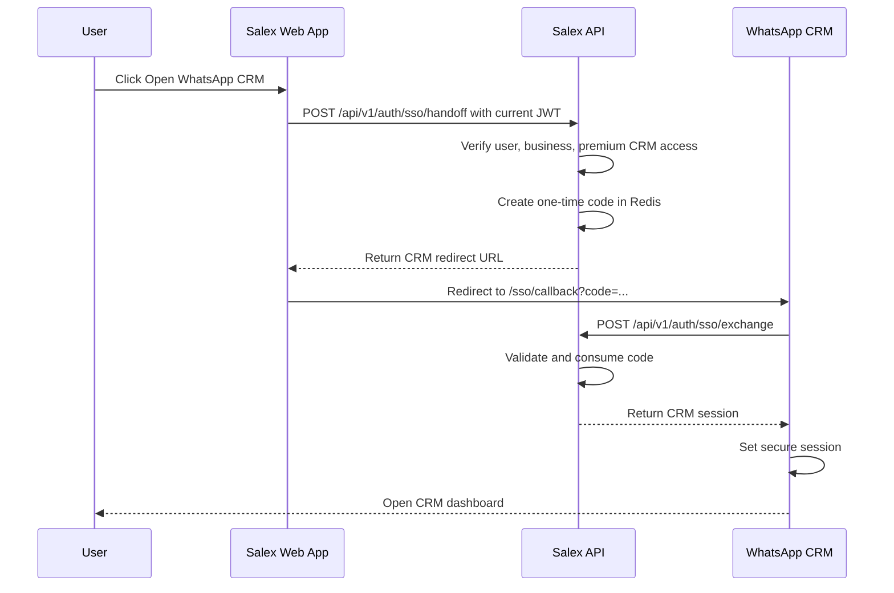
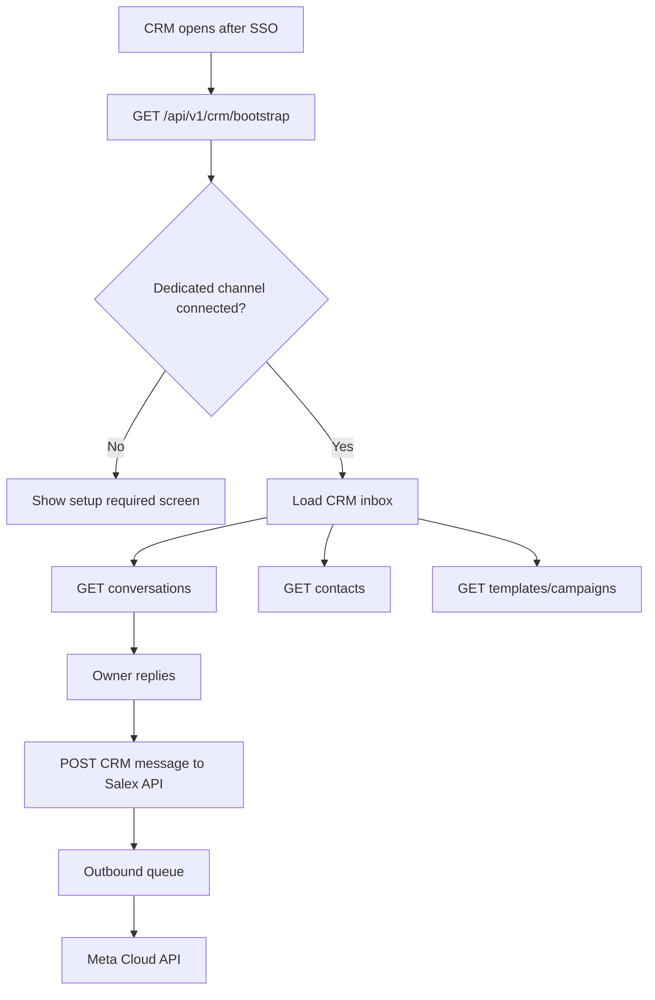

# WhatsApp CRM Subdomain SSO Integration

Document version: 1.1  
Prepared for: Salex product and engineering  
Status: Architecture plan for premium WhatsApp CRM integration, wacrm fork, and CRM auth handoff

## 1. Purpose

Salex will support a premium WhatsApp CRM for businesses that use a dedicated WhatsApp number. The CRM should feel like part of Salex, but it should run as a separate web experience so the merchant app does not become heavy or confusing.

Target domains:

```text
Salex Web App
app.salex.in

WhatsApp CRM
crm.salex.in

Salex API
api.salex.in
```

The owner should be able to click **Open WhatsApp CRM** from the Salex web app and land inside the CRM without logging in again.

The important security decision is:

```text
Do not pass the current JWT directly to crm.salex.in.
Use a short-lived one-time SSO handoff code.
```

This gives the simple user experience we want without exposing the user's real login token through URLs, browser history, logs, analytics, screenshots, or referrer headers.

## 2. Grounding In Current Code And Reference Repo

This plan must be implemented against the current Salex source of truth, not as an isolated CRM product.

Current Salex code and schema that matter:

```text
packages/shared-types/prisma/schema.prisma
apps/api/src/routes/auth.routes.ts
apps/api/src/controllers/password-auth.controller.ts
apps/api/src/controllers/auth.controller.ts
apps/api/src/services/auth-method.service.ts
apps/api/src/services/token.service.ts
apps/api/src/services/whatsapp-channel.service.ts
apps/api/src/services/whatsapp.service.ts
apps/api/src/queues/whatsapp-queues.ts
apps/api/src/workers/whatsapp-outbound.worker.ts
```

Current Salex auth facts:

```text
User.phone is unique.
AuthMethod supports PASSWORD and PHONE_OTP.
Password login already exists at POST /api/v1/auth/password/login.
Password change already exists at POST /api/v1/auth/password/change.
OTP endpoints already exist at POST /api/v1/auth/otp/request and POST /api/v1/auth/otp/verify.
OTP is controlled by OTP_LOGIN_ENABLED and Twilio configuration.
```

Current Salex WhatsApp facts:

```text
WhatsAppChannel stores dedicated channel credentials.
WhatsAppChannel.businessId maps the dedicated number to one business.
Admin dashboard owns WhatsAppChannel setup and test connection.
Webhook routing already uses phoneNumberId to distinguish shared vs dedicated numbers.
Outbound sending already resolves business-specific channel credentials through the API/service layer.
Redis/BullMQ already exists for WhatsApp queueing.
```

Current Salex customer/contact facts:

```text
Person is the global phone identity.
BusinessCustomer is the business-scoped CRM/customer record.
WhatsAppConversation is the WhatsApp conversation state/history anchor.
WhatsAppMessage is the message audit/history table.
Booking is the operational source of truth for appointments.
```

Reference CRM repo:

```text
https://github.com/ArnasDon/wacrm.git
inspected commit: c3f8b3f71def50660e0d74aa5a91bb8789a3a491
```

The `wacrm` repo is a good UI and module reference because it already contains a WhatsApp CRM shape:

```text
shared inbox
contacts
broadcasts
templates
automations
flows
team/account roles
WhatsApp Cloud API integration
```

But it must not become a second source of truth. It uses Supabase Auth, Supabase tables, and its own WhatsApp configuration tables. Salex must replace those parts with Salex API and Salex Prisma models.

Recommended placement:

```text
apps/whatsapp-crm
```

The implementation should fork or copy the usable `wacrm` app shell and CRM modules into `apps/whatsapp-crm`, then replace auth, data access, WhatsApp config, and send/webhook behavior.

## 3. wacrm Fork Replacement Matrix

Use these parts from `wacrm` as reference or starting UI:

```text
src/app/(dashboard)/contacts/page.tsx
src/app/(dashboard)/broadcasts/page.tsx
src/app/(dashboard)/automations/page.tsx
src/app/(dashboard)/flows/page.tsx
src/components/contacts/*
src/components/broadcasts/*
src/components/automations/*
src/components/flows/*
src/lib/whatsapp/template-*
src/lib/broadcast-status.ts
src/lib/automations/*
src/lib/flows/*
```

Replace these parts instead of using them directly:

```text
wacrm Supabase Auth
wacrm Supabase RLS data access
wacrm whatsapp_config table
wacrm direct Meta send API routes
wacrm webhook route
wacrm account/profile/invitation model
```

Concrete replacement rules:

| wacrm area | Salex replacement |
| --- | --- |
| `src/hooks/use-auth.tsx` | Salex CRM session + `/api/v1/crm/bootstrap` |
| `src/middleware.ts` | CRM cookie/session guard + SSO callback handling |
| `src/app/(auth)/login/page.tsx` | Phone/password fallback login, not email login |
| `src/lib/supabase/client.ts` | Salex API client or CRM BFF client |
| `src/lib/supabase/server.ts` | CRM server-side session helper |
| `src/app/api/whatsapp/config/route.ts` | Read-only Salex `WhatsAppChannel` status |
| `src/app/api/whatsapp/send/route.ts` | Salex outbound message API + queue |
| `src/app/api/whatsapp/webhook/route.ts` | Do not use; Salex API webhook remains canonical |
| `supabase/migrations/*` | Do not apply directly; translate needed concepts into Prisma migrations |

The forked CRM may keep Next.js/Tailwind UI patterns from `wacrm`, but it should behave as a Salex client.

## 4. Product Positioning

The WhatsApp CRM is a premium dedicated-number feature in v1.

Shared-number businesses should continue using the normal Salex booking experience. The CRM should unlock only when the business has:

- an active premium plan or CRM entitlement,
- a connected dedicated WhatsApp channel,
- an authenticated owner or staff user,
- permission to access the selected business.

Recommended product placement:

```text
Salex Web App / More / WhatsApp CRM
```

or:

```text
Salex Web App / Business / WhatsApp CRM
```

The admin dashboard remains responsible only for platform-side setup:

```text
Admin configures dedicated WhatsApp number
Admin enters Meta Cloud API credentials
Admin tests the connection
Admin marks the WhatsAppChannel as CONNECTED
```

The CRM web app is for daily business usage:

```text
Inbox
Contacts
Templates
Campaigns
Automations
Analytics
Customer booking history
```

## 5. CRM Login Rules

SSO is the default login path.

```text
Owner is already inside Salex web app.
Owner clicks Open WhatsApp CRM.
Salex creates a one-time SSO handoff.
CRM opens without asking for login again.
```

Phone/password is the fallback login path.

```text
Owner opens crm.salex.in directly.
CRM does not find an active CRM session.
CRM shows phone + password login.
CRM calls Salex auth using existing password auth logic.
CRM creates a CRM session after successful login.
Future visits do not ask login again while the CRM session is valid.
```

OTP is the future login path after Twilio is production-ready.

```text
Current practical path: phone + password.
Future path after Twilio upgrade: phone OTP using existing OTP endpoints.
```

Do not build a separate CRM user table. Use Salex `User`, `AuthMethod`, and business ownership/membership rules.

Current Salex login APIs:

```text
POST /api/v1/auth/password/login
POST /api/v1/auth/password/change
POST /api/v1/auth/otp/request
POST /api/v1/auth/otp/verify
GET  /api/v1/auth/me
POST /api/v1/auth/refresh
```

CRM login behavior:

```text
If CRM session exists, open CRM.
If URL has SSO code, exchange code and create CRM session.
If no CRM session and no SSO code, show phone/password login.
If OTP_LOGIN_ENABLED=true later, allow phone OTP login as another option.
```

The user should not be asked to log in every time. The CRM should persist its own secure session cookie and refresh/validate it through the Salex API.

## 6. Why Direct Token Transfer Is Not Allowed

The unsafe version looks like this:

```text
https://crm.salex.in/sso/callback?token=<current-jwt>
```

Do not build this.

Problems:

- query params can appear in browser history,
- URLs may be logged by proxies, analytics, observability tools, and error trackers,
- users may screenshot or share URLs,
- referrer headers can leak the token to other origins,
- a long-lived token gives too much access if copied.

Also, `localStorage` is scoped per origin. A token stored on `app.salex.in` cannot be directly read by `crm.salex.in`.

The correct design is:

```text
app.salex.in gets a one-time code from api.salex.in
crm.salex.in exchanges that code with api.salex.in
api.salex.in creates a CRM session
```

## 7. SSO User Flow



End-user story:

```text
Owner is already logged into Salex web.
Owner clicks Open WhatsApp CRM.
Salex checks that the business is allowed to use CRM.
Salex redirects the owner to crm.salex.in.
CRM opens directly without asking for OTP or password again.
```

## 8. Planned API Surface

Add these APIs to the Salex API:

```text
POST /api/v1/auth/sso/handoff
POST /api/v1/auth/sso/exchange
POST /api/v1/auth/sso/logout
POST /api/v1/auth/crm/password/login
POST /api/v1/auth/crm/otp/request
POST /api/v1/auth/crm/otp/verify
GET  /api/v1/crm/bootstrap
```

The CRM-specific auth endpoints should reuse the existing Salex auth services and tables. They exist to create a CRM-scoped session and enforce CRM entitlement before the CRM app opens.

Do not duplicate password hashing, OTP storage, or user lookup logic inside the CRM app.

### 8.1 Create Handoff

Endpoint:

```text
POST /api/v1/auth/sso/handoff
```

Authentication:

```text
Authorization: Bearer <current-salex-web-token>
```

Request:

```json
{
  "businessId": "business_123",
  "targetApp": "WHATSAPP_CRM",
  "returnPath": "/inbox"
}
```

Server behavior:

```text
Accept the current authenticated user.
Check that the user can access the business.
Check that the business has CRM entitlement.
Check that the business has a CONNECTED dedicated WhatsAppChannel.
Create a one-time SSO code in Redis.
Return the CRM redirect URL.
```

Response:

```json
{
  "success": true,
  "data": {
    "redirectUrl": "https://crm.salex.in/sso/callback?code=public_code&state=state_nonce"
  }
}
```

### 8.2 Exchange Handoff

Endpoint:

```text
POST /api/v1/auth/sso/exchange
```

Request:

```json
{
  "code": "public_code",
  "state": "state_nonce"
}
```

Server behavior:

```text
Hash the submitted code.
Find the Redis handoff record.
Validate TTL.
Validate targetApp is WHATSAPP_CRM.
Validate state nonce.
Consume the code immediately.
Create a CRM session.
Return user, business, permissions, and bootstrap context.
```

Response:

```json
{
  "success": true,
  "data": {
    "session": {
      "expiresAt": "2026-06-10T12:00:00.000Z"
    },
    "user": {
      "id": "user_123",
      "phone": "+919999999999",
      "role": "merchant"
    },
    "business": {
      "id": "business_123",
      "name": "Glow Studio"
    },
    "permissions": [
      "crm:read",
      "crm:message:send",
      "crm:campaign:create"
    ]
  }
}
```

### 8.3 CRM Password Login Fallback

Endpoint:

```text
POST /api/v1/auth/crm/password/login
```

Request:

```json
{
  "phone": "+919999999999",
  "password": "owner-password",
  "businessId": "business_123"
}
```

Server behavior:

```text
Use existing AuthMethod PASSWORD verification.
Check User.status is ACTIVE.
Check user can access businessId.
Check business has premium CRM entitlement.
Check business has CONNECTED dedicated WhatsAppChannel.
Create CRM session.
Return user, business, permissions, and bootstrap context.
```

This endpoint should be a CRM wrapper around the existing phone/password auth system. It should not create a separate CRM password system.

### 8.4 Future CRM OTP Login

Endpoints:

```text
POST /api/v1/auth/crm/otp/request
POST /api/v1/auth/crm/otp/verify
```

These should remain optional until Twilio is upgraded and production-ready.

Implementation rule:

```text
Use existing OTP service, Otp table, and AuthMethodType.PHONE_OTP.
Do not create a new OTP provider abstraction just for CRM.
```

Recommended feature flag behavior:

```text
If OTP_LOGIN_ENABLED=false, hide OTP login from CRM.
If OTP_LOGIN_ENABLED=true and Twilio env vars are valid, show OTP as an option.
```

### 8.5 Logout

Endpoint:

```text
POST /api/v1/auth/sso/logout
```

Behavior:

```text
Clear the CRM session.
Do not necessarily log the user out of the main Salex web app.
```

### 8.6 CRM Bootstrap

Endpoint:

```text
GET /api/v1/crm/bootstrap
```

Behavior:

```text
Return the current CRM session context.
Return business details.
Return CRM entitlement.
Return dedicated WhatsApp channel status.
Return allowed permissions.
Return navigation config.
```

Example response:

```json
{
  "success": true,
  "data": {
    "user": {
      "id": "user_123",
      "role": "merchant"
    },
    "business": {
      "id": "business_123",
      "name": "Glow Studio",
      "plan": "PREMIUM"
    },
    "crm": {
      "enabled": true,
      "permissions": [
        "crm:read",
        "crm:message:send",
        "crm:campaign:create"
      ]
    },
    "whatsappChannel": {
      "status": "CONNECTED",
      "displayPhoneNumber": "+91 98765 43210",
      "phoneNumberId": "masked_or_public_id"
    },
    "navigation": {
      "inbox": true,
      "contacts": true,
      "campaigns": true,
      "automations": false,
      "analytics": true
    }
  }
}
```

## 9. Redis Handoff Storage

Use Redis for the short-lived handoff code.

Key format:

```text
sso:crm:<codeHash>
```

TTL:

```text
60 seconds
```

Properties:

```text
single use: true
target app: WHATSAPP_CRM
```

Stored value:

```json
{
  "userId": "user_123",
  "businessId": "business_123",
  "targetApp": "WHATSAPP_CRM",
  "scopes": [
    "crm:read",
    "crm:message:send",
    "crm:campaign:create"
  ],
  "state": "state_nonce",
  "returnPath": "/inbox",
  "createdAt": "2026-06-10T11:59:00.000Z",
  "expiresAt": "2026-06-10T12:00:00.000Z"
}
```

Implementation notes:

- Store only a hash of the public code.
- Generate the public code with cryptographically secure random bytes.
- Delete the Redis key immediately after successful exchange.
- If the exchange fails, do not reveal whether the code existed.
- Log only request IDs and business IDs, not the raw code.

## 10. CRM Session Requirements

Production session recommendation:

```text
HttpOnly
Secure
SameSite=Lax
Domain scoped to crm.salex.in
```

The CRM session should be separate from the main Salex web token. Logging out from the CRM can clear only the CRM session unless product later decides to support global logout.

Recommended production shape:

```text
Browser stores only an HttpOnly CRM session cookie.
Browser JavaScript cannot read the CRM session.
CRM Next.js server routes read the cookie.
CRM server routes call Salex API server-to-server.
Salex API remains the authority for validating the CRM session.
```

This means the forked CRM should use a thin BFF pattern:

```text
CRM browser
  -> crm.salex.in/api/*
  -> CRM Next.js server route reads HttpOnly cookie
  -> CRM server route calls api.salex.in
  -> Salex API checks session/business/permissions
```

Do not rely on browser JavaScript reading a token and attaching `Authorization` headers in production.

Temporary development fallback:

```text
sessionStorage may be used only in local development.
Do not use sessionStorage for production CRM auth.
```

Do not store the CRM session in `localStorage` for production.

## 11. CRM Data Source

The CRM should load contacts and conversations from Salex data, not from an independent CRM database.

Primary data mapping:

```text
Person
BusinessCustomer
WhatsAppConversation
WhatsAppMessage
Booking
```

Meaning:

- `Person` is the global phone identity.
- `BusinessCustomer` is the salon-specific CRM contact.
- `WhatsAppConversation` is the conversation thread for that customer and business.
- `WhatsAppMessage` is the message history/audit trail.
- `Booking` gives the CRM real business context.

The CRM contact page should eventually show:

```text
customer name
phone number
tags
notes
last interaction
upcoming booking
past bookings
no-show/cancellation history
loyalty status
campaign history
```

## 12. WhatsApp Channel Relationship

The CRM must not ask the salon owner to enter WhatsApp API credentials.

Credential setup belongs to the admin dashboard:

```text
GET  /api/v1/admin/businesses/:businessId/whatsapp-channel
PUT  /api/v1/admin/businesses/:businessId/whatsapp-channel
POST /api/v1/admin/businesses/:businessId/whatsapp-channel/test
POST /api/v1/admin/businesses/:businessId/whatsapp-channel/connect
POST /api/v1/admin/businesses/:businessId/whatsapp-channel/disconnect
```

The CRM should read only safe channel status from the Salex API:

```text
businessId
status
displayPhoneNumber
qualityRating
messagingLimit
lastInboundAt
lastOutboundAt
```

Outbound CRM messages should call the Salex API. The Salex API should resolve the correct dedicated `WhatsAppChannel` internally and enqueue the message through the existing outbound worker.

CRM must not call Meta Graph API directly from the browser.

## 13. Runtime Integration With WhatsApp CRM

Recommended flow after SSO:



The CRM should be allowed to show a read-only setup state if the channel is not connected, but it should not allow sending messages until the channel is connected.

## 14. Required Safety Rules

Hard rules:

- Do not transfer JWT through URL query params.
- Do not copy `localStorage` token across subdomains.
- Do not iframe the CRM in v1.
- Do not allow CRM access for shared-only businesses.
- Do not allow CRM access without a premium entitlement.
- Do not allow CRM browser code to access Meta API credentials.
- Do not allow a one-time SSO code to be reused.
- Do not allow one user to exchange an SSO code created for another business unless the encoded access check still passes.
- Do not add Supabase Auth from `wacrm` into Salex CRM.
- Do not use `wacrm` email/password login as-is.
- Do not apply `wacrm` Supabase migrations directly to Salex production.

Operational rules:

- Handoff code expires after 60 seconds.
- Handoff code is consumed immediately after exchange.
- Failed exchanges should be rate limited.
- CRM bootstrap should be called after page refresh to recover session context.
- CRM logout clears CRM session.

## 15. Local Development Shape

Suggested local domains:

```text
Salex Web App
http://localhost:3000

WhatsApp CRM
http://localhost:3001

Salex API
http://localhost:3002/api/v1
```

Local redirect example:

```text
http://localhost:3001/sso/callback?code=public_code&state=state_nonce
```

Environment variables:

```text
SALEX_WEB_ORIGIN=http://localhost:3000
SALEX_CRM_ORIGIN=http://localhost:3001
SALEX_API_ORIGIN=http://localhost:3002
CRM_SSO_CODE_TTL_SECONDS=60
CRM_SESSION_COOKIE_NAME=salex_crm_session
CRM_SSO_DEFAULT=true
CRM_PASSWORD_LOGIN_ENABLED=true
CRM_OTP_LOGIN_ENABLED=false
```

Production equivalents:

```text
SALEX_WEB_ORIGIN=https://app.salex.in
SALEX_CRM_ORIGIN=https://crm.salex.in
SALEX_API_ORIGIN=https://api.salex.in
CRM_SSO_CODE_TTL_SECONDS=60
CRM_SESSION_COOKIE_NAME=salex_crm_session
CRM_SSO_DEFAULT=true
CRM_PASSWORD_LOGIN_ENABLED=true
CRM_OTP_LOGIN_ENABLED=false
```

When Twilio is production-ready:

```text
OTP_LOGIN_ENABLED=true
CRM_OTP_LOGIN_ENABLED=true
TWILIO_ACCOUNT_SID=...
TWILIO_AUTH_TOKEN=...
TWILIO_VERIFY_SERVICE_SID=...
```

## 16. Testing Checklist

Authentication tests:

```text
Logged-in web user can create an SSO handoff.
Anonymous user cannot create an SSO handoff.
Expired handoff code cannot be exchanged.
Already-used handoff code cannot be exchanged again.
Wrong state nonce cannot be exchanged.
CRM session is created only after successful exchange.
CRM bootstrap fails without CRM session.
Direct CRM phone/password login works for an active Salex user.
Direct CRM phone/password login creates a CRM session cookie.
Direct CRM reload does not ask login again while the CRM session is valid.
CRM OTP login stays hidden when CRM_OTP_LOGIN_ENABLED=false.
```

Authorization tests:

```text
User cannot open CRM for another business.
Shared-only business cannot open CRM.
Non-premium business cannot open CRM.
Business with disconnected dedicated channel cannot send CRM messages.
Phone/password login fails for a valid user who cannot access the requested business.
```

Security tests:

```text
Raw JWT never appears in redirect URL.
Raw SSO code is never stored in logs.
Redis stores only hashed code keys.
SSO code is deleted after exchange.
CRM browser code never receives WhatsApp access token.
CRM browser code never reads the CRM session token in JavaScript.
CRM does not use wacrm Supabase Auth after integration.
```

CRM bootstrap tests:

```text
Bootstrap returns current user.
Bootstrap returns current business.
Bootstrap returns CRM permissions.
Bootstrap returns safe WhatsApp channel status.
Bootstrap returns navigation config.
```

## 17. Implementation Phases

Phase 1:

```text
Document and lock architecture.
Add API contract tests for SSO handoff and exchange.
Implement Redis-backed SSO code service.
Implement /auth/sso/handoff and /auth/sso/exchange.
Implement /auth/crm/password/login using existing AuthMethod PASSWORD logic.
```

Phase 2:

```text
Fork/copy ArnasDon/wacrm into apps/whatsapp-crm.
Remove Supabase Auth dependency from the CRM runtime path.
Replace email/password login with phone/password fallback login.
Add /sso/callback route.
Exchange code for CRM session.
Call /crm/bootstrap.
Show connected/disconnected WhatsApp channel state.
```

Phase 3:

```text
Load contacts from BusinessCustomer.
Load conversations from WhatsAppConversation.
Load messages from WhatsAppMessage.
Send manual replies through Salex API and outbound queue.
Replace wacrm /api/whatsapp/send behavior with Salex outbound API calls.
```

Phase 4:

```text
Add templates.
Add campaigns.
Add segments.
Add automations.
Add analytics.
Add mobile QR open-to-web flow if needed.
Enable OTP login only after Twilio production access is ready.
```

## 18. Assumptions

- CRM is premium dedicated-number only in v1.
- Salex web app already has a valid logged-in owner or staff session.
- WhatsApp credentials are configured from the admin dashboard, not the CRM.
- CRM subdomain uses Salex API, not an independent backend source of truth.
- The wacrm fork can be used as the UI/module base, but auth and data access must be replaced with Salex API integration.
- Salex API remains the authority for auth, CRM access, business ownership, WhatsApp channel status, and outbound message sending.
- SSO is the default CRM login path.
- Phone/password login remains available as direct CRM fallback.
- OTP login is a future switch-on path after Twilio upgrade and production validation.
